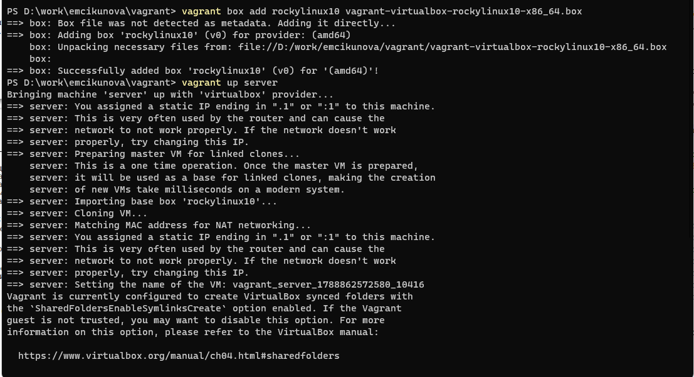
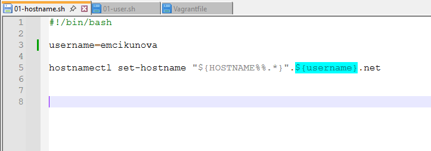
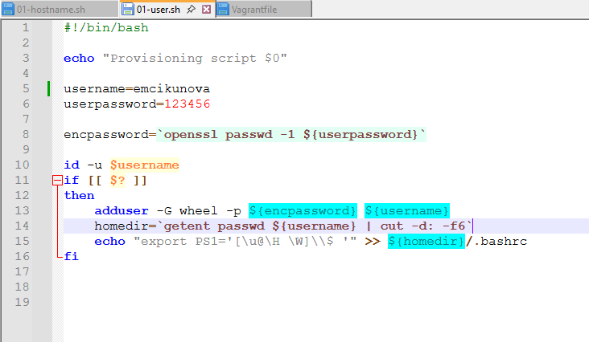

---
## Author
author:
  name: Цыкунова Екатерина Михайловна
  email: 1132246732@rudn.ru
  affiliation:
    - name: Российский университет дружбы народов
      country: Российская Федерация
      postal-code: 117198
      city: Москва
      address: ул. Миклухо-Маклая, д. 6

## Title
title: Лабораторная работа №1
subtitle: Подготовка лабораторного стенда
license: CC BY
date: today
date-format: "YYYY-MM-DD"
---

# Цели и задачи работы

## Цель лабораторной работы

Целью данной работы является приобретение практических навыков подготовки и запуска виртуальных машин Rocky Linux с использованием Vagrant и VirtualBox.

## Задачи лабораторной работы

- сформировать box-файл с дистрибутивом Rocky Linux для VirtualBox;
- добавить box-файл в локальное хранилище Vagrant;
- запустить виртуальные машины `server` и `client`;
- настроить пользователя с правами администратора;
- изменить имена хостов виртуальных машин;
- проверить работоспособность виртуальных машин и подключение по SSH.

# Процесс выполнения лабораторной работы

## Добавляю box-файл Rocky Linux

{ #fig:001 width=70% height=70% }

## Создаю сценарий изменения имени хоста

{ #fig:002 width=70% height=70% }

## Создаю сценарий добавления пользователя

{ #fig:003 width=70% height=70% }

## Проверяю имя пользователя и хоста

{ #fig:004 width=70% height=70% }

## Подключаюсь к серверу по SSH

{ #fig:005 width=70% height=70% }

## Вывод

В ходе лабораторной работы были приобретены практические навыки подготовки образа Rocky Linux, создания box-файла и запуска виртуальных машин с использованием Vagrant и VirtualBox.

Были настроены виртуальные машины `server` и `client`, добавлен пользователь с правами администратора, изменены имена хостов и проверено подключение к виртуальной машине по SSH.