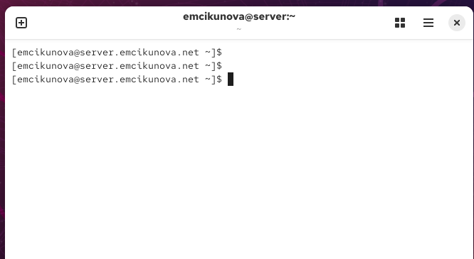
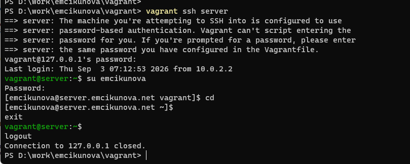

---
## Author
author:
  name: Цыкунова Екатерина Михайловна
  email: 1132246732@rudn.ru
  affiliation:
    - name: Российский университет дружбы народов
      country: Российская Федерация
      postal-code: 117198
      city: Москва
      address: ул. Миклухо-Маклая, д. 6

## Title
title: "Отчёт по лабораторной работе №1"
subtitle: "Подготовка лабораторного стенда"
license: "CC BY"
---

# Цель работы

Целью данной работы является приобретение практических навыков установки Rocky Linux на виртуальную машину с помощью инструмента Vagrant.

# Выполнение лабораторной работы

Формирую box-файл с дистрибутивом Rocky Linux для VirtualBox и добавляю его в локальное хранилище Vagrant командой `vagrant box add`. После успешного добавления образа запускаю виртуальную машину сервера командой `vagrant up server` (см. рис. [@fig-001]).

{ #fig-001 width=70% }

Для автоматической настройки имени хоста создаю сценарий `01-hostname.sh`. В сценарии задаю имя пользователя и с помощью команды `hostnamectl set-hostname` формирую полное доменное имя виртуальной машины, содержащее имя хоста и имя пользователя (см. рис. [@fig-002]).

{ #fig-002 width=70% }

Создаю сценарий `01-user.sh` для автоматического добавления пользователя при развёртывании виртуальной машины. В сценарии задаю имя пользователя и пароль, формирую хеш пароля с помощью `openssl passwd`, после чего добавляю пользователя в группу `wheel`, предоставляющую права администратора. Также настраиваю командную строку пользователя в файле `.bashrc` (см. рис. [@fig-003]).

{ #fig-003 width=70% }

После внесения изменений запускаю виртуальную машину и проверяю результат настройки. В терминале отображается созданный пользователь `emcikunova`, а имя хоста изменено на `server.emcikunova.net`, что подтверждает успешное выполнение сценариев автоматической настройки (см. рис. [@fig-004]).

{ #fig-004 width=70% }

Проверяю возможность подключения к серверу средствами Vagrant с помощью команды `vagrant ssh server`. После подключения выполняю переход от стандартного пользователя `vagrant` к созданному пользователю `emcikunova`. В приглашении командной строки отображается имя хоста `server.emcikunova.net`, что подтверждает корректность выполненных настроек и работоспособность виртуальной машины (см. рис. [@fig-005]).

{ #fig-005 width=70% }

Аналогичные настройки загрузки и автоматической конфигурации применяю к виртуальной машине `client`: добавляю пользователя с правами администратора и задаю соответствующее имя хоста. После запуска виртуальных машин `server` и `client` проверяю их работоспособность и возможность подключения.

Для возможности повторного развёртывания виртуальных машин на другом компьютере копирую на внешний носитель необходимые файлы Vagrant, включая `Vagrantfile`, сценарии автоматической настройки, а также подготовленные box-файлы виртуальных машин.

# Вывод

В ходе лабораторной работы были приобретены практические навыки подготовки образов Rocky Linux для VirtualBox, создания box-файлов, а также запуска и настройки виртуальных машин с использованием Vagrant.

Были настроены виртуальные машины `server` и `client`, добавлен пользователь с правами администратора, изменены имена хостов и проверена возможность подключения к виртуальным машинам по SSH.

# Контрольные вопросы

*1. Для чего предназначен Vagrant?*

Vagrant предназначен для автоматизированного создания, настройки, запуска и управления виртуальными машинами. Он позволяет описать параметры виртуального окружения в конфигурационном файле и затем развернуть одинаковую среду на разных компьютерах.

Vagrant работает совместно с системами виртуализации, например VirtualBox, VMware и другими.

В данной лабораторной работе Vagrant используется совместно с VirtualBox для запуска и настройки виртуальных машин `server` и `client` с операционной системой Rocky Linux.

*2. Что такое box-файл? В чём назначение Vagrantfile?*

Box-файл представляет собой подготовленный образ виртуальной машины, который используется Vagrant в качестве основы для создания новых виртуальных машин. Он содержит операционную систему и необходимые параметры для её запуска.

Box-файлы можно добавлять в локальное хранилище Vagrant, например:

`vagrant box add rocky10 vagrant-virtualbox-rockylinux10-x86_64.box`

После этого данный образ можно использовать при создании виртуальных машин.

`Vagrantfile` — основной конфигурационный файл Vagrant. В нём описываются параметры создаваемых виртуальных машин: используемый box-образ, имя виртуальной машины, сетевые настройки, объём оперативной памяти, количество процессоров, параметры VirtualBox и сценарии автоматической настройки.

В данной работе в `Vagrantfile` задаются параметры виртуальных машин `server` и `client`.

*3. Приведите описание и примеры вызова основных команд Vagrant.*

`vagrant init` — создаёт новый файл `Vagrantfile` в текущем каталоге.

Пример:

`vagrant init rocky10`

`vagrant box add` — добавляет box-файл в локальное хранилище Vagrant.

Пример:

`vagrant box add rocky10 vagrant-virtualbox-rockylinux10-x86_64.box`

`vagrant box list` — выводит список box-образов, добавленных в Vagrant.

Пример:

`vagrant box list`

`vagrant up` — создаёт и запускает виртуальную машину в соответствии с параметрами `Vagrantfile`.

Пример запуска всех виртуальных машин:

`vagrant up`

Пример запуска только сервера:

`vagrant up server`

Пример запуска только клиента:

`vagrant up client`

`vagrant status` — отображает текущее состояние виртуальных машин.

Пример:

`vagrant status`

`vagrant ssh` — выполняет подключение к виртуальной машине по SSH.

Пример:

`vagrant ssh server`

`vagrant halt` — корректно завершает работу виртуальной машины.

Пример:

`vagrant halt server`

`vagrant reload` — перезапускает виртуальную машину и повторно применяет параметры из `Vagrantfile`.

Пример:

`vagrant reload server`

`vagrant provision` — повторно запускает сценарии автоматической настройки уже созданной виртуальной машины.

Пример:

`vagrant provision server`

`vagrant suspend` — приостанавливает работу виртуальной машины с сохранением её текущего состояния.

Пример:

`vagrant suspend server`

`vagrant resume` — возобновляет работу ранее приостановленной виртуальной машины.

Пример:

`vagrant resume server`

`vagrant destroy` — удаляет созданную виртуальную машину.

Пример:

`vagrant destroy server`

*4. Дайте построчные пояснения содержания файлов vagrant-rocky.pkr.hcl, ks.cfg, Vagrantfile, Makefile*

Файл `vagrant-rocky.pkr.hcl` является конфигурационным файлом Packer. Он содержит описание процесса автоматического создания виртуальной машины Rocky Linux и формирования образа, который в дальнейшем может использоваться для создания box-файла Vagrant. В нём задаются параметры виртуальной машины, используемый ISO-образ, настройки VirtualBox и этапы подготовки системы.

Файл `ks.cfg` является файлом автоматической установки Kickstart. Он используется установщиком Rocky Linux и позволяет выполнять установку операционной системы без ручного ввода большинства параметров. В нём могут быть определены параметры дисков, сети, пользователей, паролей, часового пояса, устанавливаемых пакетов и других компонентов системы.

Файл `Vagrantfile` содержит конфигурацию виртуальных машин, которыми управляет Vagrant. С его помощью задаются используемые box-образы, параметры виртуальных машин, сетевые интерфейсы, имена хостов и сценарии автоматической настройки. В данной работе он используется для описания виртуальных машин `server` и `client`.

Файл `Makefile` предназначен для автоматизации выполнения часто используемых команд. Он содержит набор целей, с помощью которых можно упростить сборку образов, создание box-файлов, запуск вспомогательных команд и очистку временных файлов. Вместо последовательного ручного ввода нескольких команд необходимые действия можно выполнить одной командой `make` с указанием соответствующей цели.