---
## Author
author:
  name: Цыкунова Екатерина Михайловна
  email: 1132246732@rudn.ru
  affiliation:
    - name: Российский университет дружбы народов
      country: Российская Федерация
      postal-code: 117198
      city: Москва
      address: ул. Миклухо-Маклая, д. 6

## Title
title: Лабораторная работа №2
subtitle: Настройка DNS-сервера
license: CC BY
date: today
date-format: "YYYY-MM-DD"
---

# Цели и задачи работы

## Цель лабораторной работы

Целью данной работы является приобретение практических навыков установки, настройки и проверки работы DNS-сервера BIND на виртуальной машине `server`.

## Задачи лабораторной работы

- установить пакеты `bind` и `bind-utils`;
- настроить кэширующий DNS-сервер;
- настроить первичный DNS-сервер для домена `emcikunova.net`;
- создать прямую и обратную DNS-зоны;
- проверить работу DNS-сервера с помощью утилит `dig` и `host`;
- подготовить сценарий автоматической настройки DNS-сервера для Vagrant.

# Процесс выполнения лабораторной работы

## Устанавливаю BIND и проверяю DNS-запрос

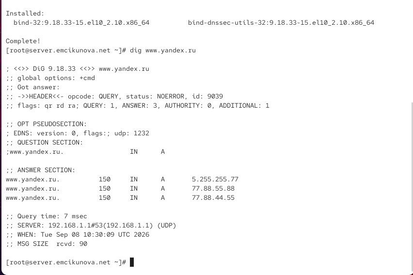{ #fig:001 width=70% height=70% }

## Просматриваю resolv.conf и named.conf

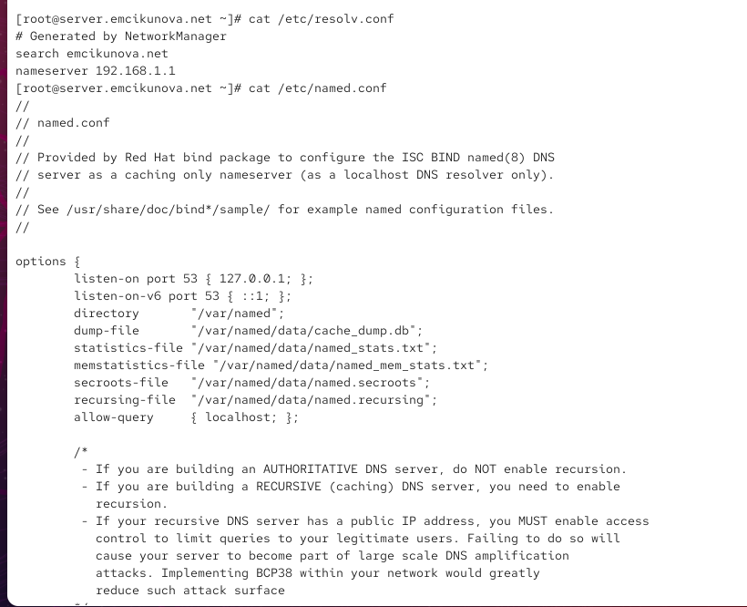{ #fig:002 width=70% height=70% }

## Анализирую файл корневых DNS-серверов

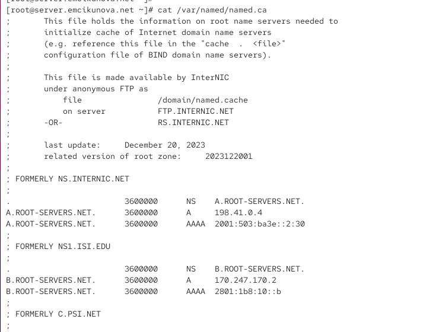{ #fig:003 width=70% height=70% }

## Просматриваю стандартные файлы зон

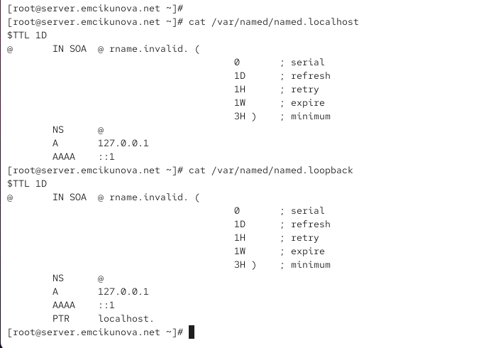{ #fig:004 width=70% height=70% }

## Запускаю службу named

{ #fig:005 width=70% height=70% }

## Настраиваю локальный DNS через nmcli

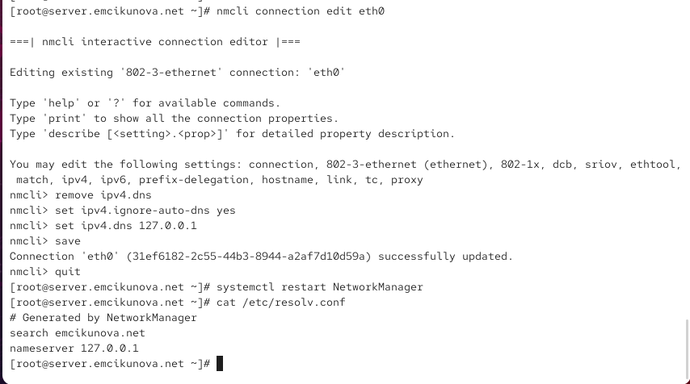{ #fig:006 width=70% height=70% }

## Разрешаю запросы из внутренней сети

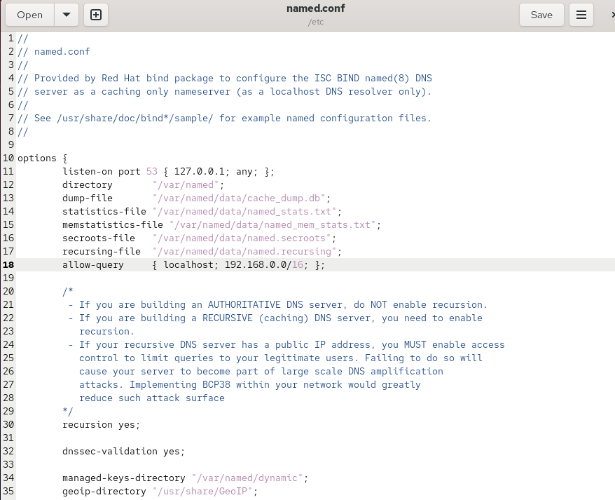{ #fig:007 width=70% height=70% }

## Настраиваю межсетевой экран

{ #fig:008 width=70% height=70% }

## Подключаю файл описания зон

{ #fig:009 width=70% height=70% }

## Создаю описание прямой и обратной зон

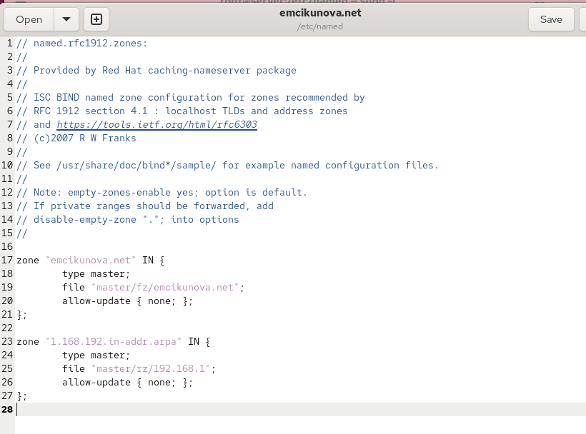{ #fig:010 width=70% height=70% }

## Создаю файл прямой DNS-зоны

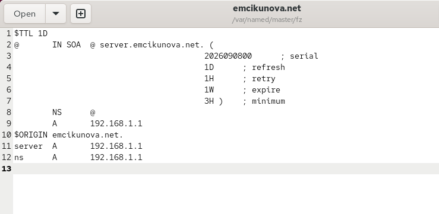{ #fig:011 width=70% height=70% }

## Создаю файл обратной DNS-зоны

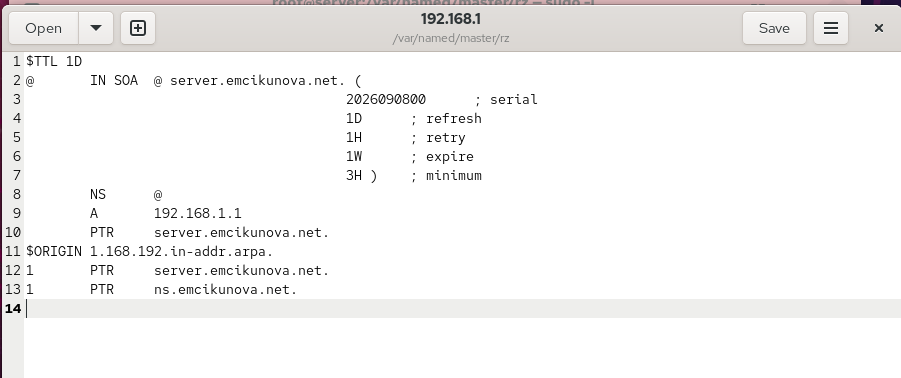{ #fig:012 width=70% height=70% }

## Настраиваю права доступа и SELinux

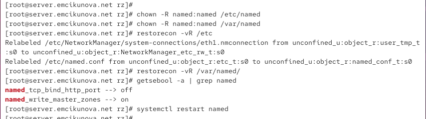{ #fig:013 width=70% height=70% }

## Проверяю DNS-запись с помощью dig

{ #fig:014 width=70% height=70% }

## Проверяю зоны с помощью host

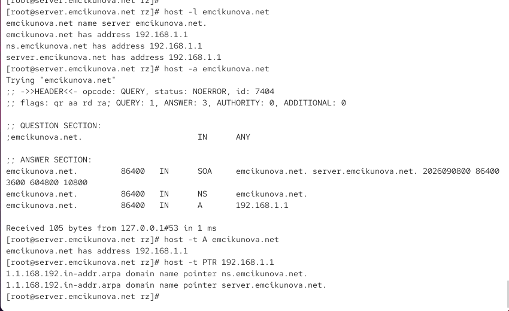{ #fig:015 width=70% height=70% }

## Подготавливаю файлы для Vagrant

{ #fig:016 width=70% height=70% }

## Создаю сценарий автоматической настройки

{ #fig:017 width=70% height=70% }

## Вывод

В ходе лабораторной работы был установлен и настроен DNS-сервер BIND на виртуальной машине `server`.

Был настроен кэширующий DNS-сервер, создан первичный DNS-сервер для домена `emcikunova.net`, сформированы прямая и обратная DNS-зоны.

Работа DNS-сервера была проверена с помощью утилит `dig` и `host`. Также был подготовлен сценарий `dns.sh`, автоматизирующий установку и конфигурирование DNS-сервера во внутреннем окружении Vagrant.