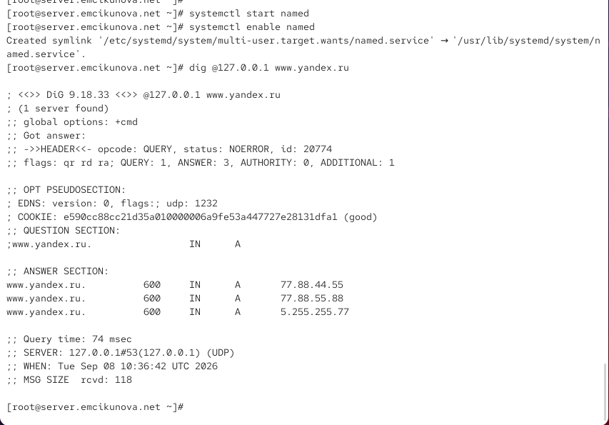
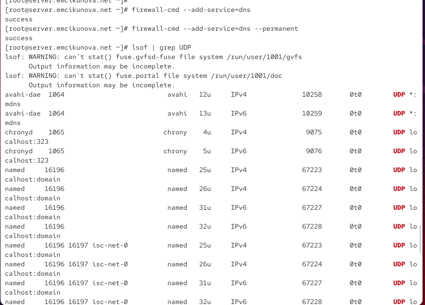
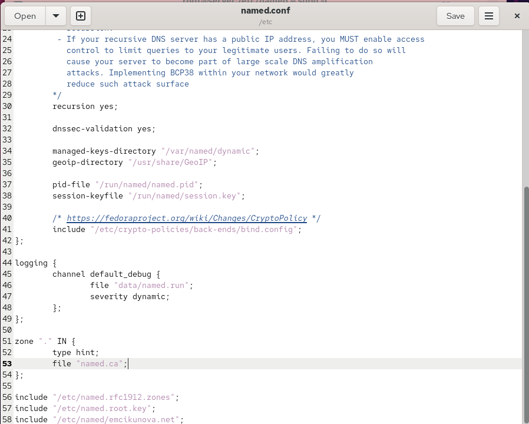
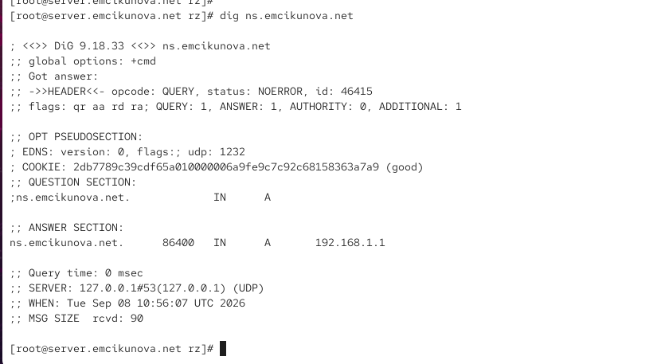
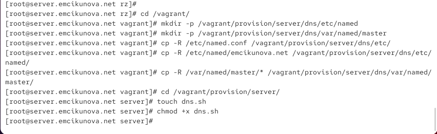
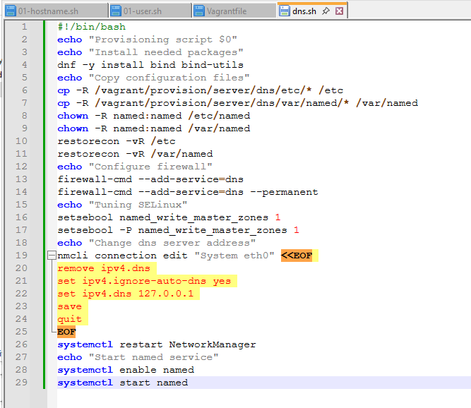

---
## Author
author:
  name: Цыкунова Екатерина Михайловна
  email: 1132246732@rudn.ru
  affiliation:
    - name: Российский университет дружбы народов
      country: Российская Федерация
      postal-code: 117198
      city: Москва
      address: ул. Миклухо-Маклая, д. 6

## Title
title: "Отчёт по лабораторной работе №2"
subtitle: "Настройка DNS-сервера"
license: "CC BY"
---

# Цель работы

Приобретение практических навыков по установке и конфигурированию DNS сервера, усвоение принципов работы системы доменных имён.

# Выполнение лабораторной работы

На виртуальной машине `server` устанавливаю DNS-сервер BIND и набор диагностических утилит командой `dnf -y install bind bind-utils`. После завершения установки выполняю первоначальную проверку разрешения доменных имён командой `dig www.yandex.ru` (см. рис. [@fig-001]).

В выводе утилиты `dig` строка `DiG 9.18.33` показывает используемую версию программы и имя, для которого выполняется запрос. В секции `HEADER` значение `opcode: QUERY` указывает на обычный DNS-запрос, а `status: NOERROR` означает, что запрос обработан без ошибок. Поле `QUERY: 1` показывает наличие одного запроса, `ANSWER: 3` — трёх записей в ответе, `AUTHORITY: 0` — отсутствие записей в секции авторитетных серверов, `ADDITIONAL: 1` — наличие дополнительной служебной записи. Флаги `qr rd ra` означают, что получено сообщение-ответ (`qr`), клиент запросил рекурсивное разрешение имени (`rd`), а используемый DNS-сервер поддерживает рекурсию (`ra`).

В секции `QUESTION SECTION` указано, что запрашивается запись типа `A` для имени `www.yandex.ru`. В `ANSWER SECTION` получены три IPv4-адреса: `5.255.255.77`, `77.88.55.88` и `77.88.44.55`. Значение `150` является временем жизни записей в кэше DNS в секундах. Строка `Query time: 7 msec` показывает время выполнения запроса, а `SERVER: 192.168.1.1#53` указывает, что на данном этапе запрос был отправлен DNS-серверу `192.168.1.1` на стандартный порт DNS `53`.

{ #fig-001 width=70% }

Для изучения текущей настройки разрешения имён просматриваю содержимое файла `/etc/resolv.conf`, а затем основной конфигурационный файл DNS-сервера `/etc/named.conf` (см. рис. [@fig-002]).

В файле `/etc/resolv.conf` строка `search emcikunova.net` задаёт домен поиска, который может автоматически добавляться к коротким именам узлов. Строка `nameserver 192.168.1.1` показывает, что до настройки локального DNS-сервера система использует DNS-сервер с адресом `192.168.1.1`.

Файл `/etc/named.conf` содержит основные настройки службы `named`. Директива `listen-on port 53 { 127.0.0.1; };` первоначально разрешает серверу принимать IPv4-запросы только через локальный интерфейс. Директива `listen-on-v6 port 53 { ::1; };` выполняет аналогичную настройку для IPv6. Параметр `directory "/var/named";` определяет рабочий каталог BIND. Директивы `dump-file`, `statistics-file`, `memstatistics-file`, `secroots-file` и `recursing-file` задают расположение служебных файлов сервера. Параметр `allow-query { localhost; };` первоначально разрешает DNS-запросы только от локального узла.

{ #fig-002 width=70% }

Далее просматриваю файл `/var/named/named.ca`, содержащий сведения о корневых DNS-серверах Интернета (см. рис. [@fig-003]). Этот файл необходим рекурсивному DNS-серверу для первоначального поиска серверов корневой зоны.

Начальные строки файла являются комментариями и содержат описание назначения файла, источник информации и дату последнего обновления. Далее располагаются записи для корневых серверов. Например, запись `NS A.ROOT-SERVERS.NET.` указывает имя одного из авторитетных серверов корневой зоны. Следующие за ней записи типа `A` и `AAAA` задают соответственно IPv4- и IPv6-адреса этого сервера. Аналогичным образом описываются `B.ROOT-SERVERS.NET.` и остальные корневые DNS-серверы. Большое значение TTL позволяет длительное время хранить эти данные в кэше.

{ #fig-003 width=70% }

Просматриваю стандартные файлы зон `/var/named/named.localhost` и `/var/named/named.loopback` (см. рис. [@fig-004]). Они используются в качестве шаблонов и описывают локальные DNS-записи.

В обоих файлах директива `$TTL 1D` устанавливает время жизни DNS-записей равным одному дню. Запись `SOA` определяет начало зоны и содержит основные параметры: серийный номер зоны, интервалы `refresh` и `retry`, время `expire` и минимальное время кэширования. Запись `NS @` указывает сервер имён текущей зоны.

В `named.localhost` запись типа `A` связывает локальное имя с IPv4-адресом `127.0.0.1`, а запись `AAAA` — с IPv6-адресом `::1`. Файл `named.loopback` дополнительно содержит запись `PTR localhost.`, используемую для обратного преобразования IP-адреса в DNS-имя.

{ #fig-004 width=70% }

Запускаю службу DNS-сервера командой `systemctl start named` и включаю её автоматический запуск при загрузке системы с помощью `systemctl enable named`. После этого непосредственно обращаюсь к локальному DNS-серверу командой `dig @127.0.0.1 www.yandex.ru` (см. рис. [@fig-005]).

Полученный ответ имеет статус `NOERROR`, а в секции `ANSWER SECTION` присутствуют три записи типа `A` для `www.yandex.ru`: `77.88.44.55`, `77.88.55.88` и `5.255.255.77`. Флаг `ra` подтверждает поддержку рекурсивных запросов. В отличие от первоначального запроса, в строке `SERVER` теперь указан адрес `127.0.0.1#53`, следовательно, запрос обрабатывается локально запущенной службой BIND. Время выполнения запроса составляет `74 msec`, что также подтверждает выполнение полноценного рекурсивного разрешения через локальный DNS-сервер.

{ #fig-005 width=70% }

Для использования локального BIND в качестве DNS-сервера по умолчанию изменяю параметры сетевого соединения `eth0` с помощью интерактивной команды `nmcli connection edit eth0`. Удаляю прежние DNS-настройки командой `remove ipv4.dns`, запрещаю получение DNS-сервера автоматически параметром `set ipv4.ignore-auto-dns yes` и задаю адрес локального DNS-сервера командой `set ipv4.dns 127.0.0.1`. После сохранения настроек перезапускаю `NetworkManager` и повторно просматриваю `/etc/resolv.conf` (см. рис. [@fig-006]).

В результате в файле появляется строка `nameserver 127.0.0.1`. Это означает, что теперь сама виртуальная машина `server` использует локальную службу BIND для разрешения DNS-имён.

{ #fig-006 width=70% }

Для возможности обработки запросов не только от самой виртуальной машины, но и от узлов внутренней сети изменяю файл `/etc/named.conf` (см. рис. [@fig-007]). В параметре `listen-on port 53` дополнительно указываю `any`, в результате чего сервер начинает прослушивать DNS-запросы не только на `127.0.0.1`, но и на остальных IPv4-интерфейсах.

В директиве `allow-query` помимо `localhost` разрешаю сеть `192.168.0.0/16`. Благодаря этому DNS-сервер может принимать запросы от узлов внутренней виртуальной сети. Параметр `recursion yes` оставляю включённым, поскольку на данном этапе сервер выполняет функции рекурсивного кэширующего DNS-сервера.

{ #fig-007 width=70% }

Разрешаю работу DNS через межсетевой экран командами `firewall-cmd --add-service=dns` и `firewall-cmd --add-service=dns --permanent`. Первая команда применяет правило к текущей конфигурации, а вторая сохраняет его для последующих загрузок системы (см. рис. [@fig-008]).

После этого выполняю `lsof | grep UDP`. В полученном выводе присутствуют процессы `named`, использующие `localhost:domain`, то есть UDP-порт службы DNS. Это подтверждает, что демон BIND запущен и прослушивает стандартный DNS-порт `53`.

{ #fig-008 width=70% }

Перехожу к настройке первичного DNS-сервера. Для подключения созданного описания зон в основном файле `/etc/named.conf` добавляю директиву `include "/etc/named/emcikunova.net";` (см. рис. [@fig-009]).

В этом же фрагменте конфигурации присутствует описание корневой зоны `zone "." IN`, для которой используется тип `hint` и файл `named.ca`. Таким образом, стандартная настройка корневых серверов сохраняется, а отдельный файл `emcikunova.net` подключается для описания собственной прямой и обратной зон.

{ #fig-009 width=70% }

В файле `/etc/named/emcikunova.net` формирую описание прямой и обратной DNS-зон (см. рис. [@fig-010]). Для прямой зоны `emcikunova.net` устанавливаю `type master`, поэтому данный сервер является первичным и содержит исходные данные зоны. В параметре `file` указываю файл `master/fz/emcikunova.net`, а `allow-update { none; };` запрещает динамическое изменение зоны.

Для обратного разрешения создаю зону `1.168.192.in-addr.arpa`. Она также имеет тип `master`, а данные зоны располагаются в файле `master/rz/192.168.1`. Таким образом, сервер получает возможность выполнять как преобразование доменного имени в IP-адрес, так и обратное преобразование IP-адреса в DNS-имя.

{ #fig-010 width=70% }

Создаю файл прямой зоны `/var/named/master/fz/emcikunova.net` (см. рис. [@fig-011]). Директива `$TTL 1D` задаёт время жизни записей равным одному дню.

В SOA-записи указываю сервер `server.emcikunova.net.` и серийный номер `2026090800`, сформированный в формате `ГГГГММДДВВ`. Значения `1D`, `1H`, `1W` и `3H` задают соответственно интервалы обновления, повторной попытки, срок устаревания зоны и минимальное время кэширования.

Запись `NS @` определяет сервер имён текущего домена, а запись `A 192.168.1.1` связывает имя зоны с IPv4-адресом сервера. Директивой `$ORIGIN emcikunova.net.` задаю домен, относительно которого интерпретируются последующие имена. Записи `server A 192.168.1.1` и `ns A 192.168.1.1` сопоставляют именам `server.emcikunova.net` и `ns.emcikunova.net` адрес `192.168.1.1`.

{ #fig-011 width=70% }

Аналогично создаю файл обратной зоны `/var/named/master/rz/192.168.1` (см. рис. [@fig-012]). В SOA-записи указываю `server.emcikunova.net.` и тот же серийный номер зоны.

Директива `$ORIGIN 1.168.192.in-addr.arpa.` задаёт пространство имён обратной зоны для сети `192.168.1.0/24`. PTR-записи связывают адрес `192.168.1.1` с именами `server.emcikunova.net.` и `ns.emcikunova.net.`. Благодаря этому DNS-сервер может выполнять обратное разрешение адреса `192.168.1.1`.

{ #fig-012 width=70% }

После создания файлов зон исправляю владельца каталогов `/etc/named` и `/var/named` командами `chown -R named:named`, чтобы служба `named` имела необходимые права доступа. Затем командами `restorecon -vR /etc` и `restorecon -vR /var/named` восстанавливаю корректные контексты безопасности SELinux (см. рис. [@fig-013]).

Проверяю связанные с BIND переключатели SELinux командой `getsebool -a | grep named`. В выводе видно, что `named_tcp_bind_http_port` отключён, а `named_write_master_zones` включён. После выполнения настройки перезапускаю DNS-сервер командой `systemctl restart named`, чтобы применить новую конфигурацию первичной зоны.

{ #fig-013 width=70% }

Проверяю созданную прямую DNS-зону командой `dig ns.emcikunova.net` (см. рис. [@fig-014]). Запрос завершается со статусом `NOERROR`, следовательно, сервер корректно обрабатывает имя собственной зоны.

В секции `QUESTION SECTION` запрашивается A-запись для `ns.emcikunova.net`. В секции `ANSWER SECTION` получен адрес `192.168.1.1`. Флаг `aa` в заголовке означает `Authoritative Answer`, то есть ответ является авторитетным и сформирован непосредственно первичным сервером данной зоны. Строка `SERVER: 127.0.0.1#53` подтверждает, что запрос был обработан локальным DNS-сервером.

{ #fig-014 width=70% }

Дополнительно анализирую работу прямой и обратной зон с помощью утилиты `host` (см. рис. [@fig-015]). Команда `host -l emcikunova.net` выводит содержимое зоны: сервер имён и A-записи для домена, узлов `ns` и `server`.

Команда `host -a emcikunova.net` выполняет расширенный запрос типа `ANY`. В ответе присутствуют SOA-запись, NS-запись и A-запись домена, что подтверждает корректность основных записей зоны. Команда `host -t A emcikunova.net` возвращает IPv4-адрес `192.168.1.1`.

Командой `host -t PTR 192.168.1.1` проверяю обратное разрешение. Сервер возвращает два имени — `ns.emcikunova.net` и `server.emcikunova.net`, что соответствует созданным PTR-записям. Таким образом, прямая и обратная зоны работают корректно.

{ #fig-015 width=70% }

Для автоматизации выполненной настройки перехожу в каталог `/vagrant` и создаю структуру `/vagrant/provision/server/dns`, предназначенную для хранения конфигурационных файлов DNS-сервера. В подкаталог `etc` копирую `/etc/named.conf` и файл описания зоны, а в структуру `var/named/master` — файлы прямой и обратной зон (см. рис. [@fig-016]).

После копирования конфигурации перехожу в `/vagrant/provision/server/`, создаю сценарий `dns.sh` командой `touch dns.sh` и устанавливаю для него право на выполнение командой `chmod +x dns.sh`. Такой сценарий позволяет автоматически воспроизводить настройку DNS-сервера при развёртывании виртуальной машины.

{ #fig-016 width=70% }

В сценарии `dns.sh` фиксирую действия, необходимые для автоматического развёртывания настроенного DNS-сервера (см. рис. [@fig-017]). Сначала устанавливаю пакеты `bind` и `bind-utils`, затем копирую подготовленные конфигурационные файлы из каталога `/vagrant/provision/server/dns` в `/etc` и `/var/named`.

После копирования назначаю каталогам владельца `named:named` и восстанавливаю контексты SELinux командами `restorecon`. Далее разрешаю службу DNS в `firewalld` как для текущего сеанса, так и на постоянной основе. Командами `setsebool` включаю возможность записи `named` в файлы мастер-зон.

В блоке настройки `nmcli` удаляю ранее заданные DNS-серверы, включаю `ipv4.ignore-auto-dns` и устанавливаю адрес `127.0.0.1`, после чего сохраняю конфигурацию сетевого соединения. Затем перезапускаю `NetworkManager`, включаю службу `named` в автозагрузку и запускаю её. В результате сценарий автоматизирует установку пакетов, копирование конфигурации, настройку прав доступа, SELinux, межсетевого экрана, DNS-параметров сетевого соединения и запуск BIND.

{ #fig-017 width=70% }

# Вывод

В результате выполнения работы на виртуальной машине `server` установлен и настроен DNS-сервер BIND. Первоначально сервер настроен в режиме кэширующего DNS-сервера, после чего для домена `emcikunova.net` созданы собственные прямая и обратная зоны. Проверки с использованием утилит `dig` и `host` показывают корректное разрешение имени `ns.emcikunova.net` в адрес `192.168.1.1`, получение записей собственной DNS-зоны и обратное преобразование адреса `192.168.1.1` в имена `server.emcikunova.net` и `ns.emcikunova.net`. Действия по развёртыванию конфигурации зафиксированы в сценарии `dns.sh`, что позволяет автоматизировать настройку DNS-сервера во внутреннем окружении Vagrant.

# Контрольные вопросы

*1. Что такое DNS?*

DNS (Domain Name System) — распределённая иерархическая система доменных имён, предназначенная для преобразования удобных для человека доменных имён в IP-адреса и обратно.

Например, DNS позволяет определить IP-адрес узла `server.emcikunova.net` по его имени либо определить доменное имя по известному IP-адресу. Также DNS хранит дополнительную информацию о доменах: адреса почтовых серверов, серверов имён, псевдонимы и другие данные.

*2. Каково назначение кэширующего DNS-сервера?*

Кэширующий DNS-сервер выполняет DNS-запросы от клиентов и сохраняет полученные ответы в локальном кэше на время, определяемое параметром TTL.

При повторном запросе тех же данных сервер может вернуть сохранённый результат без повторного обращения к внешним DNS-серверам. Это уменьшает время обработки запросов, снижает сетевой трафик и нагрузку на вышестоящие DNS-серверы.

*3. Чем отличается прямая DNS-зона от обратной?*

Прямая DNS-зона используется для преобразования доменного имени в IP-адрес. Обычно для этого применяются записи типа `A` для IPv4 и `AAAA` для IPv6.

Например:

`server.emcikunova.net -> 192.168.1.1`

Обратная DNS-зона используется для преобразования IP-адреса в доменное имя. Для этого применяются записи типа `PTR`.

Например:

`192.168.1.1 -> server.emcikunova.net`

*4. В каких каталогах и файлах располагаются настройки DNS-сервера? Кратко охарактеризуйте, за что они отвечают.*

Основным конфигурационным файлом BIND является `/etc/named.conf`. В нём задаются общие параметры DNS-сервера, интерфейсы и порты прослушивания, разрешённые клиенты, параметры рекурсии и подключаются файлы описания зон.

Дополнительные описания зон могут располагаться в каталоге `/etc/named/`. Например, в лабораторной работе используется файл `/etc/named/emcikunova.net`.

Основные файлы данных DNS располагаются в каталоге `/var/named`. В частности:

- `/var/named/named.ca` — информация о корневых DNS-серверах;
- `/var/named/named.localhost` — стандартная зона localhost;
- `/var/named/named.loopback` — стандартная обратная зона loopback;
- `/var/named/master/fz/` — файлы прямых зон;
- `/var/named/master/rz/` — файлы обратных зон.

Файл `/etc/resolv.conf` относится к настройке DNS-клиента и определяет DNS-серверы, которые система использует для разрешения имён.

*5. Что указывается в файле resolv.conf?*

Файл `/etc/resolv.conf` содержит параметры работы системного DNS-клиента.

Основные директивы:

- `nameserver` — IP-адрес используемого DNS-сервера;
- `search` — список доменов, автоматически добавляемых при разрешении коротких имён;
- `domain` — домен локального узла;
- `options` — дополнительные параметры DNS-разрешения.

Например:

`nameserver 127.0.0.1`

означает, что в качестве DNS-сервера используется локальный узел.

*6. Какие типы записи описания ресурсов есть в DNS и для чего они используются?*

Наиболее распространённые типы ресурсных записей DNS:

- `A` — связывает доменное имя с IPv4-адресом;
- `AAAA` — связывает доменное имя с IPv6-адресом;
- `PTR` — используется для обратного преобразования IP-адреса в доменное имя;
- `NS` — указывает авторитетный сервер имён для зоны;
- `SOA` — содержит основную служебную информацию о DNS-зоне;
- `MX` — указывает почтовый сервер домена;
- `CNAME` — создаёт псевдоним для другого доменного имени;
- `TXT` — содержит произвольную текстовую информацию и используется, например, в SPF, DKIM и для подтверждения владения доменом;
- `SRV` — содержит информацию о расположении определённой сетевой службы;
- `CAA` — определяет центры сертификации, которым разрешено выпускать TLS-сертификаты для домена.

*7. Для чего используется домен in-addr.arpa?*

Домен `in-addr.arpa` используется для обратного разрешения IPv4-адресов, то есть преобразования IP-адреса в доменное имя.

Октеты IPv4-адреса записываются в обратном порядке. Например, для сети `192.168.1.0/24` используется зона:

`1.168.192.in-addr.arpa`

Для сопоставления адреса с доменным именем в такой зоне применяются записи `PTR`.

*8. Для чего нужен демон named?*

`named` — основной демон DNS-сервера BIND. Он принимает и обрабатывает DNS-запросы клиентов.

В зависимости от конфигурации `named` может выполнять функции кэширующего, рекурсивного, авторитетного первичного или вторичного DNS-сервера. Обычно он принимает DNS-запросы по порту `53` по протоколам UDP и TCP.

*9. В чём заключаются основные функции slave-сервера и master-сервера?*

`master`-сервер является первичным авторитетным DNS-сервером зоны. На нём располагается основной файл зоны, в который непосредственно вносятся изменения.

`slave`-сервер является вторичным авторитетным сервером. Он получает копию зоны с `master`-сервера с помощью механизма передачи зон `AXFR` или `IXFR`.

Slave-сервер обеспечивает резервирование DNS и уменьшает нагрузку на основной сервер. Если master-сервер становится недоступен, slave-сервер некоторое время продолжает отвечать на авторитетные запросы.

*10. Какие параметры отвечают за время обновления зоны?*

Временные параметры зоны указываются в записи `SOA`.

Основные параметры:

- `serial` — серийный номер версии зоны;
- `refresh` — через какой интервал slave-сервер должен проверить наличие новой версии зоны;
- `retry` — через какое время повторить попытку, если master-сервер оказался недоступен;
- `expire` — через какое время slave-сервер перестаёт считать данные зоны действительными, если связь с master-сервером отсутствует;
- `minimum` — минимальное время кэширования отрицательных DNS-ответов.

Дополнительно для записей зоны используется параметр `TTL`, определяющий время хранения DNS-записи в кэше.

*11. Как обеспечить защиту зоны от скачивания и просмотра?*

Для защиты зоны необходимо ограничить возможность выполнения передачи зоны `AXFR` и `IXFR`.

В конфигурации BIND для полного запрещения передачи зоны можно указать:

`allow-transfer { none; };`

Если существует slave-сервер, передачу зоны следует разрешить только его IP-адресу:

`allow-transfer { 192.168.1.2; };`

Для дополнительной защиты передачи зон могут использоваться ключи `TSIG`, позволяющие аутентифицировать DNS-серверы.

*12. Какая запись RR применяется при создании почтовых серверов?*

Для определения почтового сервера домена применяется ресурсная запись `MX` (Mail Exchange).

Например:

`emcikunova.net. IN MX 10 mail.emcikunova.net.`

Числовое значение является приоритетом почтового сервера. Чем меньше число, тем выше приоритет.

*13. Как протестировать работу сервера доменных имён?*

Для проверки DNS-сервера можно использовать утилиты `dig`, `host` и `nslookup`.

Например:

`dig emcikunova.net`

проверяет разрешение доменного имени.

`dig @127.0.0.1 emcikunova.net`

отправляет запрос конкретному DNS-серверу.

`host -t A emcikunova.net`

проверяет A-запись.

`host -t PTR 192.168.1.1`

проверяет обратную PTR-запись.

Для проверки конфигурации BIND также применяются:

`named-checkconf`

и

`named-checkzone emcikunova.net /var/named/master/fz/emcikunova.net`.

*14. Как запустить, перезапустить или остановить какую-либо службу в системе?*

В системах с `systemd` управление службами выполняется командой `systemctl`.

Запуск службы:

`systemctl start named`

Перезапуск:

`systemctl restart named`

Остановка:

`systemctl stop named`

Просмотр состояния:

`systemctl status named`

Включение автоматического запуска:

`systemctl enable named`

Отключение автоматического запуска:

`systemctl disable named`.

*15. Как посмотреть отладочную информацию при запуске какого-либо сервиса или службы?*

Состояние службы и последние сообщения можно посмотреть командой:

`systemctl status named`

Более подробные записи журнала конкретной службы можно получить командой:

`journalctl -u named`

Для просмотра подробной информации об ошибках используется:

`journalctl -xeu named`

Для наблюдения за сообщениями в реальном времени можно выполнить:

`journalctl -x -f`.

*16. Где хранится отладочная информация по работе системы и служб? Как её посмотреть?*

В современных системах с `systemd` сообщения служб и системы сохраняются в системном журнале `systemd-journald`.

Для их просмотра применяется команда:

`journalctl`

Для просмотра сообщений конкретной службы:

`journalctl -u named`

Для просмотра сообщений в режиме реального времени:

`journalctl -f`

Кроме системного журнала, отдельные программы могут записывать данные в файлы каталога `/var/log`, например `/var/log/messages`, `/var/log/secure` и другие файлы журналов.

*17. Как посмотреть, какие файлы использует в своей работе тот или иной процесс? Приведите несколько примеров.*

Для просмотра открытых процессами файлов применяется команда `lsof`.

Например, просмотр файлов и сетевых ресурсов процесса `named`:

`lsof -c named`

Просмотр ресурсов конкретного процесса по его PID:

`lsof -p 16196`

Просмотр процессов, использующих определённый файл:

`lsof /etc/named.conf`

Для просмотра процессов, использующих UDP-соединения:

`lsof | grep UDP`

Также информацию об открытых файловых дескрипторах процесса можно получить через каталог `/proc`:

`ls -l /proc/PID/fd`

*18. Приведите несколько примеров по изменению сетевого соединения при помощи командного интерфейса nmcli.*

Просмотреть существующие соединения:

`nmcli connection show`

Просмотреть состояние сетевых интерфейсов:

`nmcli device status`

Установить статический IPv4-адрес:

`nmcli connection modify eth0 ipv4.addresses 192.168.1.10/24`

Установить шлюз:

`nmcli connection modify eth0 ipv4.gateway 192.168.1.1`

Установить DNS-сервер:

`nmcli connection modify eth0 ipv4.dns 127.0.0.1`

Отключить автоматическое получение DNS:

`nmcli connection modify eth0 ipv4.ignore-auto-dns yes`

Удалить ранее заданный DNS:

`nmcli connection modify eth0 -ipv4.dns 192.168.1.1`

Перезапустить соединение:

`nmcli connection down eth0`

`nmcli connection up eth0`

Также соединение можно изменять в интерактивном режиме:

`nmcli connection edit eth0`

*19. Что такое SELinux?*

SELinux (Security-Enhanced Linux) — система принудительного контроля доступа в Linux.

SELinux дополняет стандартную систему прав Linux и позволяет ограничивать действия процессов даже в тех случаях, когда обычные права пользователя разрешают выполнение операции.

Основная задача SELinux — уменьшить последствия компрометации служб и предотвратить несанкционированный доступ процессов к файлам, портам и другим системным ресурсам.

*20. Что такое контекст (метка) SELinux?*

Контекст SELinux — специальная метка безопасности, назначаемая файлам, каталогам, процессам, портам и другим объектам системы.

Контекст обычно имеет вид:

`user:role:type:level`

Например:

`system_u:object_r:named_zone_t:s0`

Особенно важной частью является `type`. SELinux использует тип объекта и тип процесса для определения того, разрешено ли процессу выполнять определённые операции над объектом.

*21. Как восстановить контекст SELinux после внесения изменений в конфигурационные файлы?*

Для восстановления стандартного контекста SELinux используется команда `restorecon`.

Например:

`restorecon -v /etc/named.conf`

Для рекурсивного восстановления контекстов каталога:

`restorecon -vR /etc/named`

или:

`restorecon -vR /var/named`

Команда назначает объектам контексты, соответствующие установленной политике SELinux.

*22. Как создать разрешающие правила политики SELinux из файлов журналов, содержащих сообщения о запрете операций?*

Сообщения о запретах SELinux обычно фиксируются системой аудита. Найти сообщения `AVC` можно командой:

`ausearch -m AVC -ts recent`

На основе сообщений журнала можно создать модуль политики с помощью `audit2allow`:

`ausearch -m AVC -ts recent | audit2allow -M mypolicy`

В результате создаются файлы модуля политики. Установить созданный модуль можно командой:

`semodule -i mypolicy.pp`

Перед созданием разрешающего правила необходимо проверить причину запрета, поскольку автоматическое разрешение всех запрещённых операций может снизить безопасность системы.

*23. Что такое булевый переключатель в SELinux?*

Булевый переключатель SELinux — параметр, позволяющий включать или отключать определённое поведение политики SELinux без изменения и перекомпиляции самой политики.

Например, переключатель:

`named_write_master_zones`

определяет, разрешено ли процессу `named` выполнять запись в файлы мастер-зон DNS.

*24. Как посмотреть список переключателей SELinux и их состояние?*

Для просмотра всех булевых переключателей SELinux используется команда:

`getsebool -a`

Для поиска переключателей, относящихся к определённой службе, можно использовать:

`getsebool -a | grep named`

Также подробный список переключателей можно получить командой:

`semanage boolean -l`

Она отображает имя переключателя, его текущее и стандартное состояние, а также краткое описание.

*25. Как изменить значение переключателя SELinux?*

Для изменения булевого переключателя применяется команда `setsebool`.

Например, временно включить разрешение на запись BIND в мастер-зоны можно командой:

`setsebool named_write_master_zones on`

или:

`setsebool named_write_master_zones 1`

Такое изменение действует до перезагрузки системы.

Для постоянного изменения используется параметр `-P`:

`setsebool -P named_write_master_zones on`

В этом случае новое значение сохраняется и после перезагрузки операционной системы.