---
## Author
author:
  name: Цыкунова Екатерина Михайловна
  email: 1132246732@rudn.ru
  affiliation:
    - name: Российский университет дружбы народов
      country: Российская Федерация
      postal-code: 117198
      city: Москва
      address: ул. Миклухо-Маклая, д. 6

## Title
title: Лабораторная работа №3
subtitle: Настройка DHCP-сервера
license: CC BY
date: today
date-format: "YYYY-MM-DD"
---

# Цели и задачи работы

## Цель лабораторной работы

Целью данной работы является приобретение практических навыков установки, настройки и проверки работы DHCP-сервера Kea на виртуальной машине `server`.

## Задачи лабораторной работы

- установить DHCP-сервер Kea;
- настроить DHCP для внутренней сети `192.168.1.0/24`;
- задать пул выдаваемых адресов;
- проверить получение адреса клиентом;
- настроить динамическое обновление DNS-зоны;
- проверить DNS-запись клиента с помощью `dig`;
- подготовить сценарий автоматической настройки DHCP-сервера для Vagrant.

# Процесс выполнения лабораторной работы

## Устанавливаю DHCP-сервер Kea

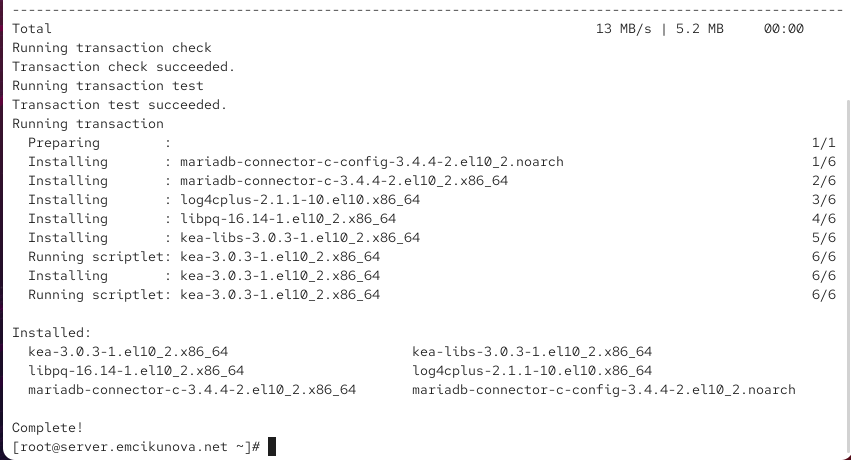{ #fig:001 width=70% height=70% }

## Настраиваю DNS-параметры DHCP

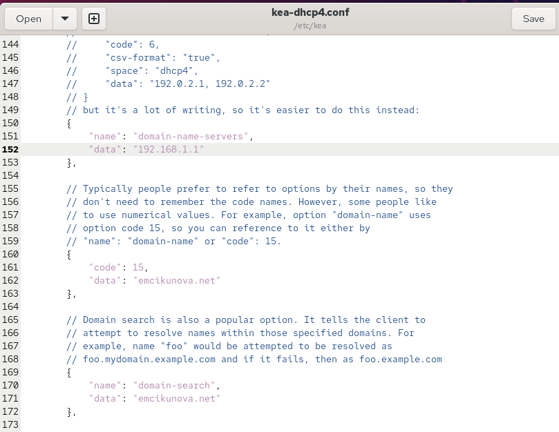{ #fig:002 width=70% height=70% }

## Задаю DHCP-подсеть и пул адресов

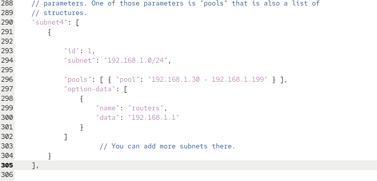{ #fig:003 width=70% height=70% }

## Привязываю DHCP к интерфейсу eth1

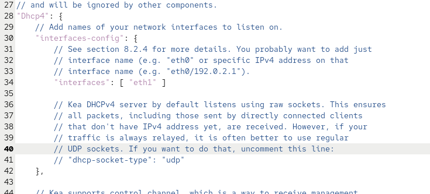{ #fig:004 width=70% height=70% }

## Добавляю DHCP-сервер в обратную DNS-зону

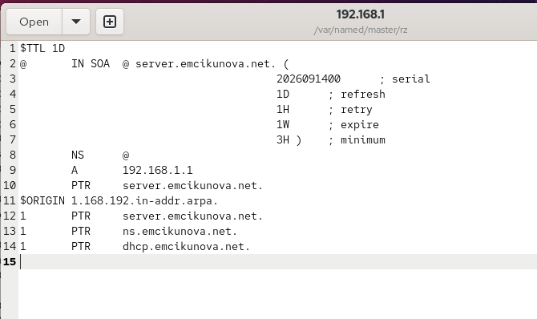{ #fig:005 width=70% height=70% }

## Проверяю доступность DHCP-сервера по имени

{ #fig:006 width=70% height=70% }

## Настраиваю firewalld и запускаю DHCP

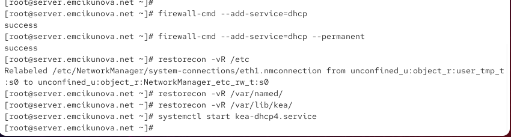{ #fig:007 width=70% height=70% }

## Создаю скрипт маршрутизации клиента

{ #fig:008 width=70% height=70% }

## Проверяю сетевые интерфейсы клиента

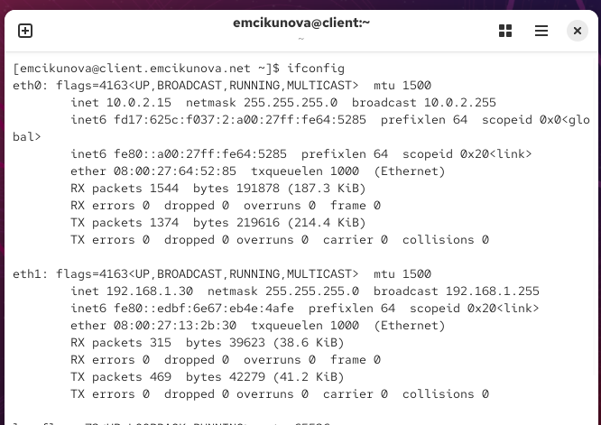{ #fig:009 width=70% height=70% }

## Анализирую файл DHCP-аренд

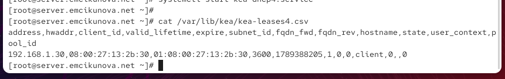{ #fig:010 width=70% height=70% }

## Создаю TSIG-ключ для DDNS

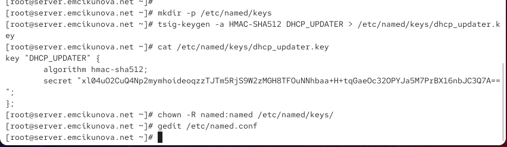{ #fig:011 width=70% height=70% }

## Разрешаю обновление DNS-зон

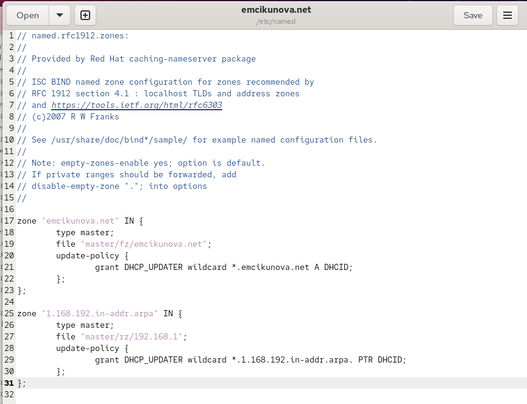{ #fig:012 width=70% height=70% }

## Создаю ключ Kea в формате JSON

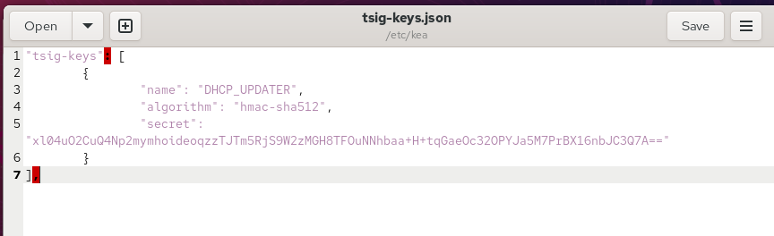{ #fig:013 width=70% height=70% }

## Настраиваю Kea DHCP-DDNS

{ #fig:014 width=70% height=70% }

## Проверяю и запускаю службу DHCP-DDNS

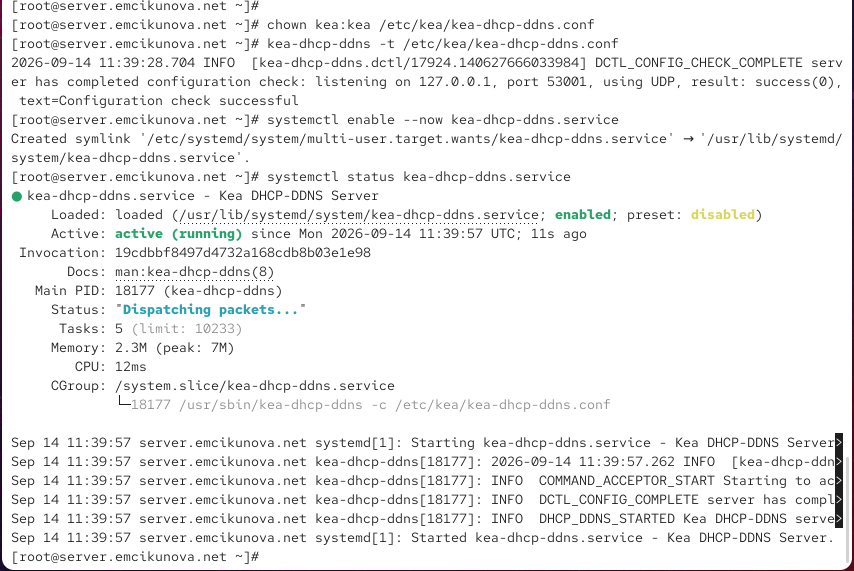{ #fig:015 width=70% height=70% }

## Включаю DDNS в DHCPv4

{ #fig:016 width=70% height=70% }

## Перезапускаю DHCPv4-сервер

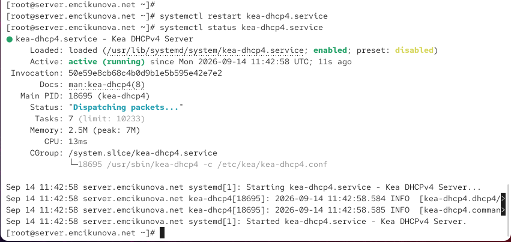{ #fig:017 width=70% height=70% }

## Проверяю DNS-запись клиента

{ #fig:018 width=70% height=70% }

## Копирую конфигурацию для Vagrant

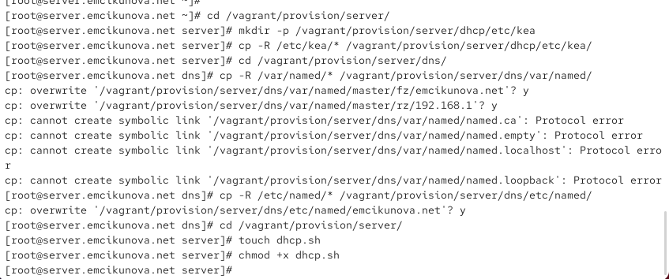{ #fig:019 width=70% height=70% }

## Создаю сценарий автоматической настройки

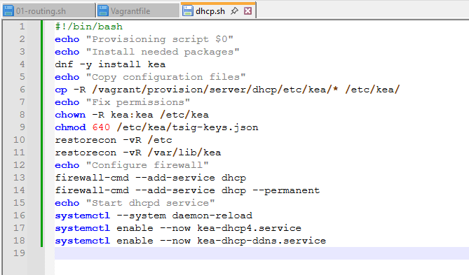{ #fig:020 width=70% height=70% }

## Вывод

В ходе лабораторной работы был установлен и настроен DHCP-сервер Kea на виртуальной машине `server`.

Для внутренней сети `192.168.1.0/24` был задан пул адресов `192.168.1.30–192.168.1.199`, а клиентская машина получила адрес `192.168.1.30` через DHCP.

Дополнительно было настроено динамическое обновление DNS-зоны с использованием Kea DHCP-DDNS и TSIG-ключа `DHCP_UPDATER`.

Работа DHCP и DDNS была проверена с помощью утилит `ifconfig`, `ping`, `cat` и `dig`. Также был подготовлен сценарий `dhcp.sh`, автоматизирующий установку и настройку DHCP-сервера во внутреннем окружении Vagrant.
