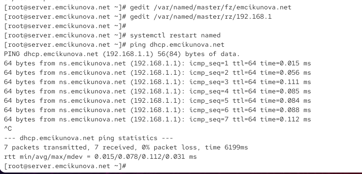
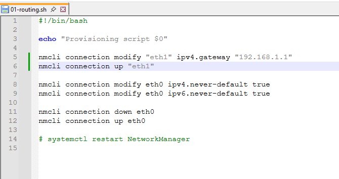
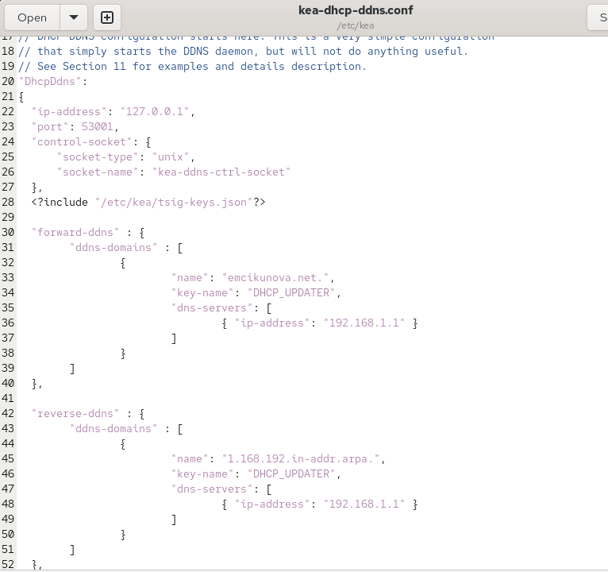
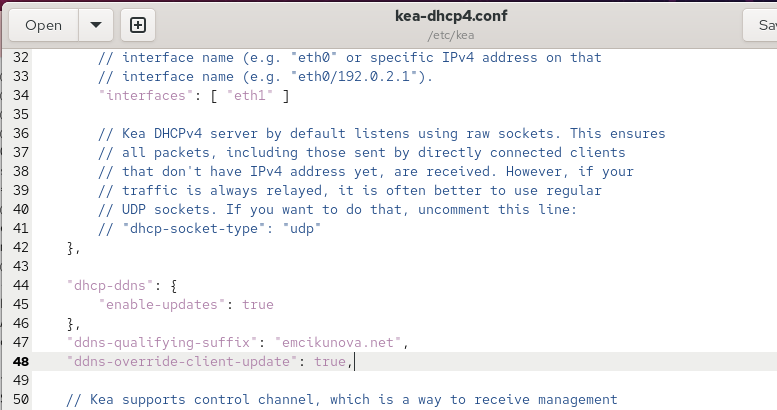
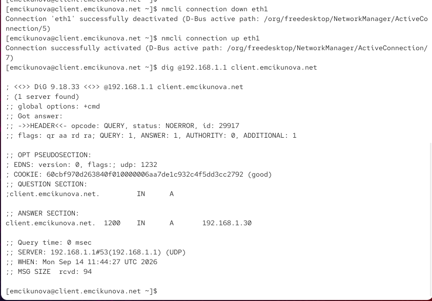

---
## Author
author:
  name: Цыкунова Екатерина Михайловна
  email: 1132246732@rudn.ru
  affiliation:
    - name: Российский университет дружбы народов
      country: Российская Федерация
      postal-code: 117198
      city: Москва
      address: ул. Миклухо-Маклая, д. 6

## Title
title: "Отчёт по лабораторной работе №3"
subtitle: "Настройка DHCP-сервера"
license: "CC BY"
---

# Цель работы

Приобретение практических навыков по установке и конфигурированию DHCP сервера.

# Выполнение лабораторной работы

На виртуальной машине `server` перехожу в режим суперпользователя и устанавливаю DHCP-сервер Kea командой `dnf -y install kea` (см. рис. [@fig-001]).

В процессе установки менеджер пакетов выполняет проверку транзакции и устанавливает основной пакет `kea-3.0.3-1.el10_2.x86_64`, библиотеку `kea-libs`, а также необходимые зависимости, в том числе `libpq`, `log4cplus` и компоненты MariaDB Connector/C. Строки `Transaction check succeeded` и `Transaction test succeeded` показывают успешное прохождение предварительных проверок. Сообщение `Complete!` подтверждает завершение установки без ошибок. После установки в системе становятся доступны службы DHCPv4 и DHCP-DDNS, которые будут использоваться далее.

{ #fig-001 width=70% }

Перед изменением настроек сохраняю резервную копию исходного конфигурационного файла командой `cp /etc/kea/kea-dhcp4.conf /etc/kea/kea-dhcp4.conf__$(date -I)`. Затем открываю `/etc/kea/kea-dhcp4.conf` и задаю параметры DNS, которые DHCP-сервер должен передавать клиентам (см. рис. [@fig-002]).

В параметре `domain-name-servers` указываю значение `192.168.1.1`. Это адрес виртуальной машины `server`, на которой уже работает настроенный DNS-сервер BIND. В результате DHCP-клиенты внутренней сети будут использовать `192.168.1.1` для разрешения доменных имён.

Для DHCP-опции с кодом `15`, соответствующей имени домена, задаю значение `emcikunova.net`. Параметр `domain-search` также получает значение `emcikunova.net`. Первая настройка передаёт клиенту основное доменное имя, а вторая задаёт домен поиска. При обращении к узлу по короткому имени система клиента сможет дополнять его суффиксом `emcikunova.net`.

{ #fig-002 width=70% }

В этом же файле настраиваю IPv4-подсеть, из которой DHCP-сервер будет выдавать адреса клиентам внутренней виртуальной сети (см. рис. [@fig-003]).

В блоке `subnet4` задаю идентификатор подсети `"id": 1` и сеть `"subnet": "192.168.1.0/24"`. Префикс `/24` соответствует маске `255.255.255.0`, поэтому адрес сети равен `192.168.1.0`, а широковещательный адрес — `192.168.1.255`.

В параметре `pools` задаю диапазон `"192.168.1.30 - 192.168.1.199"`. Адреса из этого диапазона Kea может динамически передавать клиентским узлам. Нижний адрес диапазона `192.168.1.30` впоследствии получает виртуальная машина `client`.

В блоке `option-data` параметр `routers` получает значение `192.168.1.1`. Этот адрес передаётся DHCP-клиенту в качестве шлюза по умолчанию. Поскольку адрес `192.168.1.1` принадлежит внутреннему интерфейсу сервера, клиент сможет направлять через него трафик, предназначенный для других сетей.

{ #fig-003 width=70% }

Далее привязываю DHCPv4-сервер к интерфейсу внутренней сети `eth1` (см. рис. [@fig-004]). Для этого в секции `interfaces-config` указываю `"interfaces": [ "eth1" ]`.

Ограничение интерфейса необходимо, чтобы DHCP-служба обслуживала именно внутреннюю виртуальную сеть и не принимала DHCP-запросы через интерфейс `eth0`, который используется виртуальной машиной для внешнего сетевого подключения.

После редактирования проверяю синтаксис конфигурации командой `kea-dhcp4 -t /etc/kea/kea-dhcp4.conf`. Затем выполняю `systemctl --system daemon-reload` и разрешаю автоматический запуск сервера командой `systemctl enable kea-dhcp4.service`.

{ #fig-004 width=70% }

Для обращения к DHCP-серверу по доменному имени добавляю DNS-записи. В файл прямой зоны `/var/named/master/fz/emcikunova.net` вношу запись `dhcp A 192.168.1.1`, связывающую имя `dhcp.emcikunova.net` с IPv4-адресом сервера.

В файл обратной зоны `/var/named/master/rz/192.168.1` добавляю запись `1 PTR dhcp.emcikunova.net.` (см. рис. [@fig-005]). Она связывает адрес `192.168.1.1` с доменным именем DHCP-сервера при выполнении обратного DNS-разрешения.

В начале файла установлено `$TTL 1D`, поэтому стандартное время жизни записей зоны составляет один день. В SOA-записи серийный номер изменён на `2026091400`. Первые восемь цифр соответствуют дате `2026-09-14`, а последние две позволяют последовательно увеличивать версию зоны при нескольких изменениях за один день.

В зоне также присутствуют PTR-записи `server.emcikunova.net.`, `ns.emcikunova.net.` и добавленная `dhcp.emcikunova.net.` для адреса с последним октетом `1`.

{ #fig-005 width=70% }

После изменения файлов зон перезапускаю DNS-сервер командой `systemctl restart named` и проверяю разрешение нового имени командой `ping dhcp.emcikunova.net` (см. рис. [@fig-006]).

Утилита `ping` успешно преобразует имя `dhcp.emcikunova.net` в адрес `192.168.1.1`. В ответах отображается имя `ns.emcikunova.net`, которое также связано с адресом `192.168.1.1` в обратной зоне. Для каждого ICMP-пакета получен ответ с `ttl=64`. Всего передано и принято по 7 пакетов, а значение `0% packet loss` подтверждает отсутствие потерь.

Среднее время прохождения пакета составляет `0.078 ms`, минимальное — `0.015 ms`, максимальное — `0.112 ms`. Успешное разрешение имени и получение ICMP-ответов подтверждают доступность сервера по внутренней сети и корректную обработку созданной DNS-записи.

{ #fig-006 width=70% }

Далее разрешаю DHCP-трафик в межсетевом экране. Командой `firewall-cmd --add-service=dhcp` добавляю разрешение в текущую конфигурацию `firewalld`, а командой `firewall-cmd --add-service=dhcp --permanent` сохраняю его для последующих запусков системы (см. рис. [@fig-007]). В обоих случаях выводится `success`, что подтверждает успешное изменение правил.

После этого восстанавливаю корректные контексты SELinux командами `restorecon -vR /etc`, `restorecon -vR /var/named/` и `restorecon -vR /var/lib/kea/`. В выводе видно, что для файла `/etc/NetworkManager/system-connections/eth1.nmconnection` контекст изменяется с `user_tmp_t` на предназначенный для конфигурации NetworkManager контекст `NetworkManager_etc_rw_t`. Для каталогов `/var/named` и `/var/lib/kea` дополнительных сообщений нет, что означает отсутствие объектов, требующих заметного изменения контекста.

После подготовки межсетевого экрана и SELinux запускаю DHCPv4-сервер командой `systemctl start kea-dhcp4.service`. Команда завершается без сообщения об ошибке.

{ #fig-007 width=70% }

Для подготовки виртуальной машины `client` создаю скрипт `01-routing.sh`, изменяющий её маршрутизацию (см. рис. [@fig-008]).

Строка `#!/bin/bash` определяет интерпретатор скрипта. Команда `echo "Provisioning script $0"` выводит имя выполняемого файла и позволяет видеть запуск provisioning-сценария в журнале Vagrant.

Командой `nmcli connection modify "eth1" ipv4.gateway "192.168.1.1"` устанавливаю для соединения `eth1` шлюз `192.168.1.1`, после чего `nmcli connection up "eth1"` активирует соединение с обновлёнными параметрами.

Для интерфейса `eth0` устанавливаю параметры `ipv4.never-default true` и `ipv6.never-default true`. Они запрещают NetworkManager создавать маршрут по умолчанию через `eth0` как для IPv4, так и для IPv6. Команды `nmcli connection down eth0` и `nmcli connection up eth0` повторно активируют соединение, чтобы изменения вступили в силу. В результате основной маршрут клиента должен проходить через внутренний интерфейс `eth1` и сервер `192.168.1.1`.

В конфигурацию клиента в `Vagrantfile` подключаю созданный скрипт:

```ruby
client.vm.provision "client routing",
  type: "shell",
  preserve_order: true,
  run: "always",
  path: "provision/client/01-routing.sh"
```

После сохранения изменений запускаю provisioning клиента.

{ #fig-008 width=70% }

После запуска виртуальной машины `client` выполняю команду `ifconfig` и анализирую состояние сетевых интерфейсов (см. рис. [@fig-009]).

Для `eth0` установлены флаги `UP`, `BROADCAST`, `RUNNING` и `MULTICAST`. Флаг `UP` показывает, что интерфейс включён, `RUNNING` — что он находится в рабочем состоянии, `BROADCAST` обозначает поддержку широковещательной передачи, а `MULTICAST` — групповой передачи. Значение `mtu 1500` задаёт максимальный размер IP-пакета без фрагментации на уровне интерфейса.

Интерфейс `eth0` имеет IPv4-адрес `10.0.2.15`, маску `255.255.255.0` и широковещательный адрес `10.0.2.255`. Этот интерфейс относится к внешней сети виртуальной машины. Строка `ether 08:00:27:64:52:85` содержит его MAC-адрес. В статистике указано `RX packets 1544` и `TX packets 1374`, то есть через интерфейс уже выполнялся обмен данными. Значения `errors 0`, `dropped 0`, `overruns 0` и `collisions 0` показывают отсутствие зарегистрированных ошибок передачи.

Интерфейс `eth1` также находится в состояниях `UP` и `RUNNING`. DHCP-сервер выдал ему IPv4-адрес `192.168.1.30`, маску `255.255.255.0` и широковещательный адрес `192.168.1.255`. Адрес `192.168.1.30` является первым адресом настроенного ранее пула `192.168.1.30 - 192.168.1.199`, поэтому результат соответствует конфигурации Kea.

MAC-адрес `eth1` равен `08:00:27:13:2b:30`. В статистике интерфейса присутствует `RX packets 315` и `TX packets 469`. Для приёма и передачи также указано по нулю ошибок и отброшенных пакетов. Получение адреса `192.168.1.30` на `eth1` подтверждает работоспособность DHCP-сервера во внутренней виртуальной сети.

{ #fig-009 width=70% }

На виртуальной машине `server` просматриваю базу выданных IPv4-аренд Kea командой `cat /var/lib/kea/kea-leases4.csv` (см. рис. [@fig-010]).

Первая строка содержит названия полей CSV-файла: `address`, `hwaddr`, `client_id`, `valid_lifetime`, `expire`, `subnet_id`, `fqdn_fwd`, `fqdn_rev`, `hostname`, `state`, `user_context` и `pool_id`.

В записи клиента поле `address` содержит `192.168.1.30` — выданный IPv4-адрес. Поле `hwaddr` равно `08:00:27:13:2b:30` и совпадает с MAC-адресом `eth1`, отображённым командой `ifconfig`. Это позволяет однозначно сопоставить запись аренды с интерфейсом клиента.

Значение `client_id` содержит идентификатор DHCP-клиента, сформированный на основе аппаратного адреса. Поле `valid_lifetime` имеет значение `3600`, следовательно, срок действия аренды составляет 3600 секунд, то есть один час. Поле `expire` хранит момент окончания аренды в формате Unix time.

Значение `subnet_id` равно `1`, что соответствует идентификатору подсети, заданному ранее в `kea-dhcp4.conf`. Поля `fqdn_fwd` и `fqdn_rev` на этом этапе имеют значения `0`, поскольку динамическое обновление DNS ещё не настроено. В поле `hostname` записано имя `client`.

Поле `state` имеет значение `0`, соответствующее обычному состоянию действующей аренды. `user_context` не заполнено, поскольку дополнительный пользовательский контекст для аренды не задавался. Значение `pool_id` равно `0`, так как отдельный идентификатор пула в используемой конфигурации не назначался.

Совпадение адреса и MAC-адреса между `ifconfig` на клиенте и `kea-leases4.csv` на сервере подтверждает, что адрес `192.168.1.30` действительно был выдан сервером Kea.

{ #fig-010 width=70% }

Следующим этапом настраиваю динамическое обновление DNS-зоны при появлении новых DHCP-клиентов. Для безопасной передачи обновлений между Kea и BIND создаю TSIG-ключ (см. рис. [@fig-011]).

Командой `mkdir -p /etc/named/keys` создаю каталог для хранения ключей. Затем выполняю `tsig-keygen -a HMAC-SHA512 DHCP_UPDATER > /etc/named/keys/dhcp_updater.key`. Утилита создаёт ключ с именем `DHCP_UPDATER` и алгоритмом `hmac-sha512`, а результат перенаправляется в файл `/etc/named/keys/dhcp_updater.key`.

Командой `cat` проверяю содержимое созданного файла. В нём присутствуют параметры `algorithm hmac-sha512` и `secret`. Значение `secret` представляет сгенерированный секретный ключ, который должен совпадать в настройках BIND и Kea. Сам секрет в тексте отчёта не дублирую.

Командой `chown -R named:named /etc/named/keys/` назначаю владельцем каталога пользователя и группу `named`, после чего открываю `/etc/named.conf` для подключения ключа директивой `include "/etc/named/keys/dhcp_updater.key";`.

{ #fig-011 width=70% }

После подключения ключа изменяю описание DNS-зон в файле `/etc/named/emcikunova.net` и разрешаю обновления, подписанные ключом `DHCP_UPDATER` (см. рис. [@fig-012]).

Для прямой зоны `emcikunova.net` сохраняю тип `master` и файл `master/fz/emcikunova.net`. В секции `update-policy` добавляю правило `grant DHCP_UPDATER wildcard *.emcikunova.net A DHCID;`. Оно разрешает владельцу ключа `DHCP_UPDATER` динамически изменять записи типов `A` и `DHCID` для имён внутри зоны `emcikunova.net`.

Для обратной зоны `1.168.192.in-addr.arpa` используется файл `master/rz/192.168.1`. Правило `grant DHCP_UPDATER wildcard *.1.168.192.in-addr.arpa. PTR DHCID;` разрешает создание и изменение PTR-записей и связанных DHCID-записей.

Записи `A` используются для преобразования доменного имени в IPv4-адрес, `PTR` — для обратного преобразования адреса в имя, а `DHCID` помогает DHCP/DDNS-механизму связывать динамическую DNS-запись с конкретным DHCP-клиентом и уменьшать вероятность конфликтующих обновлений.

После сохранения файла проверяю конфигурацию BIND командой `named-checkconf` и перезапускаю DNS-сервер командой `systemctl restart named`.

{ #fig-012 width=70% }

Для компонента Kea DHCP-DDNS создаю файл `/etc/kea/tsig-keys.json` и помещаю в него тот же ключ `DHCP_UPDATER`, но уже в формате конфигурации Kea (см. рис. [@fig-013]).

Массив `tsig-keys` содержит объект с `"name": "DHCP_UPDATER"`, алгоритмом `"hmac-sha512"` и параметром `"secret"`. Секрет должен полностью совпадать со значением в `/etc/named/keys/dhcp_updater.key`, иначе BIND не сможет проверить подпись динамического DNS-обновления.

После сохранения назначаю владельца командой `chown kea:kea /etc/kea/tsig-keys.json` и ограничиваю права доступа командой `chmod 640 /etc/kea/tsig-keys.json`. В результате пользователь `kea` может читать файл, а доступ для остальных пользователей ограничен.

{ #fig-013 width=70% }

Далее редактирую `/etc/kea/kea-dhcp-ddns.conf`, настраивая отдельный компонент Kea, отвечающий за динамические DNS-обновления (см. рис. [@fig-014]).

В секции `DhcpDdns` параметр `"ip-address": "127.0.0.1"` указывает, что служба принимает запросы от локальных компонентов через loopback-интерфейс. Порт `"53001"` используется для взаимодействия между DHCPv4 и DHCP-DDNS.

В `control-socket` указан Unix-сокет `/run/kea/kea-ddns-ctrl-socket`, предназначенный для локального управления службой. Директива `<?include "/etc/kea/tsig-keys.json"?>` подключает созданный ранее TSIG-ключ.

В секции `forward-ddns` указываю прямую зону `"emcikunova.net."`, ключ `"DHCP_UPDATER"` и DNS-сервер с адресом `192.168.1.1`. Эта секция отвечает за создание записей вида `имя -> IPv4-адрес`.

В секции `reverse-ddns` задаю обратную зону `"1.168.192.in-addr.arpa."`, тот же TSIG-ключ и сервер `192.168.1.1`. Она предназначена для создания PTR-записей вида `IPv4-адрес -> имя`.

В именах обеих DNS-зон присутствует завершающая точка. Она указывает на полное доменное имя зоны и необходима для корректного сопоставления обновления с зоной BIND.

{ #fig-014 width=70% }

После редактирования назначаю владельца файла командой `chown kea:kea /etc/kea/kea-dhcp-ddns.conf` и проверяю конфигурацию командой `kea-dhcp-ddns -t /etc/kea/kea-dhcp-ddns.conf` (см. рис. [@fig-015]).

В диагностическом выводе присутствует сообщение `Configuration check successful`, следовательно, синтаксических ошибок в конфигурации не обнаружено. Также указано, что служба прослушивает адрес `127.0.0.1`, порт `53001` и использует UDP, что соответствует заданным параметрам.

Командой `systemctl enable --now kea-dhcp-ddns.service` одновременно разрешаю автоматический запуск службы при загрузке системы и запускаю её в текущем сеансе. Создание символической ссылки в `multi-user.target.wants` подтверждает включение автозапуска.

Команда `systemctl status kea-dhcp-ddns.service` показывает состояние `active (running)`. Поле `Loaded` содержит `enabled`, а строка `Status: "Dispatching packets..."` указывает, что процесс запущен и готов обрабатывать сообщения. В журнале присутствуют сообщения `DHCP_DDNS_STARTED` и `Started kea-dhcp-ddns.service`, подтверждающие штатный запуск компонента.

{ #fig-015 width=70% }

После запуска DHCP-DDNS возвращаюсь к `/etc/kea/kea-dhcp4.conf` и разрешаю DHCPv4-серверу отправлять запросы на динамическое изменение DNS (см. рис. [@fig-016]).

В секции `"dhcp-ddns"` устанавливаю `"enable-updates": true`, включая механизм DDNS. Параметр `"ddns-qualifying-suffix": "emcikunova.net"` задаёт доменный суффикс, который добавляется к имени DHCP-клиента. Например, имя `client` преобразуется в полное имя `client.emcikunova.net`.

Параметр `"ddns-override-client-update": true` разрешает серверу самостоятельно управлять обновлением DNS-записей, даже если клиент передаёт собственные параметры обновления FQDN. В результате информация о полученной DHCP-аренде может автоматически передаваться компоненту `kea-dhcp-ddns`, который затем формирует подписанный TSIG-запрос к BIND.

После сохранения проверяю конфигурацию командой `kea-dhcp4 -t /etc/kea/kea-dhcp4.conf`.

{ #fig-016 width=70% }

Для применения новой конфигурации выполняю `systemctl restart kea-dhcp4.service`, после чего проверяю состояние командой `systemctl status kea-dhcp4.service` (см. рис. [@fig-017]).

Строка `Loaded` показывает, что служба загружена и имеет состояние `enabled`, то есть включена для автоматического запуска. Значение `Active: active (running)` подтверждает работу DHCPv4-сервера.

Основной процесс имеет PID `18695`. Строка `Status: "Dispatching packets..."` означает, что Kea перешёл в рабочее состояние и ожидает DHCP-пакеты. В нижней части вывода присутствуют сообщения о запуске `kea-dhcp4.service` без сообщений об ошибках.

{ #fig-017 width=70% }

На виртуальной машине `client` принудительно переполучаю сетевые параметры. Для этого выполняю `nmcli connection down eth1`, а затем `nmcli connection up eth1` (см. рис. [@fig-018]). NetworkManager сообщает `successfully deactivated` и `successfully activated`, подтверждая успешное переподключение интерфейса.

После нового получения DHCP-аренды проверяю появление динамической DNS-записи командой `dig @192.168.1.1 client.emcikunova.net`.

В первой строке вывода `DiG 9.18.33` указана версия утилиты, адрес `@192.168.1.1` задаёт DNS-сервер, к которому направляется запрос, а `client.emcikunova.net` является проверяемым именем.

В секции `HEADER` значение `opcode: QUERY` обозначает обычный DNS-запрос, а `status: NOERROR` подтверждает его успешную обработку. Идентификатор запроса равен `29917`.

Флаги `qr aa rd ra` показывают, что получено сообщение-ответ (`qr`), ответ является авторитетным для запрашиваемой зоны (`aa`), клиент запросил рекурсию (`rd`), а сервер поддерживает рекурсивную обработку (`ra`). Значения `QUERY: 1` и `ANSWER: 1` указывают соответственно на один запрос и одну запись в ответе. Секции `AUTHORITY` нет, а в `ADDITIONAL` присутствует одна дополнительная запись.

В `OPT PSEUDOSECTION` указано использование EDNS версии `0` и максимальный размер UDP-сообщения `1232` байта. Поле `COOKIE` используется как дополнительный механизм сопоставления DNS-запроса и ответа.

В `QUESTION SECTION` запрашивается запись типа `A` для `client.emcikunova.net`.

В `ANSWER SECTION` содержится строка `client.emcikunova.net. 1200 IN A 192.168.1.30`. Значение `192.168.1.30` совпадает с адресом, ранее выданным клиенту DHCP-сервером. TTL записи равен `1200` секунд.

Строка `Query time: 0 msec` показывает практически мгновенную обработку локального запроса. `SERVER: 192.168.1.1#53(192.168.1.1) (UDP)` подтверждает, что ответ получен от настроенного DNS-сервера на стандартном порту `53` по UDP.

Наличие авторитетного ответа с записью `client.emcikunova.net -> 192.168.1.30` подтверждает, что связка Kea DHCPv4, Kea DHCP-DDNS и BIND успешно выполняет автоматическое обновление прямой DNS-зоны после получения клиентом DHCP-адреса.

{ #fig-018 width=70% }

Для фиксации выполненной настройки в provisioning-конфигурации Vagrant перехожу на сервере в каталог `/vagrant/provision/server/` и создаю структуру каталогов для DHCP-файлов (см. рис. [@fig-019]).

Командой `mkdir -p /vagrant/provision/server/dhcp/etc/kea` создаю каталог назначения, после чего `cp -R /etc/kea/* /vagrant/provision/server/dhcp/etc/kea/` копирует конфигурационные файлы Kea.

Затем перехожу в `/vagrant/provision/server/dns/` и обновляю сохранённую конфигурацию DNS. Командой `cp -R /var/named/* /vagrant/provision/server/dns/var/named/` копирую содержимое `/var/named`, включая изменённые файлы зон. При запросе на перезапись файлов прямой и обратной зон отвечаю `y`.

При копировании появляются сообщения `cannot create symbolic link ... Protocol error` для `named.ca`, `named.empty`, `named.localhost` и `named.loopback`. Ошибка относится к созданию символических ссылок внутри разделяемого каталога `/vagrant` и связана с ограничениями используемой общей файловой системы виртуальной машины. При этом обычные конфигурационные файлы и изменённые файлы зон копируются отдельно.

Командой `cp -R /etc/named/* /vagrant/provision/server/dns/etc/named/` копирую конфигурацию из `/etc/named`, включая файл описания зоны `emcikunova.net`.

После этого возвращаюсь в `/vagrant/provision/server/`, создаю файл `dhcp.sh` командой `touch dhcp.sh` и назначаю ему право на выполнение командой `chmod +x dhcp.sh`.

{ #fig-019 width=70% }

В созданном файле `dhcp.sh` фиксирую основные действия, необходимые для автоматического развёртывания DHCP-сервера (см. рис. [@fig-020]).

Строка `#!/bin/bash` определяет Bash как интерпретатор. Команда `echo "Provisioning script $0"` выводит информацию о запуске скрипта. Далее `dnf -y install kea` обеспечивает автоматическую установку Kea без интерактивного подтверждения.

Команда `cp -R /vagrant/provision/server/dhcp/etc/kea/* /etc/kea/` восстанавливает подготовленные конфигурационные файлы Kea. После копирования команда `chown -R kea:kea /etc/kea` назначает корректного владельца, а `chmod 640 /etc/kea/tsig-keys.json` ограничивает доступ к файлу с TSIG-секретом.

Команды `restorecon -vR /etc` и `restorecon -vR /var/lib/kea` восстанавливают контексты SELinux для конфигурационных и рабочих файлов DHCP-сервера.

Далее скрипт выполняет `firewall-cmd --add-service dhcp` и `firewall-cmd --add-service dhcp --permanent`, разрешая DHCP-трафик как в текущей конфигурации `firewalld`, так и после перезагрузки системы.

Команда `systemctl --system daemon-reload` перечитывает конфигурацию systemd. Затем `systemctl enable --now kea-dhcp4.service` и `systemctl enable --now kea-dhcp-ddns.service` одновременно включают автозапуск и запускают DHCPv4- и DHCP-DDNS-службы.

{ #fig-020 width=70% }

Для запуска созданного provisioning-скрипта при развёртывании виртуальной машины `server` добавляю в раздел её конфигурации в `Vagrantfile`:

```ruby
server.vm.provision "server dhcp",
  type: "shell",
  preserve_order: true,
  path: "provision/server/dhcp.sh"
```

Параметр `type: "shell"` указывает Vagrant на выполнение shell-скрипта, `preserve_order: true` сохраняет заданную последовательность provisioning-сценариев, а `path: "provision/server/dhcp.sh"` задаёт путь к подготовленному файлу.

В результате конфигурация проекта содержит необходимые файлы Kea и BIND, параметры внутренней DHCP-сети, механизм динамического обновления DNS с аутентификацией TSIG и provisioning-скрипт для автоматического восстановления настроек. Проверка на клиентской машине показала получение адреса `192.168.1.30` из настроенного диапазона, а запрос `dig` подтвердил автоматическое появление записи `client.emcikunova.net` в прямой DNS-зоне.

# Вывод

В результате выполнения работы на виртуальной машине `server` установлен и настроен DHCP-сервер Kea. Для внутренней сети `192.168.1.0/24` задан диапазон динамически выдаваемых адресов `192.168.1.30–192.168.1.199`, в качестве шлюза и DNS-сервера указан адрес `192.168.1.1`. Работа DHCP-сервера ограничена внутренним интерфейсом `eth1`, для службы настроен межсетевой экран и включён автоматический запуск.

На виртуальной машине `client` выполнена настройка маршрутизации через внутренний интерфейс `eth1`. После подключения клиента DHCP-сервер успешно выдал ему адрес `192.168.1.30`, что подтверждено выводом утилиты `ifconfig` и содержимым файла `/var/lib/kea/kea-leases4.csv`.

Дополнительно настроено динамическое обновление DNS с использованием Kea DHCP-DDNS и TSIG-ключа `DHCP_UPDATER`. При получении клиентом DHCP-адреса в DNS-зоне `emcikunova.net` автоматически создаётся запись `client.emcikunova.net`, связывающая имя клиента с адресом `192.168.1.30`. Проверка командой `dig @192.168.1.1 client.emcikunova.net` подтверждает корректную работу динамического обновления DNS.

Действия по установке и настройке DHCP-сервера зафиксированы в provisioning-сценарии `dhcp.sh`, а настройки маршрутизации клиента — в сценарии `01-routing.sh`. Это позволяет автоматически воспроизводить конфигурацию DHCP-сервера и сетевого окружения при развёртывании виртуальных машин с помощью Vagrant.

# Контрольные вопросы

*1. В каких файлах хранятся настройки сетевых подключений?*

В современных системах семейства RHEL, использующих NetworkManager, настройки сетевых подключений обычно хранятся в каталоге `/etc/NetworkManager/system-connections/`.

Для каждого подключения создаётся отдельный файл с расширением `.nmconnection`. Например, параметры интерфейса `eth1` могут находиться в файле:

`/etc/NetworkManager/system-connections/eth1.nmconnection`

В таких файлах содержатся имя и тип подключения, MAC-адрес, параметры IPv4 и IPv6, способ получения адреса, DNS-серверы, маршруты, шлюз и другие настройки.

Просматривать и изменять параметры подключений также можно с помощью утилиты `nmcli`. Например:

`nmcli connection show`

выводит список известных NetworkManager сетевых подключений, а команда

`nmcli connection show eth1`

показывает подробные параметры подключения `eth1`.


*2. За что отвечает протокол DHCP?*

DHCP (Dynamic Host Configuration Protocol) — протокол динамической конфигурации сетевых узлов. Он позволяет автоматически передавать клиентским устройствам параметры, необходимые для работы в IP-сети.

С помощью DHCP клиент может получить IP-адрес, маску сети, адрес шлюза по умолчанию, адрес DNS-сервера, доменное имя, домен поиска и другие сетевые параметры.

Использование DHCP позволяет не задавать сетевые настройки каждого клиентского узла вручную и уменьшает вероятность конфликтов IP-адресов. Сервер контролирует пул доступных адресов и предоставляет их клиентам на определённый срок, называемый временем аренды.


*3. Поясните принцип работы протокола DHCP. Какими сообщениями обмениваются клиент и сервер, используя протокол DHCP?*

При первоначальном подключении клиента к сети процесс получения адреса обычно состоит из четырёх основных этапов, которые часто обозначают как DORA: `Discover`, `Offer`, `Request`, `Acknowledgement`.

Сначала клиент, ещё не имеющий собственного IP-адреса, отправляет широковещательное сообщение `DHCPDISCOVER`. С его помощью клиент пытается обнаружить доступные DHCP-серверы в сети.

Получив запрос, DHCP-сервер выбирает свободный адрес из настроенного пула и отправляет клиенту сообщение `DHCPOFFER`. В нём сервер предлагает IP-адрес и дополнительные сетевые параметры, например маску сети, шлюз, DNS-сервер и срок аренды.

Клиент выбирает полученное предложение и отправляет сообщение `DHCPREQUEST`. Этим сообщением он сообщает, какой предложенный адрес хочет использовать.

После этого сервер подтверждает выделение адреса сообщением `DHCPACK`. Клиент применяет полученные параметры и начинает использовать выданный IP-адрес до окончания срока аренды.

Последовательность основного обмена имеет вид:

`DHCPDISCOVER → DHCPOFFER → DHCPREQUEST → DHCPACK`

Кроме основных сообщений существуют дополнительные сообщения DHCP. `DHCPNAK` используется сервером для отказа клиенту в запрошенной конфигурации. `DHCPDECLINE` отправляется клиентом, если он обнаружил, что предложенный адрес уже используется другим узлом. `DHCPRELEASE` позволяет клиенту добровольно освободить полученный адрес. `DHCPINFORM` используется клиентом, который уже имеет IP-адрес, но хочет получить от DHCP-сервера дополнительные параметры конфигурации.


*4. В каких файлах обычно находятся настройки DHCP-сервера? За что отвечает каждый из файлов?*

В данной работе используется DHCP-сервер Kea. Его основные конфигурационные файлы располагаются в каталоге `/etc/kea/`.

Файл `/etc/kea/kea-dhcp4.conf` содержит основную конфигурацию DHCPv4-сервера. В нём задаются обслуживаемые сетевые интерфейсы, подсети, диапазоны выдаваемых IP-адресов, шлюзы, DNS-серверы, домены поиска, время аренды и параметры динамического обновления DNS.

Например, в выполненной работе в этом файле задана сеть `192.168.1.0/24` и пул:

`192.168.1.30 - 192.168.1.199`

Файл `/etc/kea/kea-dhcp-ddns.conf` содержит параметры службы Kea DHCP-DDNS. Она отвечает за передачу изменений о DHCP-клиентах DNS-серверу. В этом файле задаются прямая и обратная DNS-зоны, адрес DNS-сервера и используемый TSIG-ключ.

Файл `/etc/kea/tsig-keys.json` содержит описание TSIG-ключа, применяемого Kea для подписания запросов динамического обновления DNS.

Информация о фактически выданных IPv4-адресах хранится в файле:

`/var/lib/kea/kea-leases4.csv`

Это не основной конфигурационный файл, а база аренд. В ней содержатся выданный IP-адрес, MAC-адрес клиента, срок действия аренды, идентификатор подсети, имя клиента и другая служебная информация.

Для IPv6-сервера Kea используется отдельный конфигурационный файл `/etc/kea/kea-dhcp6.conf`.


*5. Что такое DDNS? Для чего применяется DDNS?*

DDNS (Dynamic DNS) — механизм динамического обновления записей DNS без необходимости вручную редактировать файлы DNS-зон при каждом изменении адреса узла.

DDNS особенно полезен совместно с DHCP. DHCP-сервер динамически выдаёт клиенту IP-адрес, после чего информация об имени и полученном адресе автоматически передаётся DNS-серверу. Благодаря этому DNS-записи соответствуют текущей конфигурации сети.

В выполненной работе клиент получает от Kea адрес `192.168.1.30`. После получения аренды Kea DHCP-DDNS автоматически передаёт BIND запрос на обновление DNS-зоны. В результате создаётся запись:

`client.emcikunova.net. → 192.168.1.30`

Для защиты динамических обновлений используется TSIG-ключ `DHCP_UPDATER`. DNS-сервер принимает изменение зоны только при наличии корректной криптографической подписи.

DDNS применяется в сетях, где IP-адреса узлов могут изменяться и требуется автоматически поддерживать соответствие между их доменными именами и текущими адресами.


*6. Какую информацию можно получить, используя утилиту ifconfig? Приведите примеры с использованием различных опций.*

Утилита `ifconfig` предназначена для просмотра и изменения параметров сетевых интерфейсов.

Команда

`ifconfig`

показывает информацию об активных сетевых интерфейсах. Для каждого интерфейса можно увидеть его IPv4- и IPv6-адреса, маску сети, широковещательный адрес, MAC-адрес, значение MTU, состояние интерфейса и статистику передачи данных.

Например, в выполненной работе команда `ifconfig` на машине `client` показывает для интерфейса `eth1`:

`inet 192.168.1.30`

Это означает, что интерфейс получил от DHCP-сервера адрес `192.168.1.30`.

Строка `netmask` показывает маску сети, а `broadcast` — широковещательный адрес. Поле `ether` содержит MAC-адрес сетевого интерфейса.

Поля `RX packets` и `TX packets` показывают количество принятых и переданных пакетов. Значения `RX bytes` и `TX bytes` содержат соответствующий объём данных. Поля `errors`, `dropped`, `overruns` и `collisions` позволяют обнаружить некоторые проблемы сетевого обмена.

Для вывода информации о конкретном интерфейсе используется команда:

`ifconfig eth1`

Она выводит параметры только интерфейса `eth1`.

Команда

`ifconfig -a`

показывает все известные сетевые интерфейсы, включая неактивные.

Для краткого представления статистики можно использовать:

`ifconfig -s`

В этом случае данные об интерфейсах выводятся в компактной табличной форме.

Утилита также позволяет изменять состояние интерфейса. Например:

`ifconfig eth1 up`

включает интерфейс `eth1`, а

`ifconfig eth1 down`

отключает его.

В современных Linux-системах для управления сетевыми интерфейсами вместо `ifconfig` часто применяются команды `ip` и `nmcli`, однако `ifconfig` остаётся удобной диагностической утилитой.


*7. Какую информацию можно получить, используя утилиту ping? Приведите примеры с использованием различных опций.*

Утилита `ping` используется для проверки сетевой доступности удалённого узла с помощью ICMP Echo Request и ICMP Echo Reply.

Например:

`ping dhcp.emcikunova.net`

позволяет проверить разрешение доменного имени и доступность соответствующего узла. Если DNS работает корректно, перед началом обмена отображается IP-адрес, в который было преобразовано доменное имя.

Для каждого полученного ответа `ping` показывает количество переданных байтов, адрес источника, порядковый номер `icmp_seq`, значение `ttl` и время прохождения пакета `time`.

Параметр `ttl` показывает оставшееся время жизни IP-пакета, выраженное в количестве допустимых переходов между маршрутизаторами. Параметр `time` показывает время между отправкой ICMP-запроса и получением ответа.

После завершения работы выводится общая статистика: количество отправленных и принятых пакетов, процент потерь и статистика времени прохождения пакетов.

Чтобы ограничить количество запросов, используется параметр `-c`. Например:

`ping -c 4 192.168.1.1`

отправляет четыре ICMP-запроса и после этого автоматически завершает работу.

Параметр `-i` позволяет изменить интервал между запросами:

`ping -i 2 192.168.1.1`

В этом случае запросы отправляются с интервалом две секунды.

Для принудительного использования IPv4 можно выполнить:

`ping -4 client.emcikunova.net`

Для IPv6 используется:

`ping -6 <IPv6-адрес>`

Параметр `-s` позволяет изменить размер данных ICMP-пакета. Например:

`ping -s 1000 192.168.1.1`

отправляет запросы с полезной нагрузкой размером 1000 байт.

Параметр `-W` задаёт время ожидания ответа на отдельный запрос:

`ping -W 2 192.168.1.1`

В данном примере ответ ожидается в течение двух секунд.

Следовательно, с помощью `ping` можно проверить доступность узла, работоспособность DNS-разрешения при использовании доменного имени, оценить задержку и потери пакетов, а также косвенно диагностировать проблемы сетевого соединения.
