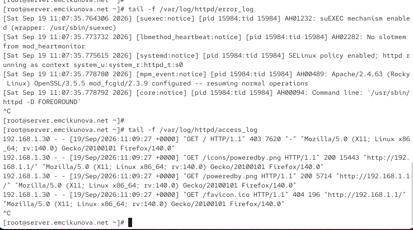
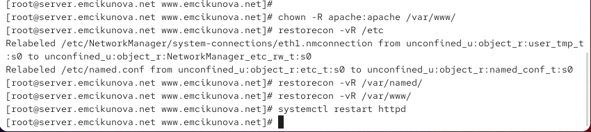
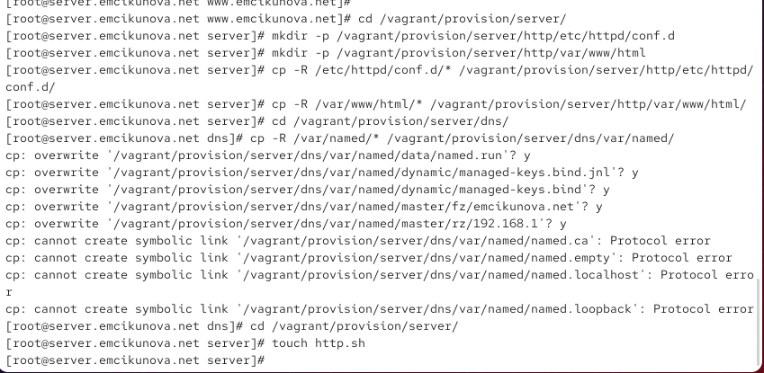
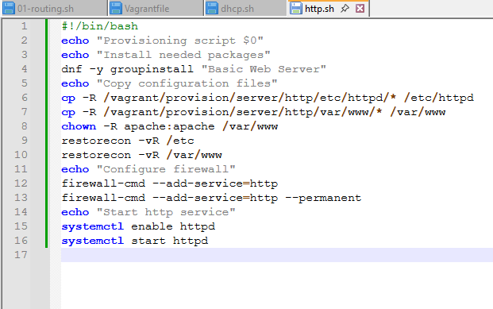

---
## Author
author:
  name: Цыкунова Екатерина Михайловна
  email: 1132246732@rudn.ru
  affiliation:
    - name: Российский университет дружбы народов
      country: Российская Федерация
      postal-code: 117198
      city: Москва
      address: ул. Миклухо-Маклая, д. 6

## Title
title: Лабораторная работа №4
subtitle: Базовая настройка HTTP-сервера Apache
license: CC BY
date: today
date-format: "YYYY-MM-DD"
---

# Цели и задачи работы

## Цель лабораторной работы

Целью данной работы является приобретение практических навыков установки, настройки и проверки работы HTTP-сервера Apache на виртуальной машине `server`.

## Задачи лабораторной работы

- установить HTTP-сервер Apache;
- настроить межсетевой экран и запустить службу `httpd`;
- проверить доступ к веб-серверу с виртуальной машины `client`;
- проанализировать журналы работы Apache;
- настроить виртуальные хосты `server.emcikunova.net` и `www.emcikunova.net`;
- создать тестовые веб-страницы;
- настроить DNS-записи для виртуальных хостов;
- подготовить сценарий автоматической настройки HTTP-сервера для Vagrant.

# Процесс выполнения лабораторной работы

## Устанавливаю HTTP-сервер Apache

{ #fig:001 width=70% height=70% }

## Просматриваю конфигурацию и запускаю Apache

{ #fig:002 width=70% height=70% }

## Проверяю доступность HTTP-сервера

{ #fig:003 width=70% height=70% }

## Анализирую журналы Apache

{ #fig:004 width=70% height=70% }

## Добавляю запись www в прямую DNS-зону

{ #fig:005 width=70% height=70% }

## Настраиваю обратную DNS-зону

{ #fig:006 width=70% height=70% }

## Настраиваю виртуальный хост server.emcikunova.net

{ #fig:007 width=70% height=70% }

## Настраиваю виртуальный хост www.emcikunova.net

{ #fig:008 width=70% height=70% }

## Создаю страницу server.emcikunova.net

{ #fig:009 width=70% height=70% }

## Создаю страницу www.emcikunova.net

{ #fig:010 width=70% height=70% }

## Настраиваю права и SELinux

{ #fig:011 width=70% height=70% }

## Проверяю server.emcikunova.net

{ #fig:012 width=70% height=70% }

## Проверяю www.emcikunova.net

{ #fig:013 width=70% height=70% }

## Сохраняю конфигурацию для Vagrant

{ #fig:014 width=70% height=70% }

## Создаю сценарий автоматической настройки

{ #fig:015 width=70% height=70% }

## Вывод

В ходе лабораторной работы был установлен и настроен HTTP-сервер Apache на виртуальной машине `server`.

Работа веб-сервера была проверена с виртуальной машины `client`, а журналы `access_log` и `error_log` подтвердили обработку HTTP-запросов.

Был настроен виртуальный хостинг для адресов `server.emcikunova.net` и `www.emcikunova.net`. Для каждого сайта созданы отдельные каталоги с веб-контентом и собственные конфигурационные файлы.

Дополнительно были настроены DNS-записи, права доступа и контексты SELinux. Для автоматического воспроизведения конфигурации подготовлен provisioning-сценарий `http.sh` и внесены изменения в `Vagrantfile`.