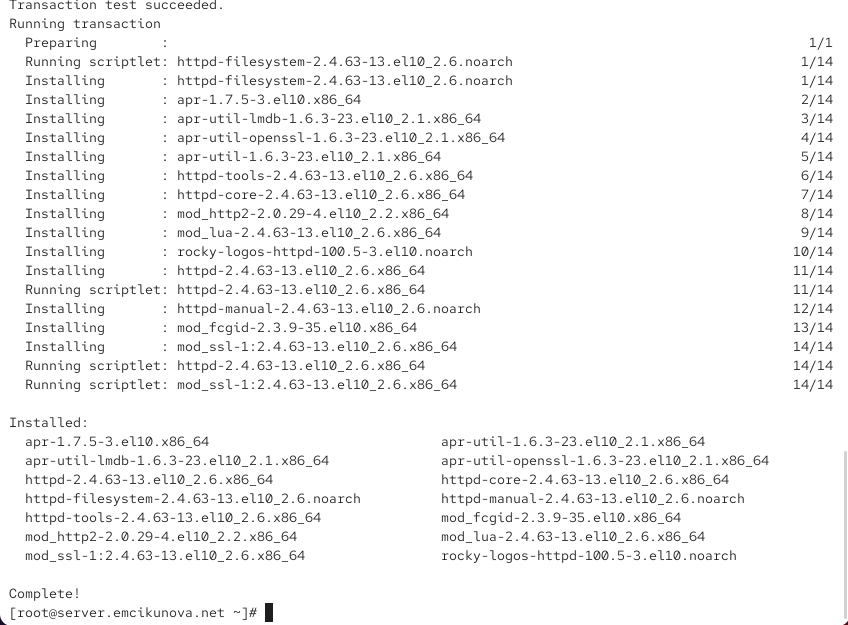
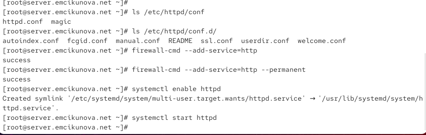
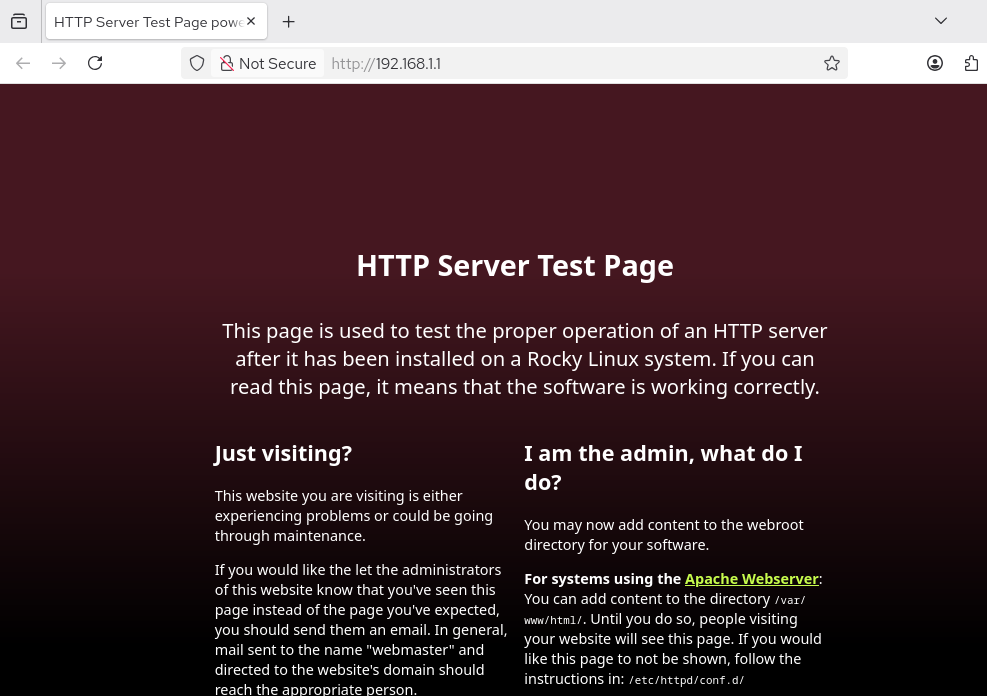
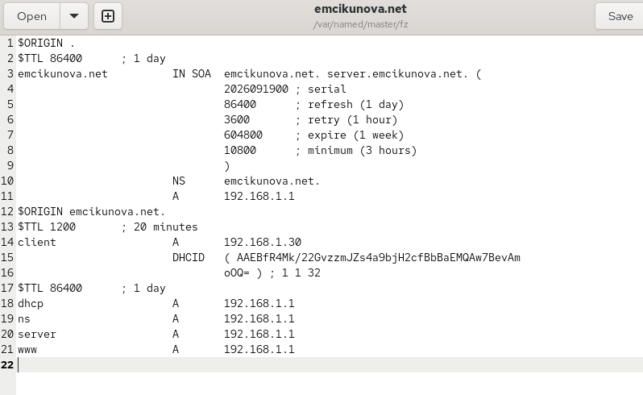
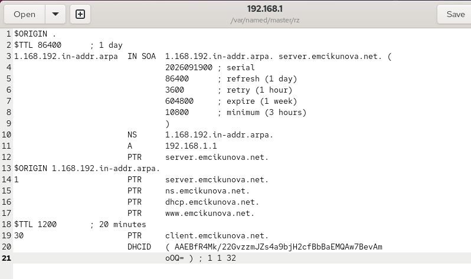
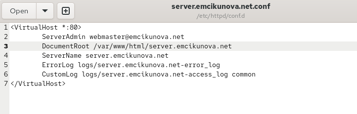
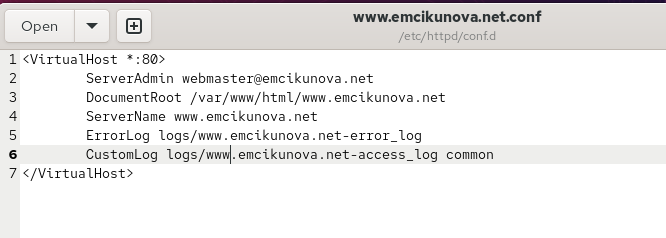
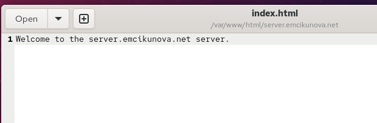
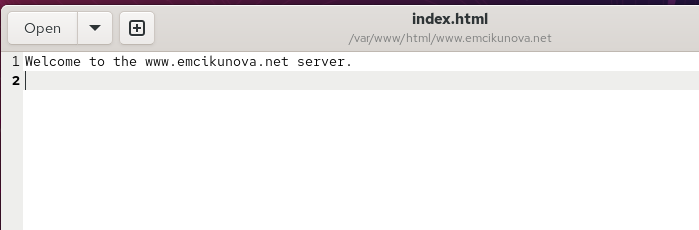

---
## Author
author:
  name: Цыкунова Екатерина Михайловна
  email: 1132246732@rudn.ru
  affiliation:
    - name: Российский университет дружбы народов
      country: Российская Федерация
      postal-code: 117198
      city: Москва
      address: ул. Миклухо-Маклая, д. 6

## Title
title: "Отчёт по лабораторной работе №4"
subtitle: "Базовая настройка HTTP-сервера Apache"
license: "CC BY"
---

# Цель работы

Приобретение практических навыков по установке и базовому конфигурированию HTTP-сервера Apache.

# Выполнение лабораторной работы

На виртуальной машине `server` перехожу в режим суперпользователя и устанавливаю набор пакетов, необходимый для работы HTTP-сервера Apache, командой `dnf -y groupinstall "Basic Web Server"` (см. рис. [@fig-001]).

В процессе установки менеджер пакетов выполняет проверку транзакции и устанавливает веб-сервер `httpd`, пакет `httpd-core` с основными компонентами Apache, набор служебных утилит `httpd-tools`, файловую структуру `httpd-filesystem`, документацию `httpd-manual`, а также дополнительные модули `mod_http2`, `mod_lua`, `mod_ssl` и другие зависимости. Наличие `mod_ssl` позволяет в дальнейшем использовать HTTPS, а `mod_http2` добавляет поддержку протокола HTTP/2.

Строка `Transaction test succeeded` свидетельствует об успешной предварительной проверке транзакции, а сообщение `Complete!` подтверждает завершение установки без ошибок. В результате на виртуальной машине установлен HTTP-сервер Apache версии 2.4 и необходимые для его функционирования компоненты.

{ #fig-001 width=70% }

После установки просматриваю содержимое основных каталогов конфигурации Apache командами `ls /etc/httpd/conf` и `ls /etc/httpd/conf.d` (см. рис. [@fig-002]).

В каталоге `/etc/httpd/conf` находятся основной конфигурационный файл `httpd.conf` и файл `magic`. Файл `httpd.conf` содержит глобальные настройки веб-сервера: параметры прослушиваемых портов, подключение модулей, расположение каталогов с веб-контентом, правила доступа, параметры журналирования и другие основные директивы. Файл `magic` используется модулем определения типов содержимого файлов.

Каталог `/etc/httpd/conf.d` предназначен для дополнительных конфигурационных файлов. В нём присутствуют `autoindex.conf`, `fcgid.conf`, `manual.conf`, `ssl.conf`, `userdir.conf`, `welcome.conf` и другие файлы. `ssl.conf` содержит настройки HTTPS, `userdir.conf` управляет доступом к пользовательским веб-каталогам, `welcome.conf` отвечает за стандартную тестовую страницу Apache при отсутствии пользовательского содержимого, а `autoindex.conf` содержит настройки отображения содержимого каталогов.

Для разрешения входящих HTTP-соединений добавляю службу `http` в конфигурацию межсетевого экрана. Команда `firewall-cmd --add-service=http` применяет разрешение к текущей конфигурации firewalld, а `firewall-cmd --add-service=http --permanent` сохраняет его после перезагрузки системы. В обоих случаях получено сообщение `success`.

После настройки межсетевого экрана разрешаю автоматический запуск Apache командой `systemctl enable httpd`. В результате создаётся символическая ссылка для запуска `httpd.service` при переходе системы в целевой режим `multi-user.target`. Затем запускаю веб-сервер командой `systemctl start httpd`.

{ #fig-002 width=70% }

Для проверки базовой конфигурации запускаю виртуальную машину `client` и в веб-браузере обращаюсь к серверу по адресу `http://192.168.1.1` (см. рис. [@fig-003]).

В браузере отображается стандартная страница `HTTP Server Test Page` для Rocky Linux. Её появление подтверждает, что служба `httpd` успешно запущена, принимает соединения на TCP-порту 80 и доступна с клиентской виртуальной машины через внутреннюю сеть. Кроме того, прохождение запроса подтверждает корректность правила firewalld, разрешающего службу `http`.

Браузер отображает пометку `Not Secure`, поскольку соединение на данном этапе выполняется по обычному протоколу HTTP и не защищено TLS.

{ #fig-003 width=70% }

На виртуальной машине `server` анализирую журналы работы Apache. Для просмотра диагностических сообщений использую команду `tail -f /var/log/httpd/error_log`, а для наблюдения за запросами клиентов — `tail -f /var/log/httpd/access_log` (см. рис. [@fig-004]).

В журнале ошибок присутствуют сообщения о включении механизма `suEXEC`, политике SELinux и запуске Apache. Строка `Apache/2.4.63 (Rocky Linux) ... configured -- resuming normal operations` свидетельствует о том, что сервер успешно прочитал конфигурацию и перешёл к штатной работе. В журнале также отображается команда запуска `/usr/sbin/httpd -D FOREGROUND`.

В `access_log` фиксируются обращения от узла `192.168.1.30`, который является клиентом внутренней сети. В журнале присутствуют запросы `GET` к корневому ресурсу `/` и вспомогательным файлам тестовой страницы. Для части ресурсов сервер возвращает код `200`, означающий успешную обработку запроса. Начальный запрос к `/` также фиксируется с кодом `403`, поскольку стандартная конфигурация Rocky Linux при пустом каталоге `/var/www/html` использует механизм тестовой страницы вместо обычного списка содержимого каталога. Запрос к `favicon.ico` завершается кодом `404`, поскольку данный файл отсутствует. Это не препятствует работе основного веб-сайта.

По строкам журнала также видно, что клиент использует браузер Firefox. Следовательно, запрос из браузера виртуальной машины `client` действительно поступает на Apache и обрабатывается сервером.

{ #fig-004 width=70% }

Для настройки виртуального хостинга необходимо обеспечить разрешение доменных имён `server.emcikunova.net` и `www.emcikunova.net`. Перед изменением файлов DNS-зон останавливаю службу BIND командой `systemctl stop named`.

В файл прямой зоны `/var/named/master/fz/emcikunova.net` добавляю ресурсную запись `www A 192.168.1.1` (см. рис. [@fig-005]). В зоне уже присутствует запись `server A 192.168.1.1`, поэтому оба DNS-имени будут разрешаться в один IP-адрес веб-сервера.

Запись типа `A` устанавливает соответствие между именем узла и его IPv4-адресом. В результате запросы к `server.emcikunova.net` и `www.emcikunova.net` будут направляться на внутренний интерфейс виртуальной машины `server` с адресом `192.168.1.1`.

{ #fig-005 width=70% }

Далее редактирую файл обратной зоны `/var/named/master/rz/192.168.1` и добавляю для адреса `192.168.1.1` PTR-запись `www.emcikunova.net.` (см. рис. [@fig-006]).

PTR-записи выполняют обратное преобразование IP-адреса в DNS-имя. В зоне уже присутствуют имена `server.emcikunova.net`, `ns.emcikunova.net` и `dhcp.emcikunova.net`, связанные с адресом сервера. Добавление `www.emcikunova.net.` обеспечивает наличие обратной DNS-записи и для имени виртуального веб-сервера.

После внесения изменений удаляю журнальные файлы динамического обновления DNS-зон, если они существуют, и снова запускаю DNS-сервер командой `systemctl start named`.

{ #fig-006 width=70% }

Для виртуального веб-сервера `server.emcikunova.net` в каталоге `/etc/httpd/conf.d` создаю конфигурационный файл `server.emcikunova.net.conf` (см. рис. [@fig-007]).

В директиве `<VirtualHost *:80>` указываю, что виртуальный хост должен принимать HTTP-соединения на порту 80 на всех доступных адресах сервера. Параметр `ServerAdmin webmaster@emcikunova.net` определяет адрес администратора веб-сайта.

В `DocumentRoot` задаю каталог `/var/www/html/server.emcikunova.net`, содержимое которого Apache будет возвращать пользователю при обращении к данному виртуальному хосту. Директива `ServerName server.emcikunova.net` задаёт DNS-имя, по которому Apache выбирает эту конфигурацию на основании HTTP-заголовка `Host`.

Для виртуального хоста также создаются отдельные журналы. Ошибки записываются в `logs/server.emcikunova.net-error_log`, а обращения клиентов — в `logs/server.emcikunova.net-access_log`. Путь `logs` в конфигурации Apache соответствует системному каталогу журналов веб-сервера.

{ #fig-007 width=70% }

Аналогично создаю файл `/etc/httpd/conf.d/www.emcikunova.net.conf` для второго виртуального хоста (см. рис. [@fig-008]).

Для него задаю `ServerName www.emcikunova.net`, а корневым каталогом веб-сайта назначаю `/var/www/html/www.emcikunova.net`. Отдельные файлы `www.emcikunova.net-error_log` и `www.emcikunova.net-access_log` позволяют независимо анализировать ошибки и обращения к этому веб-сайту.

Оба виртуальных хоста используют один IP-адрес `192.168.1.1` и один TCP-порт 80. Выбор нужного сайта выполняется Apache по имени, которое клиент передаёт в HTTP-заголовке `Host`. Это позволяет размещать несколько сайтов на одном сетевом интерфейсе.

{ #fig-008 width=70% }

В каталоге `/var/www/html` создаю подкаталог `server.emcikunova.net`, предназначенный для содержимого первого виртуального хоста. В нём создаю файл `index.html` со строкой `Welcome to the server.emcikunova.net server.` (см. рис. [@fig-009]).

Файл `index.html` является индексной страницей веб-сервера и автоматически возвращается Apache при обращении клиента к корневому URL виртуального хоста.

{ #fig-009 width=70% }

Для второго виртуального хоста создаю каталог `/var/www/html/www.emcikunova.net` и файл `index.html`. В него помещаю строку `Welcome to the www.emcikunova.net server.` (см. рис. [@fig-010]).

Различное содержимое индексных страниц позволяет при последующей проверке однозначно определить, какой виртуальный хост был выбран Apache при обработке запроса.

{ #fig-010 width=70% }

После создания каталогов и веб-страниц назначаю владельцем дерева `/var/www` системного пользователя и группу Apache командой `chown -R apache:apache /var/www/` (см. рис. [@fig-011]). Это обеспечивает веб-серверу необходимые права для работы с размещённым содержимым.

Далее восстанавливаю корректные контексты SELinux командами `restorecon -vR /etc`, `restorecon -vR /var/named` и `restorecon -vR /var/www`. Команда `restorecon` назначает объектам контексты безопасности в соответствии с системной политикой SELinux. На экране видно, что для отдельных файлов действительно выполняется изменение меток.

После корректировки прав и контекстов перезапускаю Apache командой `systemctl restart httpd`. Команда завершается без сообщения об ошибке, следовательно, созданные конфигурационные файлы виртуальных хостов принимаются веб-сервером.

{ #fig-011 width=70% }

На виртуальной машине `client` проверяю первый виртуальный хост, введя в браузере адрес `http://server.emcikunova.net` (см. рис. [@fig-012]).

DNS-сервер разрешает имя `server.emcikunova.net` в адрес `192.168.1.1`, после чего HTTP-запрос поступает на Apache. В ответ отображается содержимое созданного ранее файла `/var/www/html/server.emcikunova.net/index.html`: `Welcome to the server.emcikunova.net server.`

Это подтверждает совместную корректную работу DNS-разрешения имён и механизма виртуальных хостов Apache.

{ #fig-012 width=70% }

Затем в браузере виртуальной машины `client` открываю адрес `http://www.emcikunova.net` (см. рис. [@fig-013]).

Веб-сервер возвращает строку `Welcome to the www.emcikunova.net server.`, расположенную в `/var/www/html/www.emcikunova.net/index.html`. Несмотря на использование того же IP-адреса и порта, Apache выбирает другой `DocumentRoot` на основании имени `www.emcikunova.net`.

Успешное отображение обеих тестовых страниц подтверждает корректность настройки виртуального хостинга. Пометка `Not Secure` связана с использованием HTTP без TLS и не является ошибкой конфигурации.

{ #fig-013 width=70% }

Для сохранения выполненной конфигурации в проекте Vagrant перехожу в каталог `/vagrant/provision/server/` и создаю структуру каталогов для HTTP-сервера (см. рис. [@fig-014]).

Командами `mkdir -p /vagrant/provision/server/http/etc/httpd/conf.d` и `mkdir -p /vagrant/provision/server/http/var/www/html` создаю каталоги, повторяющие расположение конфигурации и содержимого веб-сервера внутри виртуальной машины.

После этого копирую файлы из `/etc/httpd/conf.d/` в `/vagrant/provision/server/http/etc/httpd/conf.d/`, а содержимое `/var/www/html/` — в `/vagrant/provision/server/http/var/www/html/`. Благодаря этому конфигурации виртуальных хостов и тестовые страницы становятся частью проекта и могут быть автоматически восстановлены при повторном развёртывании виртуальной машины.

Также перехожу в `/vagrant/provision/server/dns/` и копирую содержимое `/var/named/` в `/vagrant/provision/server/dns/var/named/`, сохраняя изменённые прямую и обратную DNS-зоны.

Во время копирования DNS-файлов появляются сообщения `cannot create symbolic link ...: Protocol error` для нескольких стандартных символических ссылок BIND. Они связаны с особенностями общей директории Vagrant, в которой создание символических ссылок может быть ограничено. Основные файлы зон, включая изменённые `emcikunova.net` и `192.168.1`, при этом копируются. Для полной воспроизводимости DNS-конфигурации наличие файлов, на которые указывают не созданные ссылки, следует контролировать отдельно.

В завершение создаю файл `/vagrant/provision/server/http.sh`, предназначенный для автоматизации установки и настройки HTTP-сервера.

{ #fig-014 width=70% }

В созданный файл `http.sh` помещаю provisioning-скрипт, повторяющий основные действия, выполненные вручную (см. рис. [@fig-015]).

Скрипт начинается с `#!/bin/bash`, после чего выводит информационные сообщения о текущих этапах настройки. Командой `dnf -y groupinstall "Basic Web Server"` автоматически устанавливается HTTP-сервер и необходимые пакеты.

Затем командами `cp -R` сохранённые в проекте конфигурационные файлы Apache и содержимое веб-каталогов копируются обратно в `/etc/httpd` и `/var/www`. Команда `chown -R apache:apache /var/www` устанавливает необходимого владельца веб-контента, а `restorecon -vR /etc` и `restorecon -vR /var/www` восстанавливают контексты SELinux.

После этого скрипт разрешает HTTP в firewalld как для текущего сеанса, так и постоянно командами `firewall-cmd --add-service=http` и `firewall-cmd --add-service=http --permanent`.

На последнем этапе `systemctl enable httpd` включает автоматический запуск Apache, а `systemctl start httpd` запускает службу. Файлу `http.sh` назначаю право на выполнение командой `chmod +x http.sh`.

{ #fig-015 width=70% }

# Вывод

В результате работы на виртуальной машине `server` установлен и настроен HTTP-сервер Apache. Для него разрешён HTTP-трафик в `firewalld`, включён автоматический запуск и проверена доступность с виртуальной машины `client`.

Настроены два виртуальных хоста: `server.emcikunova.net` и `www.emcikunova.net`. Для каждого создан отдельный каталог с веб-контентом и настроены собственные журналы. Работа виртуальных хостов успешно проверена через браузер.

Конфигурация HTTP-сервера сохранена в каталоге `provision`, а действия по установке и настройке записаны в скрипте `http.sh`, который подключён в `Vagrantfile`.

# Контрольные вопросы

*1. Через какой порт по умолчанию работает Apache?*

Apache по протоколу HTTP по умолчанию работает через TCP-порт `80`. Для HTTPS обычно используется порт `443`.

*2. Под каким пользователем запускается Apache и к какой группе относится этот пользователь?*

Рабочие процессы Apache в Rocky Linux запускаются от имени пользователя `apache`, который входит в группу `apache`.

*3. Где располагаются лог-файлы веб-сервера? Что можно по ним отслеживать?*

Основные журналы Apache располагаются в каталоге:

`/var/log/httpd/`

Файл `access_log` содержит сведения о запросах клиентов, а `error_log` — сообщения об ошибках и работе веб-сервера.

*4. Где по умолчанию содержится контент веб-серверов?*

По умолчанию веб-контент Apache располагается в каталоге:

`/var/www/html/`

Для виртуальных хостов можно назначать отдельные каталоги с помощью директивы `DocumentRoot`.

*5. Каким образом реализуется виртуальный хостинг? Что он даёт?*

Виртуальный хостинг в Apache реализуется с помощью блоков `<VirtualHost>`. Для каждого сайта задаются `ServerName`, `DocumentRoot` и другие параметры.

Это позволяет размещать несколько сайтов на одном сервере и одном IP-адресе. Apache выбирает нужный сайт по доменному имени, переданному клиентом в HTTP-запросе.
