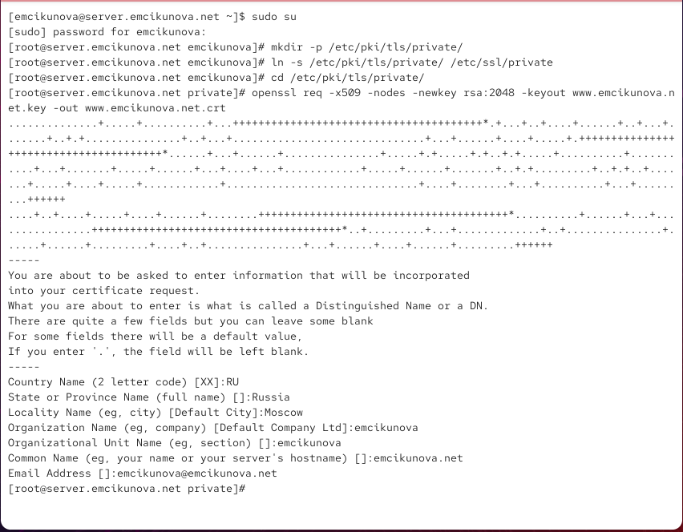
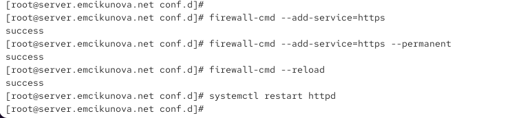
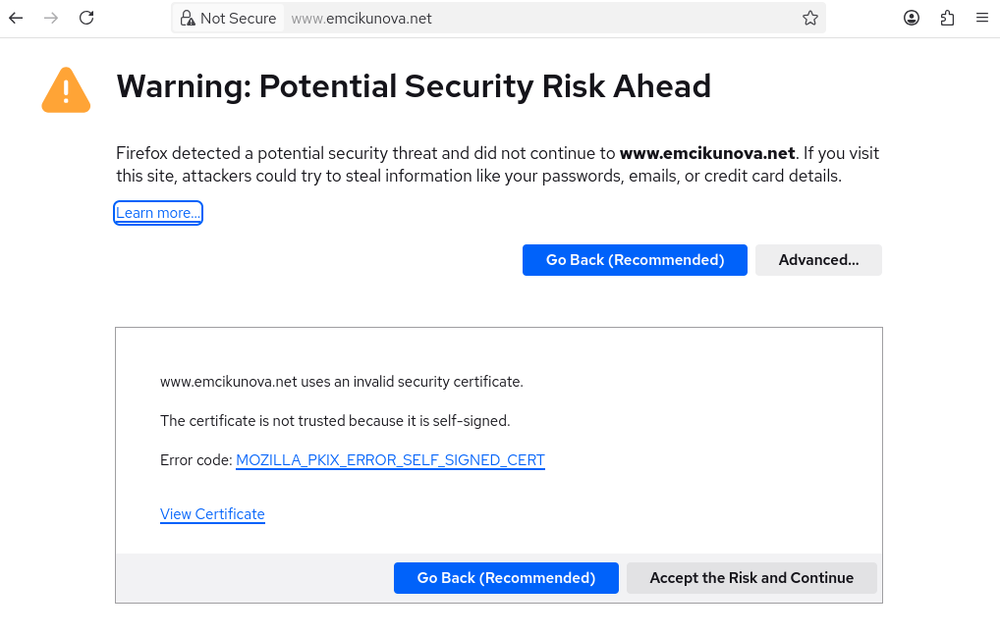
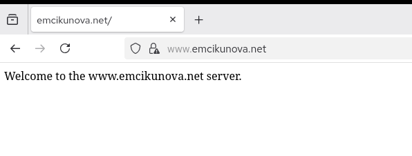
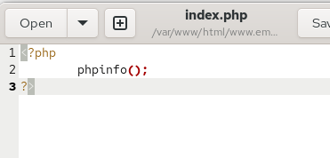
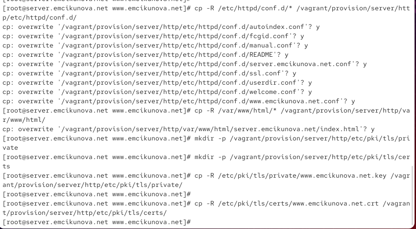
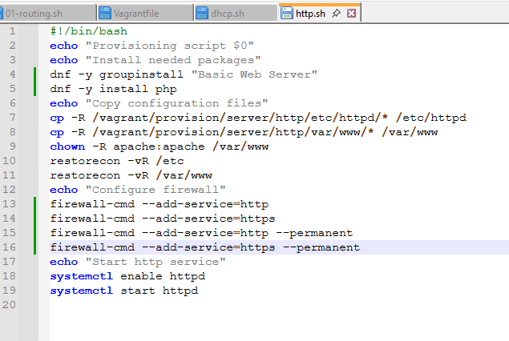

---
## Author
author:
  name: Цыкунова Екатерина Михайловна
  email: 1132246732@rudn.ru
  affiliation:
    - name: Российский университет дружбы народов
      country: Российская Федерация
      postal-code: 117198
      city: Москва
      address: ул. Миклухо-Маклая, д. 6

## Title
title: Лабораторная работа №5
subtitle: Расширенная настройка HTTP-сервера Apache
license: CC BY
date: today
date-format: "YYYY-MM-DD"
---

# Цели и задачи работы

## Цель лабораторной работы

Целью данной работы является приобретение практических навыков расширенной настройки HTTP-сервера Apache: включение HTTPS, настройка PHP и подготовка сценария автоматической настройки для Vagrant.

## Задачи лабораторной работы

- сгенерировать закрытый ключ и самоподписанный сертификат;
- настроить виртуальный хост `www.emcikunova.net` для работы через HTTPS;
- разрешить HTTPS-трафик в `firewalld`;
- проверить переход с HTTP на HTTPS;
- установить и настроить PHP;
- создать страницу `index.php` с выводом информации о PHP;
- сохранить конфигурацию веб-сервера в каталог `provision`;
- скорректировать скрипт `http.sh`.

# Процесс выполнения лабораторной работы

## Генерирую ключ и самоподписанный сертификат

{ #fig:001 width=70% height=70% }

## Настраиваю виртуальный хост для HTTPS

{ #fig:002 width=70% height=70% }

## Разрешаю HTTPS в firewalld и перезапускаю Apache

{ #fig:003 width=70% height=70% }

## Проверяю предупреждение о сертификате

{ #fig:004 width=70% height=70% }

## Проверяю работу сайта через HTTPS

{ #fig:005 width=70% height=70% }

## Просматриваю сведения о сертификате

{ #fig:006 width=70% height=70% }

## Создаю PHP-страницу

{ #fig:007 width=70% height=70% }

## Настраиваю права и SELinux

{ #fig:008 width=70% height=70% }

## Проверяю работу PHP

{ #fig:009 width=70% height=70% }

## Сохраняю конфигурацию для Vagrant

{ #fig:010 width=70% height=70% }

## Корректирую сценарий автоматической настройки

{ #fig:011 width=70% height=70% }

## Вывод

В ходе лабораторной работы была выполнена расширенная настройка HTTP-сервера Apache.

Для виртуального хоста `www.emcikunova.net` был создан закрытый ключ и самоподписанный сертификат. В конфигурации Apache настроено перенаправление с HTTP на HTTPS, а в `firewalld` разрешена служба `https`.

Работа защищённого соединения была проверена с виртуальной машины `client`. Браузер выдал предупреждение о самоподписанном сертификате, после добавления исключения сайт успешно открылся через HTTPS.

Также была установлена поддержка PHP. Файл `index.php` с функцией `phpinfo()` подтвердил корректную обработку PHP-скриптов веб-сервером.

Конфигурация Apache, веб-контент, сертификат и ключ были сохранены в каталоге `provision`. Скрипт `http.sh` дополнен установкой PHP и настройкой HTTPS для автоматического развёртывания сервера.