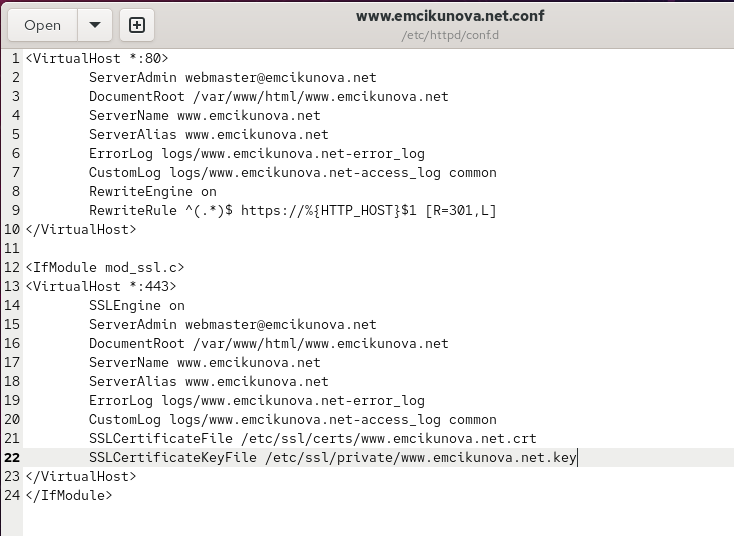
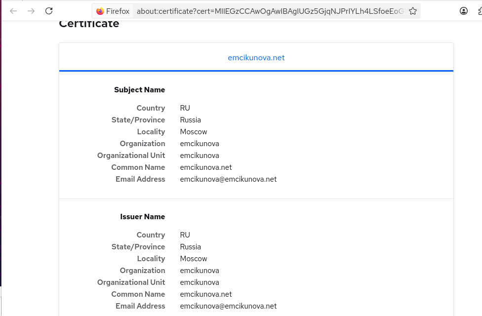
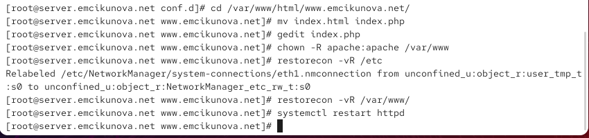
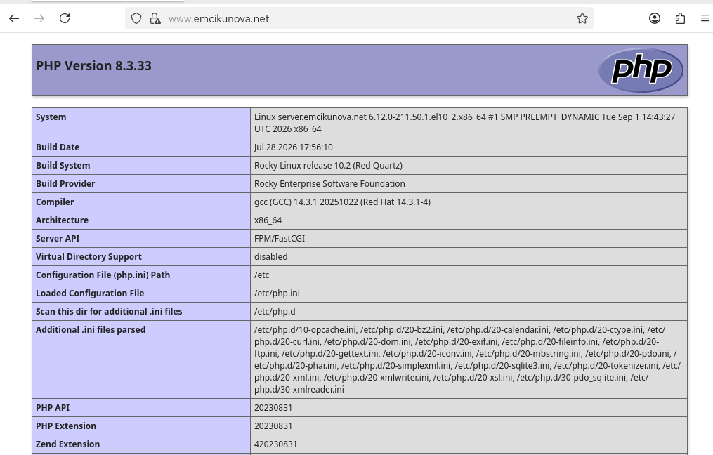

---
## Author
author:
  name: Цыкунова Екатерина Михайловна
  email: 1132246732@rudn.ru
  affiliation:
    - name: Российский университет дружбы народов
      country: Российская Федерация
      postal-code: 117198
      city: Москва
      address: ул. Миклухо-Маклая, д. 6

## Title
title: "Отчёт по лабораторной работе №5"
subtitle: "Расширенная настройка HTTP-сервера Apache"
license: "CC BY"
---

# Цель работы

Приобретение практических навыков по расширенному конфигурированию HTTP сервера Apache в части безопасности и возможности использования PHP.

# Выполнение лабораторной работы

## Конфигурирование HTTP-сервера для работы через протокол HTTPS

На виртуальной машине `server` открываю терминал и перехожу в режим суперпользователя командой `sudo su`. Для хранения закрытого криптографического ключа создаю каталог `/etc/pki/tls/private` командой `mkdir -p /etc/pki/tls/private/`. Параметр `-p` позволяет создать необходимую структуру каталогов и не выдаёт ошибку, если каталог уже существует.

Для обеспечения доступа к закрытым ключам через стандартный путь `/etc/ssl/private` создаю символическую ссылку командой `ln -s /etc/pki/tls/private/ /etc/ssl/private`. После этого перехожу в каталог `/etc/pki/tls/private/`, в котором выполняю генерацию закрытого ключа и самоподписанного сертификата (см. рис. [@fig-001]).

Для генерации используется команда:

```bash
openssl req -x509 -nodes -newkey rsa:2048 -keyout www.emcikunova.net.key -out www.emcikunova.net.crt
```

Команда `openssl req` запускает создание запроса и сертификата. Параметр `-x509` указывает OpenSSL сразу сформировать самоподписанный сертификат стандарта X.509 вместо обычного запроса на подпись сертификата. Параметр `-nodes` отключает защиту закрытого ключа парольной фразой, благодаря чему веб-сервер Apache сможет автоматически прочитать ключ при запуске без необходимости ручного ввода пароля. Параметр `-newkey rsa:2048` создаёт новый закрытый ключ RSA длиной 2048 бит. С помощью `-keyout www.emcikunova.net.key` задаётся имя файла закрытого ключа, а параметр `-out www.emcikunova.net.crt` определяет имя создаваемого сертификата.

Во время создания сертификата OpenSSL запрашивает сведения о владельце. В поле `Country Name` указываю код страны `RU`, в `State or Province Name` — `Russia`, в `Locality Name` — `Moscow`. В качестве организации и подразделения указываю логин `emcikunova`. В поле `Common Name` задаю доменное имя `emcikunova.net`, а в поле электронной почты — `emcikunova@emcikunova.net`.

Большое количество символов `+`, `.` и `*`, отображаемых OpenSSL перед запросом параметров сертификата, соответствует процессу генерации криптографического материала. Возврат приглашения командной строки без сообщения об ошибке свидетельствует об успешном создании файлов закрытого ключа и сертификата.

Для дальнейшего использования сертификата Apache файл сертификата размещается в каталоге сертификатов `/etc/pki/tls/certs`, в то время как закрытый ключ остаётся в защищённом каталоге `/etc/pki/tls/private`.

{ #fig-001 width=70% }

После создания криптографического ключа и сертификата изменяю конфигурацию виртуального веб-сервера `www.emcikunova.net`. Для этого редактирую файл `/etc/httpd/conf.d/www.emcikunova.net.conf`. В нём настраиваю перенаправление запросов HTTP на HTTPS и отдельный виртуальный хост, обслуживающий защищённые соединения на TCP-порту 443 (см. рис. [@fig-002]).

Конфигурационный файл имеет следующий вид:

```apache
<VirtualHost *:80>
    ServerAdmin webmaster@emcikunova.net
    DocumentRoot /var/www/html/www.emcikunova.net
    ServerName www.emcikunova.net
    ServerAlias www.emcikunova.net
    ErrorLog logs/www.emcikunova.net-error_log
    CustomLog logs/www.emcikunova.net-access_log common
    RewriteEngine on
    RewriteRule ^(.*)$ https://%{HTTP_HOST}$1 [R=301,L]
</VirtualHost>

<IfModule mod_ssl.c>
<VirtualHost *:443>
    SSLEngine on
    ServerAdmin webmaster@emcikunova.net
    DocumentRoot /var/www/html/www.emcikunova.net
    ServerName www.emcikunova.net
    ServerAlias www.emcikunova.net
    ErrorLog logs/www.emcikunova.net-error_log
    CustomLog logs/www.emcikunova.net-access_log common
    SSLCertificateFile /etc/ssl/certs/www.emcikunova.net.crt
    SSLCertificateKeyFile /etc/ssl/private/www.emcikunova.net.key
</VirtualHost>
</IfModule>
```

Строка `<VirtualHost *:80>` открывает описание виртуального хоста, принимающего обычные HTTP-соединения на порту 80 на всех сетевых интерфейсах сервера.

Директива `ServerAdmin webmaster@emcikunova.net` устанавливает адрес электронной почты администратора веб-сервера, который может использоваться Apache при формировании служебных страниц и сообщений об ошибках.

Директива `DocumentRoot /var/www/html/www.emcikunova.net` задаёт корневой каталог веб-сайта. Именно в этом каталоге находятся файлы, выдаваемые клиенту при обращении к виртуальному хосту.

Строка `ServerName www.emcikunova.net` определяет основное доменное имя виртуального веб-сервера. Apache использует значение заголовка `Host` HTTP-запроса для выбора подходящего виртуального хоста.

Директива `ServerAlias www.emcikunova.net` определяет дополнительное имя, по которому может быть доступен виртуальный хост. В данной конфигурации оно совпадает с основным именем сервера.

Строка `ErrorLog logs/www.emcikunova.net-error_log` задаёт файл журнала ошибок для виртуального хоста. В него Apache записывает ошибки обработки запросов и другие диагностические сообщения.

Директива `CustomLog logs/www.emcikunova.net-access_log common` задаёт отдельный журнал запросов к сайту. Параметр `common` определяет стандартный формат записи сведений о клиенте, запросе, коде ответа и объёме переданных данных.

Команда `RewriteEngine on` активирует механизм преобразования URL модуля `mod_rewrite` для данного виртуального хоста.

Строка `RewriteRule ^(.*)$ https://%{HTTP_HOST}$1 [R=301,L]` выполняет перенаправление любого запроса, пришедшего по HTTP, на аналогичный адрес с использованием HTTPS. Выражение `^(.*)$` соответствует всему пути запроса, `%{HTTP_HOST}` сохраняет имя запрошенного хоста, а `$1` добавляет исходный путь. Флаг `R=301` задаёт постоянное HTTP-перенаправление с кодом состояния `301 Moved Permanently`, а флаг `L` сообщает модулю `mod_rewrite`, что после применения данного правила дальнейшая обработка правил не требуется.

Строка `</VirtualHost>` завершает описание виртуального хоста, работающего на порту 80.

Конструкция `<IfModule mod_ssl.c>` задаёт условный блок конфигурации. Вложенные директивы обрабатываются только при наличии загруженного модуля Apache `mod_ssl`, обеспечивающего поддержку TLS/SSL.

Строка `<VirtualHost *:443>` создаёт виртуальный хост для защищённых HTTPS-соединений на TCP-порту 443.

Директива `SSLEngine on` включает механизм SSL/TLS для данного виртуального хоста.

Директивы `ServerAdmin`, `DocumentRoot`, `ServerName`, `ServerAlias`, `ErrorLog` и `CustomLog` выполняют те же функции, что и в HTTP-виртуальном хосте: задают администратора, каталог сайта, доменное имя и отдельные журналы доступа и ошибок.

Строка `SSLCertificateFile /etc/ssl/certs/www.emcikunova.net.crt` указывает Apache путь к файлу сертификата, который сервер передаёт клиенту в процессе установления TLS-соединения.

Строка `SSLCertificateKeyFile /etc/ssl/private/www.emcikunova.net.key` задаёт путь к соответствующему закрытому ключу. Закрытый ключ используется сервером при выполнении криптографических операций во время установки защищённого соединения и не должен передаваться клиентам.

Строка `</VirtualHost>` завершает описание HTTPS-виртуального хоста, а `</IfModule>` завершает условный блок конфигурации модуля `mod_ssl`.

В результате обращения к `http://www.emcikunova.net` Apache принимает запрос на порту 80 и перенаправляет браузер на `https://www.emcikunova.net`, после чего соединение обслуживается виртуальным хостом на порту 443.

{ #fig-002 width=70% }

После настройки Apache разрешаю входящие HTTPS-соединения в межсетевом экране `firewalld`. Командой `firewall-cmd --add-service=https` добавляю службу `https` в текущую конфигурацию межсетевого экрана. Полученное сообщение `success` подтверждает успешное применение правила.

Чтобы разрешение сохранилось после перезагрузки виртуальной машины, выполняю `firewall-cmd --add-service=https --permanent`. Эта команда добавляет службу HTTPS в постоянную конфигурацию `firewalld`. Затем командой `firewall-cmd --reload` перечитываю постоянную конфигурацию и применяю внесённые изменения.

После настройки межсетевого экрана перезапускаю Apache командой `systemctl restart httpd`, чтобы сервер перечитал изменённый файл виртуального хоста и начал обслуживать HTTPS-соединения (см. рис. [@fig-003]). Отсутствие сообщений об ошибках после команды `systemctl restart httpd` указывает, что служба была перезапущена и конфигурация принята.

{ #fig-003 width=70% }

Для проверки настройки перехожу на виртуальную машину `client` и открываю в браузере веб-сервер `www.emcikunova.net`. Браузер автоматически переходит к защищённому соединению, после чего Firefox выводит страницу `Warning: Potential Security Risk Ahead` (см. рис. [@fig-004]).

На странице указано, что сертификат сайта не является доверенным, поскольку он самоподписанный. Браузер выводит код ошибки `MOZILLA_PKIX_ERROR_SELF_SIGNED_CERT`. Появление данного предупреждения является ожидаемым результатом: сертификат был создан непосредственно на сервере с помощью OpenSSL и не подписан центром сертификации, которому доверяет браузер.

Нажимаю кнопку `Advanced...`, после чего становится доступна возможность просмотра сертификата и продолжения работы с сайтом через `Accept the Risk and Continue`. Для лабораторного окружения разрешаю использование данного сертификата.

{ #fig-004 width=70% }

После добавления исключения браузер открывает страницу виртуального хоста `www.emcikunova.net` по протоколу HTTPS (см. рис. [@fig-005]). В адресной строке отображается имя `www.emcikunova.net`, а в содержимом страницы выводится сообщение `Welcome to the www.emcikunova.net server.`

Успешное отображение страницы подтверждает, что Apache принимает HTTPS-соединения на порту 443, правило `firewalld` разрешает соответствующий сетевой трафик, а виртуальный хост использует созданный сертификат и закрытый ключ. Кроме того, автоматический переход к защищённой версии сайта подтверждает работоспособность правила перенаправления, заданного директивой `RewriteRule`.

{ #fig-005 width=70% }

Далее просматриваю сведения о сертификате в Firefox (см. рис. [@fig-006]). В разделе `Subject Name` отображаются данные, введённые во время работы команды `openssl req`: страна `RU`, регион `Russia`, город `Moscow`, организация `emcikunova`, подразделение `emcikunova`, общее имя `emcikunova.net` и адрес электронной почты `emcikunova@emcikunova.net`.

В разделе `Issuer Name` отображаются аналогичные сведения об издателе сертификата. Совпадение данных владельца и издателя связано с использованием самоподписанного сертификата: роль центра сертификации в данном случае выполняет сам владелец созданного сертификата.

{ #fig-006 width=70% }

## Конфигурирование HTTP-сервера для работы с PHP

Для добавления поддержки PHP на виртуальной машине `server` устанавливаю пакет `php` командой:

```bash
dnf -y install php
```

Параметр `-y` автоматически подтверждает установку необходимых пакетов и зависимостей.

После установки PHP перехожу в каталог веб-сайта `/var/www/html/www.emcikunova.net/`. Имеющийся файл `index.html` переименовываю в `index.php` командой `mv index.html index.php`, после чего открываю его для редактирования и заменяю содержимое PHP-скриптом (см. рис. [@fig-007]):

```php
<?php
    phpinfo();
?>
```

Открывающий тег `<?php` сообщает интерпретатору о начале PHP-кода. Функция `phpinfo()` генерирует диагностическую HTML-страницу, содержащую сведения об установленной версии PHP, конфигурации интерпретатора, серверном API, подключённых расширениях и параметрах среды. Закрывающий тег `?>` завершает блок PHP-кода.

Использование функции `phpinfo()` удобно для проверки корректности интеграции PHP с веб-сервером, поскольку успешное отображение созданной ею страницы подтверждает, что файл `.php` обрабатывается интерпретатором, а не передаётся клиенту как обычный текстовый файл.

{ #fig-007 width=70% }

После создания PHP-страницы корректирую владельца файлов веб-сервера командой `chown -R apache:apache /var/www` (см. рис. [@fig-008]). Параметр `-R` обеспечивает рекурсивное изменение владельца для каталога `/var/www` и всего его содержимого. Пользователь и группа `apache` соответствуют учётной записи, от имени которой работает HTTP-сервер.

Затем восстанавливаю корректные контексты безопасности SELinux командами `restorecon -vR /etc` и `restorecon -vR /var/www/`. Параметр `-R` выполняет рекурсивную обработку каталогов, а `-v` включает отображение изменяемых объектов.

При выполнении `restorecon -vR /etc` отображается сообщение о переназначении контекста файла `/etc/NetworkManager/system-connections/eth1.nmconnection`, что подтверждает фактическую проверку и восстановление SELinux-контекстов. Команда для `/var/www/` возвращает приглашение командной строки без дополнительного вывода, следовательно, для находящихся там объектов дополнительных изменений отображать не потребовалось.

После изменения прав доступа и восстановления контекстов SELinux выполняю `systemctl restart httpd`. Перезапуск необходим для применения установленной поддержки PHP и проверки работы веб-сервера с обновлённым содержимым сайта.

{ #fig-008 width=70% }

На виртуальной машине `client` повторно открываю адрес `www.emcikunova.net`. Вместо прежнего статического приветствия браузер отображает страницу, сформированную функцией `phpinfo()` (см. рис. [@fig-009]).

В верхней части страницы указана версия `PHP 8.3.33`. В таблице также отображается информация о системе `Linux server.emcikunova.net`, архитектуре `x86_64`, используемом серверном API `FPM/FastCGI`, основном конфигурационном файле `/etc/php.ini` и каталоге дополнительных конфигурационных файлов `/etc/php.d`.

Появление страницы `phpinfo()` подтверждает, что PHP установлен на сервере и PHP-скрипты корректно обрабатываются при обращении к сайту через Apache. Одновременно страница загружена с адреса `www.emcikunova.net` через настроенный ранее HTTPS-виртуальный хост.

{ #fig-009 width=70% }

## Внесение изменений в настройки внутреннего окружения виртуальной машины

После завершения ручной настройки сохраняю созданные конфигурационные файлы и содержимое веб-сервера в каталоге provisioning проекта Vagrant. Это позволяет использовать подготовленную конфигурацию при последующем автоматическом развёртывании виртуальной машины.

Конфигурационные файлы Apache копирую командой:

```bash
cp -R /etc/httpd/conf.d/* /vagrant/provision/server/http/etc/httpd/conf.d
```

На экране появляются запросы на перезапись существующих файлов, в том числе `autoindex.conf`, `fcgid.conf`, `manual.conf`, `ssl.conf`, `userdir.conf`, `welcome.conf`, а также конфигурационных файлов виртуальных хостов. Перезапись подтверждаю вводом `y`, чтобы в каталоге проекта находились актуальные версии конфигурации.

Содержимое каталога веб-сервера сохраняю командой:

```bash
cp -R /var/www/html/* /vagrant/provision/server/http/var/www/html/
```

При копировании также подтверждаю замену ранее существующих файлов.

Для хранения криптографических данных в структуре provisioning создаю каталоги:

```bash
mkdir -p /vagrant/provision/server/http/etc/pki/tls/private
mkdir -p /vagrant/provision/server/http/etc/pki/tls/certs
```

После этого копирую закрытый ключ:

```bash
cp -R /etc/pki/tls/private/www.emcikunova.net.key /vagrant/provision/server/http/etc/pki/tls/private/
```

и сертификат:

```bash
cp -R /etc/pki/tls/certs/www.emcikunova.net.crt /vagrant/provision/server/http/etc/pki/tls/certs/
```

В результате в каталоге проекта сохраняются конфигурация Apache, содержимое веб-сайта, закрытый ключ и сертификат, необходимые для воспроизведения настроенного окружения виртуальной машины (см. рис. [@fig-010]).

{ #fig-010 width=70% }

На завершающем этапе корректирую сценарий автоматической настройки `/vagrant/provision/server/http.sh` (см. рис. [@fig-011]). Скрипт содержит последовательность команд, необходимых для подготовки HTTP-сервера при создании виртуальной машины.

{ #fig-011 width=70% }

Готовый фрагмент для продолжения отчёта:

# Вывод

В результате работы настроена поддержка HTTPS для веб-сервера Apache: создан самоподписанный сертификат, разрешён HTTPS-трафик и настроено перенаправление с HTTP на HTTPS.

Также установлена поддержка PHP и проверена работа PHP-страницы через браузер. Конфигурация сервера сохранена в каталоге provision, а скрипт http.sh дополнен установкой PHP и настройкой HTTPS.

# Контрольные вопросы

*1. В чём отличие HTTP от HTTPS?*

HTTP (`HyperText Transfer Protocol`) — протокол передачи данных между клиентом и веб-сервером. При использовании обычного HTTP передаваемые данные сами по себе не шифруются, поэтому при наличии доступа к сетевому трафику их потенциально можно перехватить или изменить. По умолчанию HTTP использует TCP-порт `80`.

HTTPS (`HyperText Transfer Protocol Secure`) представляет собой HTTP, работающий поверх защищённого соединения TLS. Передаваемые между браузером и веб-сервером данные шифруются, а сертификат сервера используется для подтверждения его подлинности. По умолчанию HTTPS использует TCP-порт `443`.

*2. Каким образом обеспечивается безопасность контента веб-сервера при работе через HTTPS?*

Безопасность при работе через HTTPS обеспечивается протоколом TLS. При установлении соединения сервер передаёт клиенту цифровой сертификат, содержащий сведения о сервере и его открытый ключ. Клиент проверяет сертификат и в процессе TLS-соединения стороны согласовывают параметры шифрования и формируют сеансовые ключи.

После установления защищённого соединения HTTP-запросы и ответы передаются в зашифрованном виде. Это обеспечивает конфиденциальность передаваемых данных и затрудняет их чтение посторонними лицами.

TLS также обеспечивает контроль целостности данных, позволяя обнаружить изменение информации во время передачи. Проверка цифрового сертификата позволяет клиенту удостовериться, что он устанавливает соединение с требуемым веб-сервером. В данной лабораторной работе использовался самоподписанный сертификат, поэтому браузер не мог автоматически подтвердить доверие к его издателю и выводил соответствующее предупреждение.

*3. Что такое сертификационный центр? Приведите пример.*

Сертификационный центр, или удостоверяющий центр (`Certificate Authority`, CA), — организация, которая выпускает и подписывает цифровые сертификаты. Перед выдачей сертификата сертификационный центр проверяет право заявителя использовать указанное доменное имя или выполняет более расширенную проверку в зависимости от типа сертификата.

Браузеры и операционные системы содержат хранилище доверенных корневых сертификатов сертификационных центров. Если сертификат веб-сервера подписан доверенным центром и успешно проходит проверку, браузер может подтвердить подлинность сертификата без дополнительного вмешательства пользователя.

Примером сертификационного центра является `Let's Encrypt`. Он бесплатно выпускает TLS-сертификаты для доменных имён и широко применяется для организации защищённых HTTPS-соединений.
