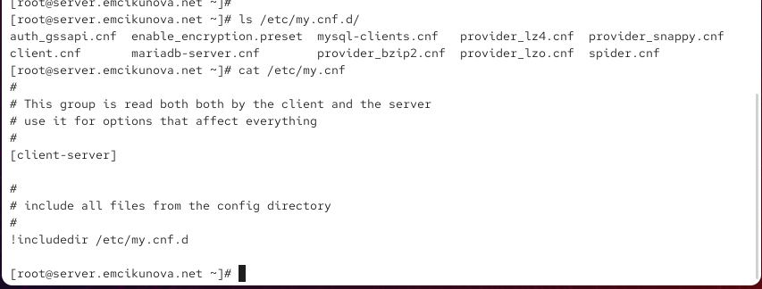
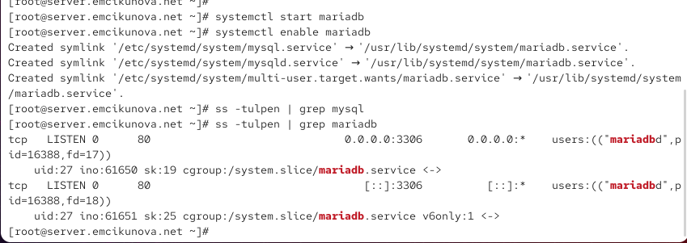
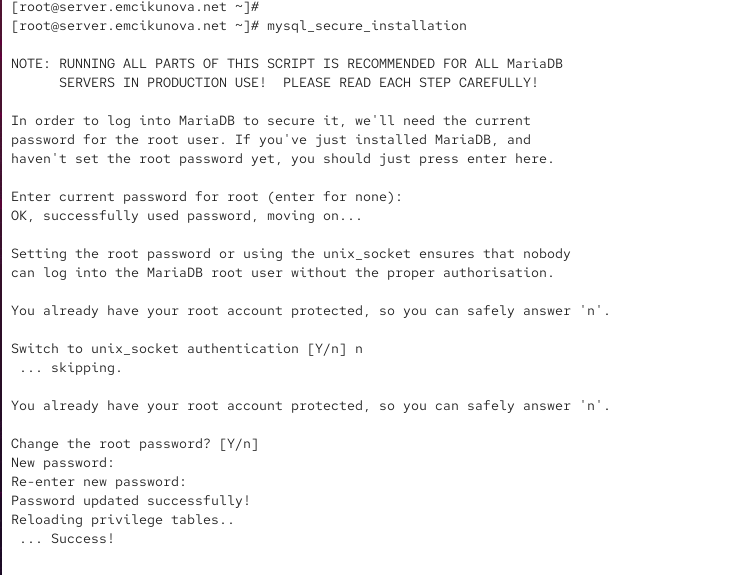
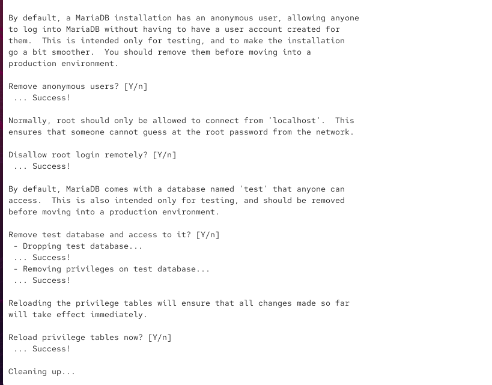
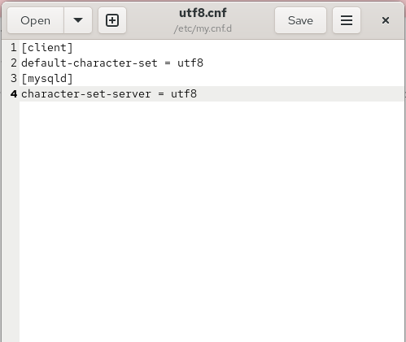
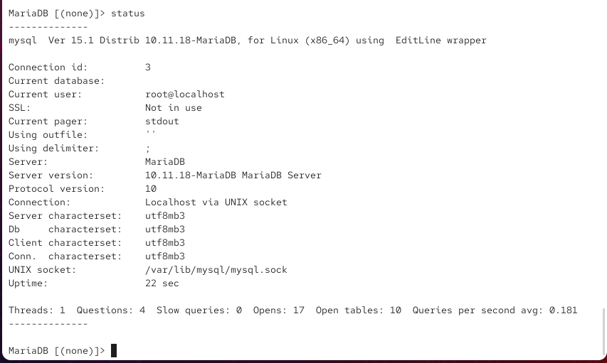
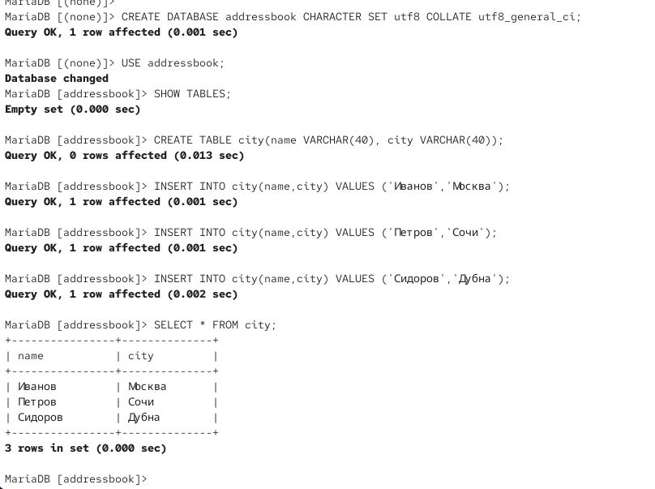
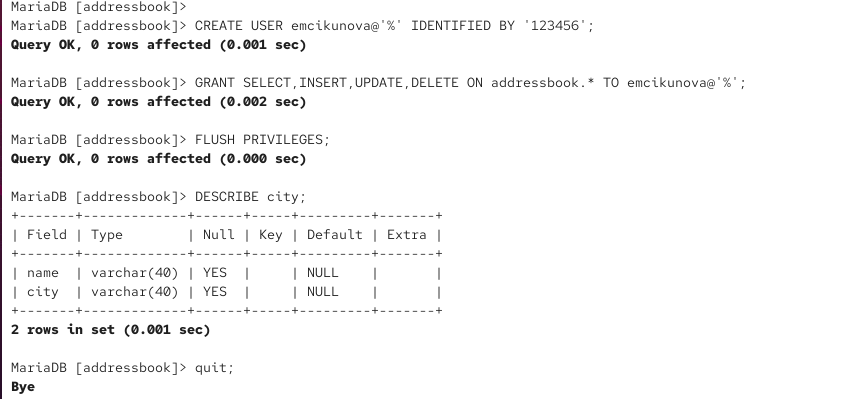
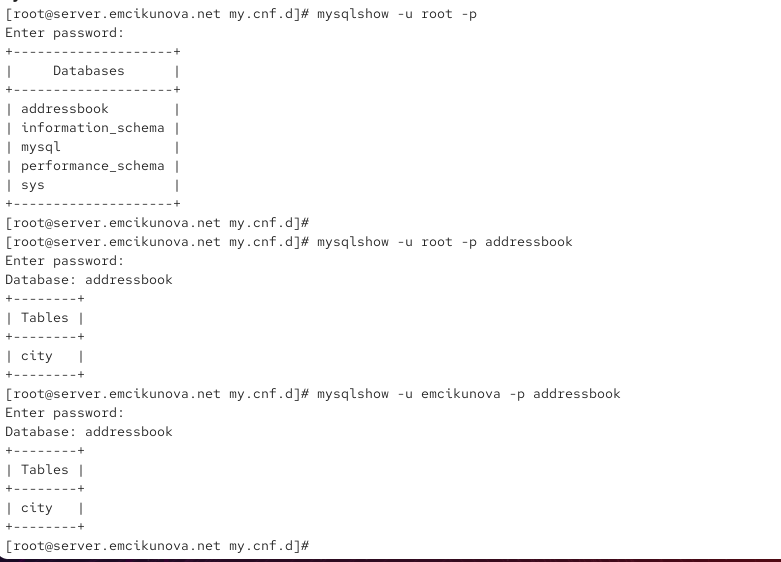
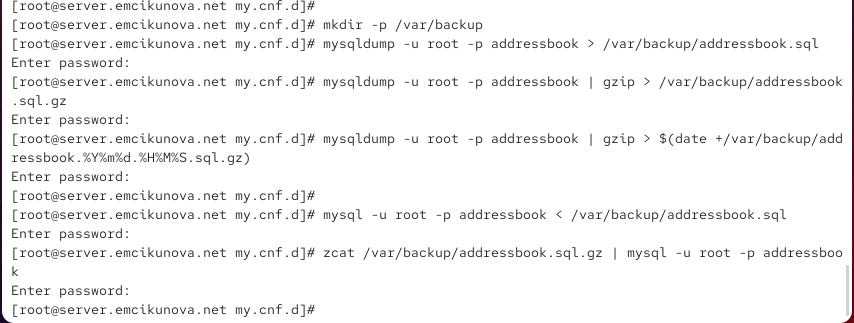

---
## Author
author:
  name: Цыкунова Екатерина Михайловна
  email: 1132246732@rudn.ru
  affiliation:
    - name: Российский университет дружбы народов
      country: Российская Федерация
      postal-code: 117198
      city: Москва
      address: ул. Миклухо-Маклая, д. 6

## Title
title: Лабораторная работа №6
subtitle: Установка и настройка системы управления базами данных MariaDB
license: CC BY
date: today
date-format: "YYYY-MM-DD"
---

# Цели и задачи работы

## Цель лабораторной работы

Целью данной работы является приобретение практических навыков установки, настройки и администрирования системы управления базами данных MariaDB.

## Задачи лабораторной работы

- установить необходимые пакеты MariaDB;
- выполнить первичную настройку безопасности;
- настроить кодировку UTF-8 по умолчанию;
- создать базу данных `addressbook`;
- создать таблицу `city` и заполнить её данными;
- создать пользователя и выдать ему права;
- создать и восстановить резервные копии базы данных;
- подготовить скрипт автоматической настройки MariaDB для Vagrant.

# Процесс выполнения лабораторной работы

## Устанавливаю пакеты MariaDB

{ #fig:001 width=70% height=70% }

## Просматриваю конфигурационные файлы MariaDB

{ #fig:002 width=70% height=70% }

## Запускаю MariaDB и проверяю порт 3306

{ #fig:003 width=70% height=70% }

## Выполняю настройку безопасности MariaDB

{ #fig:004 width=70% height=70% }

## Завершаю настройку безопасности

{ #fig:005 width=70% height=70% }

## Просматриваю справку MariaDB

{ #fig:006 width=70% height=70% }

## Проверяю системные базы данных

{ #fig:007 width=70% height=70% }

## Проверяю статус MariaDB до настройки UTF-8

{ #fig:008 width=70% height=70% }

## Создаю файл utf8.cnf

{ #fig:009 width=70% height=70% }

## Проверяю статус MariaDB после настройки UTF-8

{ #fig:010 width=70% height=70% }

## Создаю базу данных addressbook и таблицу city

{ #fig:011 width=70% height=70% }

## Создаю пользователя и назначаю права

{ #fig:012 width=70% height=70% }

## Проверяю базу данных и таблицу

{ #fig:013 width=70% height=70% }

## Создаю и восстанавливаю резервные копии

{ #fig:014 width=70% height=70% }

## Подготавливаю файлы для Vagrant

{ #fig:015 width=70% height=70% }

## Создаю скрипт автоматической настройки MariaDB

{ #fig:016 width=70% height=70% }

## Вывод

В ходе лабораторной работы была установлена и настроена система управления базами данных MariaDB.

Для сервера была настроена кодировка UTF-8 по умолчанию. После перезапуска службы изменения были проверены через команду `status`.

Была создана база данных `addressbook` с таблицей `city`, содержащей поля `name` и `city`. В таблицу были добавлены тестовые записи с фамилиями сотрудников и городами.

В завершение были созданы резервные копии базы данных и выполнено восстановление из них. Настройка MariaDB была сохранена в каталоге `provision`, а скрипт `mysql.sh` добавлен для автоматического развёртывания базы данных в Vagrant.