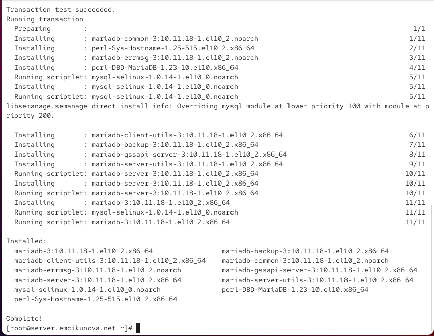
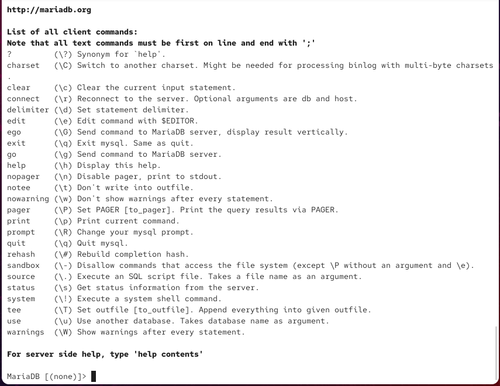
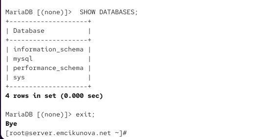
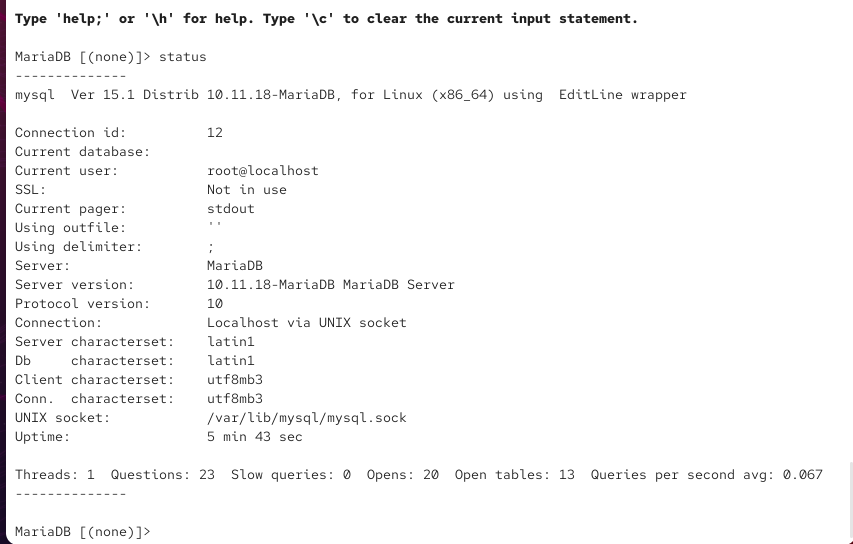
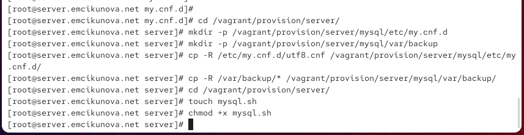
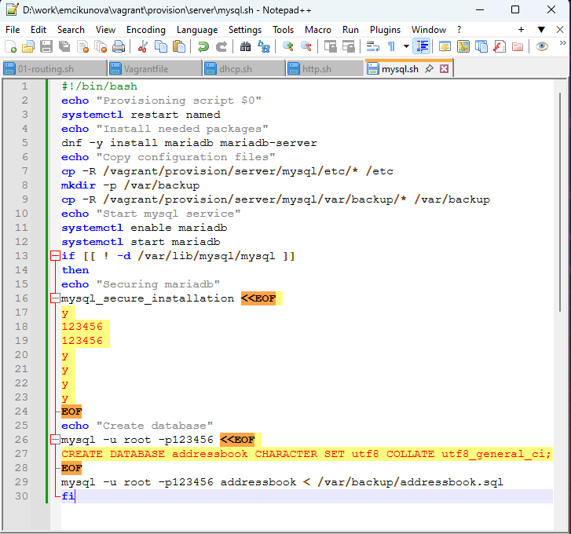

---
## Author
author:
  name: Цыкунова Екатерина Михайловна
  email: 1132246732@rudn.ru
  affiliation:
    - name: Российский университет дружбы народов
      country: Российская Федерация
      postal-code: 117198
      city: Москва
      address: ул. Миклухо-Маклая, д. 6

## Title
title: "Отчёт по лабораторной работе №6"
subtitle: "Установка и настройка системы управления базами данных MariaDB"
license: "CC BY"
---

# Цель работы

Приобретение практических навыков по установке и конфигурированию системы управления базами данных на примере программного обеспечения MariaDB.

# Выполнение лабораторной работы

## Установка и первичная настройка MariaDB

На виртуальной машине `server` открываю терминал и перехожу в режим суперпользователя. Для установки сервера баз данных MariaDB и клиентских утилит выполняю команду:

```bash
dnf -y install mariadb mariadb-server
```

Пакет `mariadb` содержит клиентские программы для подключения к серверу MariaDB и работы с базами данных, а пакет `mariadb-server` содержит серверную часть СУБД. Параметр `-y` автоматически подтверждает установку пакетов и необходимых зависимостей.

В процессе установки менеджер пакетов `dnf` устанавливает непосредственно MariaDB, серверные и клиентские компоненты, а также дополнительные зависимости, среди которых `mariadb-common`, `mariadb-client-utils`, `mariadb-server-utils`, `mariadb-backup`, модули SELinux и библиотеки Perl. Сообщения `Transaction test succeeded` и `Complete!` свидетельствуют об успешном завершении установки (см. рис. [@fig-001]).

{ #fig-001 width=70% }

После установки просматриваю набор конфигурационных файлов MariaDB в каталоге `/etc/my.cnf.d` и содержимое основного конфигурационного файла `/etc/my.cnf`. Для этого выполняю:

```bash
ls /etc/my.cnf.d/
cat /etc/my.cnf
```

В каталоге `/etc/my.cnf.d` присутствуют следующие конфигурационные файлы:

- `auth_gssapi.cnf` — параметры модуля аутентификации GSSAPI;
- `client.cnf` — параметры клиентских программ MariaDB;
- `enable_encryption.preset` — набор параметров, относящихся к настройкам шифрования;
- `mariadb-server.cnf` — основные параметры серверной части MariaDB;
- `mysql-clients.cnf` — параметры клиентских программ, совместимых с MySQL;
- `provider_bzip2.cnf`, `provider_lz4.cnf`, `provider_lzo.cnf` и `provider_snappy.cnf` — конфигурационные фрагменты провайдеров соответствующих алгоритмов сжатия;
- `spider.cnf` — параметры механизма хранения Spider.

Основной файл `/etc/my.cnf` имеет следующее содержимое:

```ini
#
# This group is read both both by the client and the server
# use it for options that affect everything
#
[client-server]

#
# include all files from the config directory
#
!includedir /etc/my.cnf.d
```

Строки, начинающиеся с символа `#`, являются комментариями и не влияют на работу MariaDB. Первые комментарии поясняют, что следующая группа параметров используется как клиентскими программами, так и сервером.

Строка:

```ini
[client-server]
```

объявляет секцию общих параметров, применяемых одновременно к клиентской и серверной частям MariaDB.

Следующие строки-комментарии указывают, что основная конфигурация дополняется файлами из отдельного каталога.

Директива:

```ini
!includedir /etc/my.cnf.d
```

предписывает MariaDB загружать дополнительные конфигурационные файлы из каталога `/etc/my.cnf.d`. Благодаря этому настройки можно разделять между несколькими файлами, не изменяя основной `/etc/my.cnf` (см. рис. [@fig-002]).

{ #fig-002 width=70% }

После установки запускаю службу MariaDB и настраиваю её автоматический запуск вместе с операционной системой:

```bash
systemctl start mariadb
systemctl enable mariadb
```

Команда `systemctl start mariadb` запускает сервер базы данных в текущем сеансе работы системы. Команда `systemctl enable mariadb` добавляет службу в автозагрузку. Сообщение о создании символической ссылки в каталоге `multi-user.target.wants` подтверждает включение автоматического запуска MariaDB.

Для проверки открытого сервером сетевого порта выполняю:

```bash
ss -tulpen | grep mysql
```

Поскольку имя процесса в установленной версии отображается как `mariadbd`, дополнительно использую:

```bash
ss -tulpen | grep mariadb
```

В результате видно, что процесс `mariadbd` прослушивает TCP-порт `3306` как для IPv4, так и для IPv6. Адрес `0.0.0.0:3306` означает прослушивание IPv4-интерфейсов, а `[::]:3306` — IPv6-интерфейсов. Стандартным портом сервера MariaDB/MySQL является TCP-порт `3306` (см. рис. [@fig-003]).

{ #fig-003 width=70% }

Для выполнения первоначальной настройки безопасности запускаю интерактивный скрипт:

```bash
mysql_secure_installation
```

В начале работы скрипт запрашивает текущий пароль пользователя `root` MariaDB. Поскольку выполняется первоначальная настройка, продолжаю настройку и устанавливаю пароль администратора базы данных.

На предложение переключить пользователя `root` на аутентификацию через Unix-сокет:

```text
Switch to unix_socket authentication [Y/n]
```

выбираю `n`, поскольку для дальнейшего выполнения лабораторной работы требуется вход по паролю с использованием команды `mysql -u root -p`.

На запрос изменения пароля пользователя `root` задаю новый пароль. Сообщение `Password updated successfully!` подтверждает успешную установку пароля, а `Reloading privilege tables.. Success!` — успешное обновление таблиц привилегий (см. рис. [@fig-004]).

{ #fig-004 width=70% }

Далее скрипт предлагает удалить анонимных пользователей. Подтверждаю операцию, чтобы исключить возможность подключения к MariaDB без заранее созданной учётной записи.

На запрос:

```text
Disallow root login remotely? [Y/n]
```

также отвечаю утвердительно. В результате пользователь `root` MariaDB может использоваться для администрирования локально, а удалённый вход с этой учётной записью запрещается.

Также подтверждаю удаление тестовой базы данных `test` и прав доступа к ней. В завершение выполняется повторная загрузка таблиц привилегий, благодаря чему внесённые изменения начинают действовать сразу. Все операции завершаются сообщениями `Success!` (см. рис. [@fig-005]).

{ #fig-005 width=70% }

После настройки безопасности вхожу в интерактивную оболочку MariaDB с правами администратора:

```bash
mysql -u root -p
```

Параметр `-u root` указывает имя пользователя базы данных, а `-p` сообщает клиенту о необходимости запросить пароль.

Для просмотра справки и списка команд интерактивного клиента выполняю:

```text
\h
```

В результате MariaDB выводит перечень команд клиента. В частности, `help` используется для вызова справки, `status` — для получения информации о текущем соединении и сервере, `use` — для выбора базы данных, `source` — для выполнения SQL-команд из файла, а `quit` и `exit` — для завершения работы с интерактивной оболочкой (см. рис. [@fig-006]).

{ #fig-006 width=70% }

Для просмотра имеющихся баз данных выполняю SQL-запрос:

```sql
SHOW DATABASES;
```

После первоначальной настройки в системе присутствуют четыре системные базы данных:

- `information_schema` — виртуальная база с метаданными о базах данных, таблицах, столбцах, правах доступа и других объектах СУБД;
- `mysql` — системная база MariaDB, содержащая сведения о пользователях, привилегиях и внутренних настройках сервера;
- `performance_schema` — база, предоставляющая сведения о производительности и внутренних событиях сервера;
- `sys` — набор представлений и вспомогательных объектов, упрощающих анализ диагностических данных MariaDB.

Тестовая база `test` в списке отсутствует, поскольку она была удалена при выполнении `mysql_secure_installation`.

Для выхода из интерактивной оболочки использую:

```text
exit;
```

После этого управление возвращается в командную оболочку операционной системы (см. рис. [@fig-007]).

{ #fig-007 width=70% }

## Конфигурация кодировки символов UTF-8

Перед изменением кодировки повторно вхожу в MariaDB с правами администратора:

```bash
mysql -u root -p
```

Для просмотра состояния текущего соединения выполняю:

```text
status
```

До изменения конфигурации команда выводит информацию о клиенте и сервере MariaDB (см. рис. [@fig-008]).

Первая строка:

```text
mysql  Ver 15.1 Distrib 10.11.18-MariaDB, for Linux (x86_64) using EditLine wrapper
```

показывает версию клиентской программы — `15.1`, версию MariaDB — `10.11.18`, архитектуру `x86_64` и использование библиотеки `EditLine` для обработки ввода.

Строка:

```text
Connection id: 12
```

содержит идентификатор текущего соединения с сервером.

Поле:

```text
Current database:
```

пустое, поскольку после подключения конкретная пользовательская база данных ещё не выбрана.

Строка:

```text
Current user: root@localhost
```

означает, что соединение выполнено от имени пользователя `root` локально.

Строка:

```text
SSL: Not in use
```

показывает, что для данного локального соединения шифрование SSL/TLS не используется.

Строка:

```text
Current pager: stdout
```

означает, что результаты запросов выводятся непосредственно на стандартный вывод терминала.

Строка:

```text
Using outfile: ''
```

показывает, что вывод результатов в отдельный файл не настроен.

Строка:

```text
Using delimiter: ;
```

указывает, что символ `;` является стандартным разделителем, завершающим SQL-запросы.

Строка:

```text
Server: MariaDB
```

определяет используемый сервер баз данных.

Строка:

```text
Server version: 10.11.18-MariaDB MariaDB Server
```

показывает установленную версию серверной части MariaDB.

Строка:

```text
Protocol version: 10
```

содержит версию сетевого протокола MySQL/MariaDB.

Строка:

```text
Connection: Localhost via UNIX socket
```

показывает, что локальное соединение с сервером выполняется через UNIX-сокет, а не через TCP.

До изменения конфигурации отображаются следующие кодировки:

```text
Server characterset: latin1
Db     characterset: latin1
Client characterset: utf8mb3
Conn.  characterset: utf8mb3
```

Следовательно, кодировкой сервера и баз данных по умолчанию является `latin1`, в то время как клиент и текущее соединение используют `utf8mb3`.

Строка:

```text
UNIX socket: /var/lib/mysql/mysql.sock
```

содержит путь к UNIX-сокету MariaDB.

Поле `Uptime` показывает время, прошедшее с момента запуска сервера. В нижней строке также выводится служебная статистика: количество активных потоков, обработанных запросов, медленных запросов, открытий таблиц, открытых таблиц и среднее число запросов в секунду.

{ #fig-008 width=70% }

Для изменения кодировки по умолчанию перехожу в каталог `/etc/my.cnf.d` и создаю отдельный конфигурационный файл `utf8.cnf`:

```bash
cd /etc/my.cnf.d
touch utf8.cnf
```

В файл записываю:

```ini
[client]
default-character-set = utf8

[mysqld]
character-set-server = utf8
```

Секция `[client]` содержит параметры клиентских программ. Директива:

```ini
default-character-set = utf8
```

устанавливает UTF-8 в качестве кодировки по умолчанию для клиентов MariaDB.

Секция `[mysqld]` относится непосредственно к серверному процессу MariaDB. Директива:

```ini
character-set-server = utf8
```

задаёт UTF-8 в качестве кодировки сервера по умолчанию. Содержимое созданного конфигурационного файла показано на рис. [@fig-009].

{ #fig-009 width=70% }

Для применения новых параметров перезапускаю MariaDB:

```bash
systemctl restart mariadb
```

После перезапуска снова подключаюсь к серверу:

```bash
mysql -u root -p
```

и выполняю:

```text
status
```

После внесения изменений значения кодировок имеют следующий вид:

```text
Server characterset: utf8mb3
Db     characterset: utf8mb3
Client characterset: utf8mb3
Conn.  characterset: utf8mb3
```

В MariaDB 10.11 имя `utf8` соответствует трёхбайтовой реализации UTF-8 и в статусе отображается под названием `utf8mb3`. До изменения параметров сервер и база данных использовали `latin1`, а после перезапуска все четыре параметра — сервер, база данных, клиент и соединение — используют `utf8mb3`. Это подтверждает успешное применение созданного файла `utf8.cnf` (см. рис. [@fig-010]).

Остальные поля `status`, например идентификатор соединения, время работы сервера и количество выполненных запросов, изменились вследствие перезапуска MariaDB и создания нового соединения и не относятся непосредственно к изменению кодировки.

{ #fig-010 width=70% }

## Создание базы данных addressbook

Подключившись к MariaDB от имени администратора, создаю базу данных `addressbook`:

```sql
CREATE DATABASE addressbook CHARACTER SET utf8 COLLATE utf8_general_ci;
```

Параметр `CHARACTER SET utf8` задаёт UTF-8 в качестве набора символов базы данных, а `COLLATE utf8_general_ci` устанавливает правила сравнения и сортировки строк. Суффикс `ci` означает `case insensitive`, то есть сравнение символов без учёта регистра.

После успешного создания выбираю базу данных для дальнейшей работы:

```sql
USE addressbook;
```

Проверяю список таблиц:

```sql
SHOW TABLES;
```

На этом этапе MariaDB возвращает:

```text
Empty set
```

поскольку база только создана и ещё не содержит таблиц.

Создаю таблицу `city`:

```sql
CREATE TABLE city(
    name VARCHAR(40),
    city VARCHAR(40)
);
```

Таблица состоит из двух текстовых полей. Поле `name` предназначено для фамилии сотрудника, а `city` — для города, в котором он работает. Для обоих полей используется тип `VARCHAR(40)`, позволяющий хранить строки переменной длины до 40 символов.

Затем добавляю сведения о трёх сотрудниках:

```sql
INSERT INTO city(name,city) VALUES ('Иванов','Москва');
INSERT INTO city(name,city) VALUES ('Петров','Сочи');
INSERT INTO city(name,city) VALUES ('Сидоров','Дубна');
```

Каждое сообщение:

```text
Query OK, 1 row affected
```

означает, что соответствующая запись успешно добавлена в таблицу.

Для проверки содержимого выполняю:

```sql
SELECT * FROM city;
```

Результат запроса содержит три строки:

```text
Иванов    Москва
Петров    Сочи
Сидоров   Дубна
```

Символ `*` в запросе `SELECT` означает выбор всех столбцов таблицы. Корректное отображение кириллических фамилий и названий городов также подтверждает работу настроенной кодировки UTF-8 (см. рис. [@fig-011]).

{ #fig-011 width=70% }

Для работы с базой данных создаю отдельного пользователя с логином `emcikunova`:

```sql
CREATE USER emcikunova@'%' IDENTIFIED BY '123456';
```

Имя пользователя состоит из двух частей. `emcikunova` является именем учётной записи MariaDB, а символ `%` в части хоста означает возможность сопоставления подключения с различных адресов. Фактическая возможность удалённого подключения дополнительно зависит от сетевой конфигурации сервера и правил межсетевого экрана.

Далее предоставляю созданному пользователю права на просмотр, добавление, изменение и удаление записей базы `addressbook`:

```sql
GRANT SELECT,INSERT,UPDATE,DELETE ON addressbook.* TO emcikunova@'%';
```

Здесь:

- `SELECT` предоставляет право чтения данных;
- `INSERT` — добавления новых записей;
- `UPDATE` — изменения существующих записей;
- `DELETE` — удаления записей;
- `addressbook.*` означает применение перечисленных прав ко всем таблицам базы `addressbook`.

Для применения изменений в таблицах привилегий выполняю:

```sql
FLUSH PRIVILEGES;
```

После этого просматриваю структуру таблицы:

```sql
DESCRIBE city;
```

Результат показывает наличие двух полей:

```text
name    varchar(40)
city    varchar(40)
```

Для обоих полей значение `Null` равно `YES`, следовательно, поля допускают значение `NULL`. Значение `Default` равно `NULL`, первичные или иные ключи для таблицы не определены, а дополнительные атрибуты отсутствуют.

Завершаю работу с интерактивной оболочкой:

```text
quit;
```

(см. рис. [@fig-012]).

{ #fig-012 width=70% }

После выхода из MariaDB проверяю список баз данных с помощью отдельной клиентской утилиты:

```bash
mysqlshow -u root -p
```

В списке теперь присутствуют:

```text
addressbook
information_schema
mysql
performance_schema
sys
```

Наличие `addressbook` подтверждает успешное создание пользовательской базы.

Для просмотра таблиц базы `addressbook` от имени администратора выполняю:

```bash
mysqlshow -u root -p addressbook
```

Утилита выводит таблицу `city`.

Дополнительно проверяю доступ от имени ранее созданного пользователя:

```bash
mysqlshow -u emcikunova -p addressbook
```

После ввода пароля пользователь `emcikunova` также получает список таблиц базы `addressbook`, содержащий `city`. Это подтверждает корректную работу созданной учётной записи и назначенных ей прав доступа (см. рис. [@fig-013]).

{ #fig-013 width=70% }

## Создание и восстановление резервных копий базы данных

Для хранения резервных копий создаю каталог `/var/backup`:

```bash
mkdir -p /var/backup
```

Параметр `-p` создаёт каталог при его отсутствии и не выдаёт ошибку, если он уже существует.

Несжатую резервную копию базы `addressbook` создаю командой:

```bash
mysqldump -u root -p addressbook > /var/backup/addressbook.sql
```

Утилита `mysqldump` формирует SQL-представление структуры и содержимого базы. Параметр `-u root` задаёт пользователя, `-p` включает запрос пароля, а `addressbook` определяет базу, содержимое которой необходимо сохранить. Оператор `>` перенаправляет сформированный SQL-дамп в файл `/var/backup/addressbook.sql`.

Для экономии дискового пространства создаю сжатую резервную копию:

```bash
mysqldump -u root -p addressbook | gzip > /var/backup/addressbook.sql.gz
```

В данном случае стандартный вывод `mysqldump` передаётся через конвейер `|` программе `gzip`, после чего сжатые данные записываются в файл `addressbook.sql.gz`.

Также создаю резервную копию, имя которой содержит дату и время:

```bash
mysqldump -u root -p addressbook | gzip > $(date +/var/backup/addressbook.%Y%m%d.%H%M%S.sql.gz)
```

Команда `date` формирует имя файла, в котором:

- `%Y` — четырёхзначный год;
- `%m` — месяц;
- `%d` — день;
- `%H` — часы;
- `%M` — минуты;
- `%S` — секунды.

В результате каждая резервная копия может получать уникальное имя, отражающее момент её создания.

Для проверки возможности восстановления сначала восстанавливаю базу из обычного SQL-файла:

```bash
mysql -u root -p addressbook < /var/backup/addressbook.sql
```

Оператор `<` передаёт содержимое файла `addressbook.sql` на стандартный ввод клиента `mysql`, который выполняет содержащиеся в дампе SQL-команды в базе `addressbook`.

Затем проверяю восстановление из сжатого файла:

```bash
zcat /var/backup/addressbook.sql.gz | mysql -u root -p addressbook
```

Команда `zcat` распаковывает содержимое архива в стандартный вывод без создания промежуточного несжатого файла, после чего SQL-команды передаются через конвейер клиенту `mysql`.

Возврат приглашения командной строки без сообщений об ошибках после обеих операций свидетельствует об успешной обработке файлов резервных копий (см. рис. [@fig-014]).

{ #fig-014 width=70% }

## Автоматизация установки и настройки MariaDB средствами Vagrant

Для фиксации выполненных действий в конфигурации внутреннего окружения виртуальной машины перехожу в каталог серверного provision:

{ #fig-015 width=70% }

Содержимое созданного файла `mysql.sh` показано на рис. [@fig-016].

{ #fig-016 width=70% }

# Вывод

В ходе работы установлена и настроена MariaDB. Выполнена настройка безопасности, установлена кодировка UTF-8, создана база данных `addressbook` с таблицей `city` и отдельным пользователем.

Также созданы резервные копии базы данных и выполнено их восстановление. Настройка MariaDB автоматизирована с помощью скрипта `mysql.sh`, который подключён в `Vagrantfile`.

# Контрольные вопросы

*1. Какая команда отвечает за настройки безопасности в MariaDB?*

Для настройки безопасности используется команда:

```bash
mysql_secure_installation
```

Она позволяет установить пароль `root`, удалить анонимных пользователей и тестовую базу, а также запретить удалённый вход для `root`.

*2. Как настроить MariaDB для доступа через сеть?*

Необходимо настроить прослушивание сетевого интерфейса, например:

```ini
[mysqld]
bind-address=0.0.0.0
```

Также нужно создать пользователя для удалённого подключения и выдать ему права:

```sql
CREATE USER user@'%' IDENTIFIED BY 'password';
GRANT SELECT,INSERT,UPDATE,DELETE ON addressbook.* TO user@'%';
```

После изменения конфигурации MariaDB перезапускается:

```bash
systemctl restart mariadb
```

*3. Какая команда позволяет получить обзор доступных баз данных после входа в среду оболочки MariaDB?*

Используется команда:

```sql
SHOW DATABASES;
```

Она выводит список доступных баз данных.

*4. Какая команда позволяет узнать, какие таблицы доступны в базе данных?*

После выбора базы командой:

```sql
USE addressbook;
```

список таблиц выводится командой:

```sql
SHOW TABLES;
```

*5. Какая команда позволяет узнать, какие поля доступны в таблице?*

Для просмотра структуры таблицы используется:

```sql
DESCRIBE city;
```

Команда показывает имена полей, их типы и свойства.

*6. Какая команда позволяет узнать, какие записи доступны в таблице?*

Для просмотра всех записей используется:

```sql
SELECT * FROM city;
```

*7. Как удалить запись из таблицы?*

Для удаления записи применяется команда `DELETE`, например:

```sql
DELETE FROM city WHERE name='Петров';
```

Условие `WHERE` указывает, какую запись необходимо удалить.

*8. Где расположены файлы конфигурации MariaDB? Что можно настроить с их помощью?*

Основной файл конфигурации находится по пути:

```text
/etc/my.cnf
```

Дополнительные файлы находятся в:

```text
/etc/my.cnf.d/
```

В них можно настроить кодировку, сетевые параметры, порт, каталог данных и другие параметры MariaDB.

*9. Где располагаются файлы с базами данных MariaDB?*

По умолчанию файлы MariaDB хранятся в каталоге:

```text
/var/lib/mysql/
```

*10. Как сделать резервную копию базы данных и затем её восстановить?*

Резервная копия создаётся командой:

```bash
mysqldump -u root -p addressbook > /var/backup/addressbook.sql
```

Восстановление выполняется командой:

```bash
mysql -u root -p addressbook < /var/backup/addressbook.sql
```

Для сжатой копии можно использовать:

```bash
mysqldump -u root -p addressbook | gzip > /var/backup/addressbook.sql.gz
```

и восстановить её командой:

```bash
zcat /var/backup/addressbook.sql.gz | mysql -u root -p addressbook
```