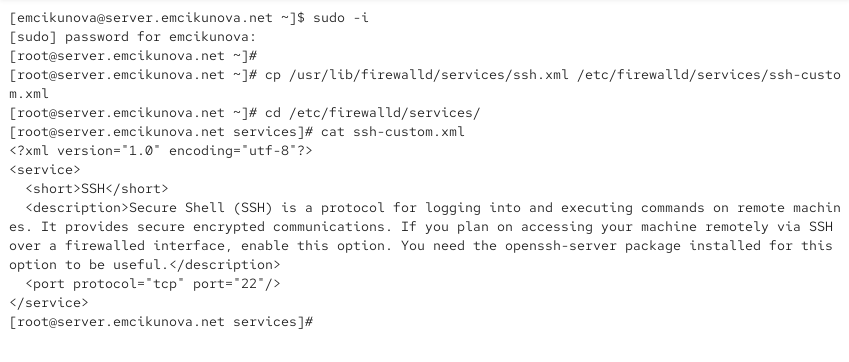
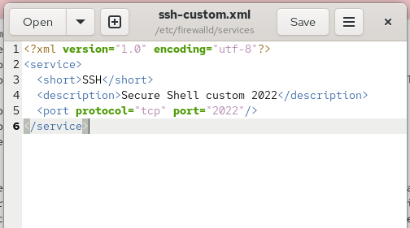
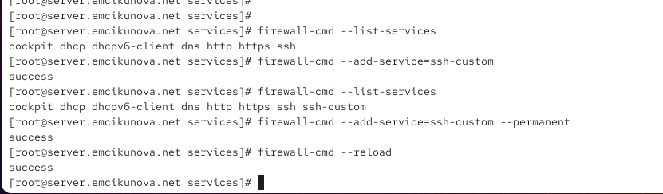
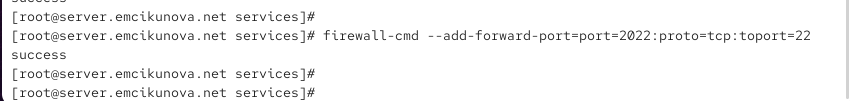
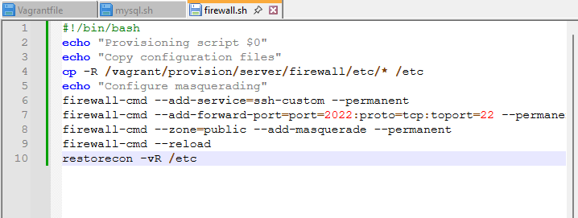

---
## Author
author:
  name: Цыкунова Екатерина Михайловна
  email: 1132246732@rudn.ru
  affiliation:
    - name: Российский университет дружбы народов
      country: Российская Федерация
      postal-code: 117198
      city: Москва
      address: ул. Миклухо-Маклая, д. 6

## Title
title: Лабораторная работа №7
subtitle: Расширенные настройки межсетевого экрана
license: CC BY
date: today
date-format: "YYYY-MM-DD"
---

# Цели и задачи работы

## Цель лабораторной работы

Целью данной работы является приобретение практических навыков расширенной настройки межсетевого экрана FirewallD: создания пользовательских служб, перенаправления портов, настройки маршрутизации IPv4-пакетов и маскарадинга, а также автоматизации конфигурации с помощью Vagrant.

## Задачи лабораторной работы

- создать пользовательскую службу `ssh-custom` на основе стандартной службы SSH;
- настроить доступ к SSH-серверу через TCP-порт `2022`;
- настроить перенаправление TCP-порта `2022` на порт `22`;
- настроить маскарадинг для предоставления клиенту доступа к Интернету;

# Процесс выполнения лабораторной работы

## Создаю пользовательскую службу FirewallD

{ #fig:001 width=70% height=70% }

## Изменяю порт пользовательской службы на 2022

{ #fig:002 width=70% height=70% }

## Проверяю список доступных служб FirewallD

{ #fig:003 width=70% height=70% }

## Перезагружаю FirewallD и проверяю регистрацию службы

{ #fig:004 width=70% height=70% }

## Активирую пользовательскую службу ssh-custom

{ #fig:005 width=70% height=70% }

## Настраиваю перенаправление TCP-порта 2022 на порт 22

{ #fig:006 width=70% height=70% }

## Проверяю SSH-подключение через порт 2022

{ #fig:007 width=70% height=70% }

## Включаю маршрутизацию IPv4 и маскарадинг

{ #fig:008 width=70% height=70% }

## Проверяю доступ клиента к сети Интернет

{ #fig:009 width=70% height=70% }

## Сохраняю конфигурационные файлы для Vagrant

{ #fig:010 width=70% height=70% }

## Создаю скрипт автоматической настройки firewall.sh

{ #fig:011 width=70% height=70% }

# Результаты лабораторной работы

## Вывод

В ходе лабораторной работы была выполнена расширенная настройка межсетевого экрана FirewallD на виртуальной машине `server`.

На основе стандартной службы SSH была создана пользовательская служба `ssh-custom`, разрешающая подключения через TCP-порт `2022`. Настроено перенаправление входящих соединений с порта `2022` на стандартный порт SSH `22`.

Работоспособность перенаправления была подтверждена успешным SSH-подключением с виртуальной машины `client`.

Для организации доступа клиента к сети Интернет на сервере была включена маршрутизация IPv4-пакетов и настроен маскарадинг в зоне `public`. Доступность внешних сетевых ресурсов подтверждена открытием веб-сайта в браузере Firefox.
