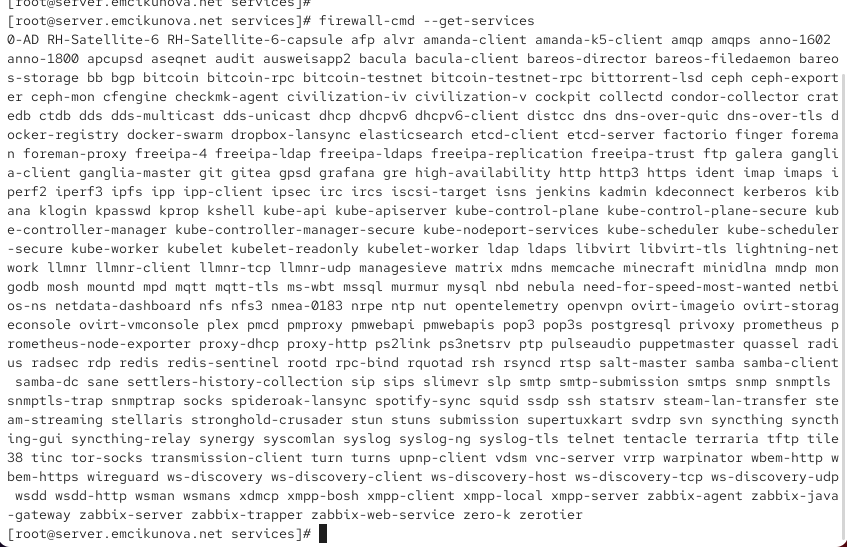
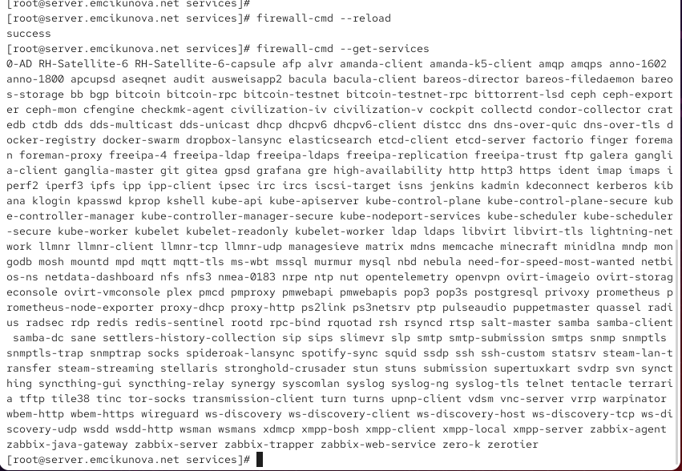
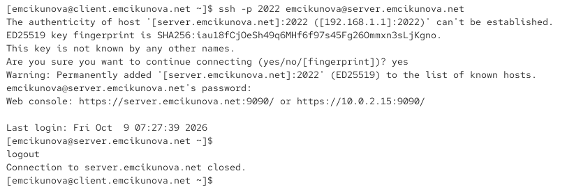
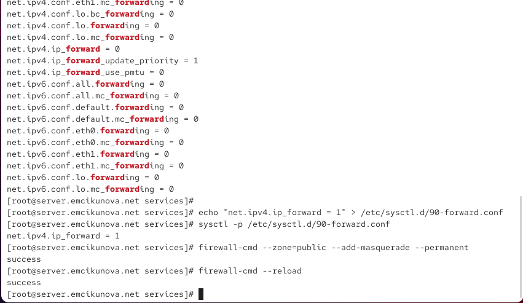
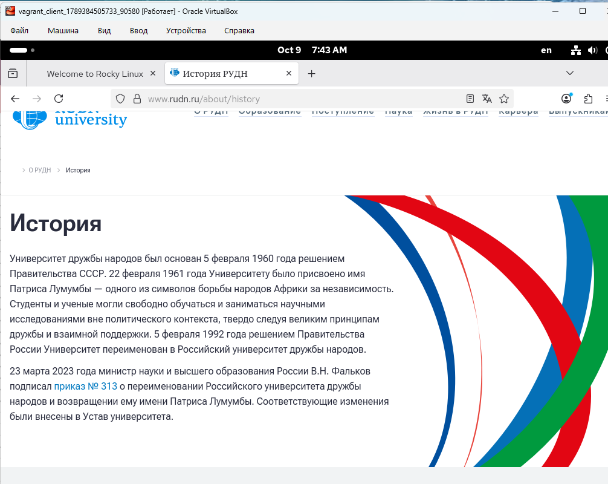
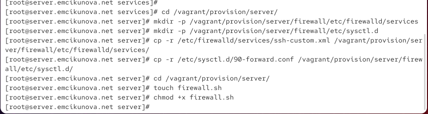

---
## Author
author:
  name: Цыкунова Екатерина Михайловна
  email: 1132246732@rudn.ru
  affiliation:
    - name: Российский университет дружбы народов
      country: Российская Федерация
      postal-code: 117198
      city: Москва
      address: ул. Миклухо-Маклая, д. 6

## Title
title: "Отчёт по лабораторной работе №7"
subtitle: "Расширенные настройки межсетевого экрана"
license: "CC BY"
---

# Цель работы

Получить навыки настройки межсетевого экрана в Linux в части переадресации портов и настройки Masquerading.

# Выполнение лабораторной работы

## Создание пользовательской службы firewalld

На виртуальной машине `server.emcikunova.net` открываю терминал и перехожу в режим суперпользователя командой `sudo -i`. Для настройки доступа к SSH-серверу через нестандартный порт создаю собственное описание службы FirewallD на основе существующего файла конфигурации SSH.

Для этого выполняю команду:

```bash
cp /usr/lib/firewalld/services/ssh.xml /etc/firewalld/services/ssh-custom.xml
```

Команда `cp` копирует стандартный файл описания службы SSH из системного каталога `/usr/lib/firewalld/services/` в каталог пользовательских конфигураций `/etc/firewalld/services/`. Новому файлу присваивается имя `ssh-custom.xml`, что позволяет изменять параметры службы без редактирования исходной системной конфигурации.

Перехожу в каталог пользовательских служб и просматриваю содержимое созданного файла:

```bash
cd /etc/firewalld/services/
cat ssh-custom.xml
```

В результате отображается XML-файл с описанием стандартной службы SSH, использующей TCP-порт `22` (см. рис. [@fig-001]).

Файл описания службы имеет следующую структуру:

- Строка `<?xml version="1.0" encoding="utf-8"?>` представляет собой XML-декларацию. Атрибут `version="1.0"` определяет версию языка XML, а `encoding="utf-8"` указывает кодировку документа.
- Тег `<service>` является корневым элементом документа и объединяет параметры службы, используемые FirewallD.
- Элемент `<short>SSH</short>` задаёт краткое название службы, которое используется для её идентификации.
- Элемент `<description>...</description>` содержит текстовое описание назначения службы. В исходном файле приводится информация о протоколе Secure Shell и его применении для защищённого удалённого доступа.
- Элемент `<port protocol="tcp" port="22"/>` определяет разрешённый сетевой порт и транспортный протокол. Атрибут `protocol="tcp"` указывает использование TCP, а `port="22"` задаёт номер порта. Символы `/>` означают, что элемент не содержит вложенных элементов и закрывается непосредственно в открывающем теге.
- Закрывающий тег `</service>` обозначает завершение описания службы.

XML использует парные открывающие и закрывающие теги для описания структуры документа. Параметры элементов записываются в виде атрибутов, значения которых заключаются в кавычки. FirewallD считывает эти параметры и на их основе формирует правила фильтрации сетевого трафика.

{ #fig-001 width=70% }

Открываю файл `/etc/firewalld/services/ssh-custom.xml` в текстовом редакторе и изменяю его содержимое. Для новой службы устанавливаю TCP-порт `2022`, а исходное описание заменяю текстом, указывающим на модификацию стандартной конфигурации SSH.

После редактирования файл содержит следующие строки:

```xml
<?xml version="1.0" encoding="utf-8"?>
<service>
  <short>SSH</short>
  <description>Secure Shell custom 2022</description>
  <port protocol="tcp" port="2022"/>
</service>
```

Строка `<description>Secure Shell custom 2022</description>` определяет новое описание пользовательской службы. Параметр `port="2022"` задаёт порт, через который предполагается организовать доступ к SSH-серверу.

Остальные элементы XML-документа сохраняют исходное назначение. После внесения изменений сохраняю файл конфигурации (см. рис. [@fig-002]).

{ #fig-002 width=70% }

Для проверки регистрации новой службы в FirewallD выполняю команду:

```bash
firewall-cmd --get-services
```

Команда `firewall-cmd` используется для управления межсетевым экраном FirewallD. Параметр `--get-services` выводит перечень всех служб, описания которых доступны межсетевому экрану.

В терминале отображается большой список стандартных служб, включая `ssh`, `http`, `https`, `dns` и другие. Созданная пользовательская служба `ssh-custom` в первоначальном списке отсутствует, поскольку после добавления нового XML-файла конфигурация FirewallD ещё не была перезагружена (см. рис. [@fig-003]).

{ #fig-003 width=70% }

Для применения изменений перезагружаю конфигурацию межсетевого экрана:

```bash
firewall-cmd --reload
```

Параметр `--reload` заставляет FirewallD повторно загрузить конфигурационные файлы и применить постоянные настройки без перезапуска операционной системы. При этом временные изменения, не сохранённые в постоянной конфигурации, могут быть сброшены.

Команда завершается сообщением `success`, подтверждающим успешную перезагрузку правил.

После этого повторно запрашиваю перечень доступных служб:

```bash
firewall-cmd --get-services
```

Теперь в списке появляется служба `ssh-custom`, что свидетельствует об успешном распознавании пользовательского XML-файла. При этом наличие службы в перечне доступных ещё не означает, что она включена в действующие правила межсетевого экрана (см. рис. [@fig-004]).

{ #fig-004 width=70% }

Для проверки активных служб выполняю команду:

```bash
firewall-cmd --list-services
```

В результате отображается список служб, разрешённых в текущей зоне межсетевого экрана: `cockpit`, `dhcp`, `dhcpv6-client`, `dns`, `http`, `https` и `ssh`. Пользовательская служба `ssh-custom` первоначально отсутствует в данном списке.

Для её активации выполняю команду:

```bash
firewall-cmd --add-service=ssh-custom
```

Параметр `--add-service=ssh-custom` добавляет пользовательскую службу в действующую конфигурацию FirewallD. Поскольку параметр `--permanent` не указан, изменение применяется только к текущим правилам межсетевого экрана.

После выполнения команды получаю сообщение `success`. Повторный вызов:

```bash
firewall-cmd --list-services
```

показывает, что служба `ssh-custom` добавлена в список активных служб наряду со стандартной службой `ssh`.

Для сохранения настройки после перезагрузки межсетевого экрана выполняю:

```bash
firewall-cmd --add-service=ssh-custom --permanent
firewall-cmd --reload
```

Параметр `--permanent` записывает изменение в постоянную конфигурацию FirewallD, а команда `--reload` применяет сохранённые правила.

Обе команды завершаются сообщением `success`, подтверждающим успешное сохранение конфигурации и её применение (см. рис. [@fig-005]).

{ #fig-005 width=70% }

## Перенаправление портов

После создания и активации пользовательской службы настраиваю перенаправление входящих TCP-соединений с порта `2022` на стандартный порт SSH-сервера `22`.

Для этого на виртуальной машине `server` выполняю команду:

```bash
firewall-cmd --add-forward-port=port=2022:proto=tcp:toport=22
```

Команда `firewall-cmd` позволяет создавать правила перенаправления портов средствами FirewallD.

В данном случае используются следующие параметры:

- `--add-forward-port` — добавляет правило перенаправления входящих соединений.
- `port=2022` — определяет исходный порт, на который поступают входящие подключения.
- `proto=tcp` — задаёт транспортный протокол TCP, используемый службой SSH.
- `toport=22` — определяет порт назначения, на который перенаправляется поступающий трафик.

В результате соединения, поступающие на TCP-порт `2022`, перенаправляются на TCP-порт `22`, на котором продолжает работать стандартная служба SSH.

При этом изменение номера порта в настройках самого демона `sshd` не требуется, поскольку перенаправление выполняется средствами межсетевого экрана.

После выполнения команды в терминале отображается сообщение `success`, подтверждающее создание правила перенаправления (см. рис. [@fig-006]).

Поскольку команда выполняется без параметра `--permanent`, данное правило первоначально действует только в текущей конфигурации FirewallD. Постоянное правило будет дополнительно предусмотрено в скрипте автоматической настройки сервера.

{ #fig-006 width=70% }

Для проверки работоспособности созданного правила перехожу на виртуальную машину `client.emcikunova.net`.

Открываю терминал и выполняю подключение к серверу по протоколу SSH с использованием порта `2022`:

```bash
ssh -p 2022 emcikunova@server.emcikunova.net
```

В данной команде параметр `-p 2022` указывает нестандартный порт для подключения, `emcikunova` является именем пользователя на сервере, а `server.emcikunova.net` — доменным именем удалённого узла.

При первом подключении SSH-клиент выводит предупреждение о том, что подлинность удалённого узла ещё не подтверждена. В сообщении отображается адрес сервера `192.168.1.1`, порт `2022` и отпечаток публичного ключа сервера алгоритма ED25519.

Для подтверждения подключения ввожу `yes`. После этого SSH добавляет сведения о сервере в файл известных узлов `known_hosts` и запрашивает пароль пользователя `emcikunova`.

Ввожу пароль и успешно подключаюсь к серверу. В терминале отображается приглашение командной строки:

```bash
[emcikunova@server.emcikunova.net ~]$
```

Появление приглашения удалённой системы подтверждает, что SSH-подключение через порт `2022` работает корректно.

После проверки завершаю сеанс командой:

```bash
logout
```

Соединение закрывается, а управление возвращается в терминал виртуальной машины `client` (см. рис. [@fig-007]).

{ #fig-007 width=70% }

## Настройка Port Forwarding и Masquerading

Для организации доступа виртуальной машины `client` к сети Интернет через виртуальную машину `server` необходимо разрешить маршрутизацию IPv4-пакетов и настроить преобразование сетевых адресов.

На виртуальной машине `server` проверяю текущие параметры ядра Linux, связанные с перенаправлением пакетов:

```bash
sysctl -a | grep forward
```

Команда `sysctl -a` выводит доступные параметры ядра, а конструкция `| grep forward` фильтрует результат и оставляет строки, содержащие слово `forward`.

Среди отображаемых параметров нахожу:

```text
net.ipv4.ip_forward = 0
```

Значение `0` означает, что глобальное перенаправление IPv4-пакетов на сервере отключено. В этом состоянии система не выполняет обычную маршрутизацию IPv4-пакетов между сетевыми интерфейсами.

Для включения маршрутизации создаю отдельный конфигурационный файл в каталоге `/etc/sysctl.d/`:

```bash
echo "net.ipv4.ip_forward = 1" > /etc/sysctl.d/90-forward.conf
```

Команда `echo` выводит строку `net.ipv4.ip_forward = 1`, а оператор `>` записывает её в файл `/etc/sysctl.d/90-forward.conf`, создавая файл или заменяя его содержимое.

Параметр `net.ipv4.ip_forward` отвечает за возможность передачи IPv4-пакетов между сетевыми интерфейсами. Значение `1` разрешает маршрутизацию пакетов ядром Linux.

Для немедленного применения настройки выполняю:

```bash
sysctl -p /etc/sysctl.d/90-forward.conf
```

Параметр `-p` указывает `sysctl` прочитать настройки из заданного файла и применить их к работающему ядру.

В результате отображается строка:

```text
net.ipv4.ip_forward = 1
```

Она подтверждает успешное включение перенаправления IPv4-пакетов.

Следующим этапом включаю маскарадинг, необходимый для предоставления клиентской виртуальной машине доступа к внешним сетям через сервер.

Выполняю команду:

```bash
firewall-cmd --zone=public --add-masquerade --permanent
```

В команде используются следующие параметры:

- `--zone=public` — указывает зону FirewallD `public`, в которой применяется правило.
- `--add-masquerade` — включает маскарадинг, представляющий собой механизм преобразования исходных IP-адресов с помощью NAT.
- `--permanent` — сохраняет настройку в постоянной конфигурации межсетевого экрана.

Маскарадинг позволяет клиентским устройствам с адресами внутренней сети обращаться к внешним ресурсам через сервер. При отправке пакетов во внешнюю сеть исходный адрес клиента заменяется адресом исходящего интерфейса сервера.

Ответные пакеты обрабатываются механизмом отслеживания соединений, после чего передаются исходному клиенту. Это позволяет использовать сервер в качестве шлюза для внутренней сети.

После добавления правила выполняю:

```bash
firewall-cmd --reload
```

Команды включения маскарадинга и перезагрузки FirewallD завершаются сообщениями `success`, что подтверждает успешное применение постоянных правил (см. рис. [@fig-008]).

{ #fig-008 width=70% }

Для проверки доступа к сети Интернет перехожу на виртуальную машину `client`.

Открываю браузер Firefox и перехожу на сайт Российского университета дружбы народов по адресу:

```text
https://www.rudn.ru/about/history
```

В браузере успешно загружается страница «История» официального сайта университета. На странице отображаются текстовая информация и графические элементы, полученные с удалённого веб-сервера.

Успешная загрузка внешнего сайта подтверждает работоспособность сетевого подключения клиентской виртуальной машины и возможность обращения к ресурсам сети Интернет после настройки маршрутизации и маскарадинга на сервере (см. рис. [@fig-009]).

{ #fig-009 width=70% }

## Внесение изменений в настройки внутреннего окружения виртуальной машины

Выполнение операций копирования, создания каталогов и подготовки файла скрипта представлено на рисунке (см. рис. [@fig-010]).

{ #fig-010 width=70% }

Открываю файл `/vagrant/provision/server/firewall.sh` в текстовом редакторе и записываю в него команды автоматической настройки межсетевого экрана.

{ #fig-011 width=70% }

# Вывод

В ходе лабораторной работы выполнена расширенная настройка межсетевого экрана FirewallD на виртуальной машине `server`.

Создана пользовательская служба `ssh-custom`, предназначенная для использования TCP-порта `2022`. Настроено перенаправление входящих SSH-соединений с порта `2022` на стандартный порт `22`. Работоспособность перенаправления подтверждена успешным SSH-подключением с виртуальной машины `client`.

На сервере включена маршрутизация IPv4-пакетов и настроен маскарадинг в зоне `public`. Доступ клиентской виртуальной машины к сети Интернет проверен посредством открытия внешнего веб-сайта в браузере Firefox.

Для автоматизации настройки подготовлены конфигурационные файлы и скрипт `firewall.sh`, содержащий команды восстановления пользовательской службы, правил перенаправления портов и маскарадинга. Также предусмотрено подключение скрипта к механизму подготовки виртуальной машины в конфигурации Vagrant.

# Контрольные вопросы

*1. Где хранятся пользовательские файлы firewalld?*

Пользовательские конфигурационные файлы FirewallD хранятся в каталоге `/etc/firewalld/`. В нём располагаются настройки межсетевого экрана, созданные или изменённые администратором системы. Пользовательские описания служб размещаются в подкаталоге `/etc/firewalld/services/`, а конфигурации зон — в `/etc/firewalld/zones/`.

Стандартные файлы служб, поставляемые вместе с FirewallD, находятся в каталоге `/usr/lib/firewalld/services/`. Их рекомендуется не изменять непосредственно, поскольку при обновлении программного обеспечения внесённые изменения могут быть перезаписаны.

Для создания собственной службы можно скопировать стандартный XML-файл в пользовательский каталог и изменить необходимые параметры. В лабораторной работе использовалась команда:

```bash
cp /usr/lib/firewalld/services/ssh.xml /etc/firewalld/services/ssh-custom.xml
```

В результате был создан пользовательский файл `ssh-custom.xml`, содержащий описание модифицированной службы SSH. При наличии файлов с одинаковыми именами в системном и пользовательском каталогах приоритет имеет пользовательская конфигурация из `/etc/firewalld/`.

*2. Какую строку надо включить в пользовательский файл службы, чтобы указать порт TCP 2022?*

Для указания TCP-порта `2022` в пользовательском XML-файле описания службы FirewallD необходимо добавить следующую строку:

```xml
<port protocol="tcp" port="2022"/>
```

Элемент `<port>` определяет сетевой порт, используемый службой. Атрибут `protocol="tcp"` указывает транспортный протокол TCP, а `port="2022"` задаёт номер разрешённого порта.

Строка должна располагаться внутри корневого элемента `<service>`. Например, пользовательский файл `/etc/firewalld/services/ssh-custom.xml` может содержать следующую конфигурацию:

```xml
<?xml version="1.0" encoding="utf-8"?>
<service>
  <short>SSH</short>
  <description>Secure Shell custom 2022</description>
  <port protocol="tcp" port="2022"/>
</service>
```

После сохранения файла необходимо перезагрузить конфигурацию межсетевого экрана командой `firewall-cmd --reload`. Для разрешения соединений через новый порт требуется также активировать пользовательскую службу командой `firewall-cmd --add-service=ssh-custom`.

При этом указание порта `2022` в описании FirewallD не изменяет порт, на котором прослушивает соединения демон `sshd`. Если SSH-сервер продолжает работать на порту `22`, необходимо дополнительно настроить перенаправление соединений с порта `2022` на порт `22`.

*3. Какая команда позволяет вам перечислить все службы, доступные в настоящее время на вашем сервере?*

Для получения полного списка служб, доступных в FirewallD, используется команда:

```bash
firewall-cmd --get-services
```

Параметр `--get-services` выводит перечень всех известных межсетевому экрану служб, включая стандартные службы и пользовательские конфигурации, загруженные из соответствующих каталогов.

В списке могут присутствовать службы `ssh`, `http`, `https`, `dns`, `dhcp` и другие. После создания пользовательской службы `ssh-custom` и перезагрузки FirewallD она также появляется в перечне доступных служб.

Необходимо различать доступные и активные службы. Команда `firewall-cmd --get-services` показывает все службы, которые FirewallD может использовать, независимо от того, разрешены ли они в действующей конфигурации.

Для просмотра только активных служб в текущей зоне применяется команда:

```bash
firewall-cmd --list-services
```

Она отображает службы, для которых разрешён входящий трафик в выбранной зоне межсетевого экрана. Для получения списка служб конкретной зоны можно дополнительно использовать параметр `--zone`, например `firewall-cmd --zone=public --list-services`.

*4. В чём разница между трансляцией сетевых адресов (NAT) и маскарадингом (masquerading)?*

NAT (`Network Address Translation`) — технология преобразования сетевых адресов, которая позволяет изменять IP-адреса и при необходимости номера портов в заголовках сетевых пакетов при их прохождении через маршрутизатор или межсетевой экран.

NAT используется для организации взаимодействия между сетями с различной адресацией, предоставления устройствам локальной сети доступа к Интернету и перенаправления входящих соединений к внутренним серверам.

Существуют различные варианты преобразования адресов. Например, SNAT (`Source NAT`) изменяет исходный IP-адрес пакета, а DNAT (`Destination NAT`) изменяет адрес назначения. Преобразование может выполняться с использованием заранее заданного адреса либо динамически.

Маскарадинг (`masquerading`) является частным случаем SNAT, при котором исходный IP-адрес пакета автоматически заменяется адресом сетевого интерфейса, через который пакет отправляется во внешнюю сеть.

Основное различие заключается в способе выбора адреса для преобразования. При обычном SNAT можно явно указать IP-адрес, который должен использоваться для замены исходного адреса. При маскарадинге используется текущий IP-адрес выходного интерфейса.

Маскарадинг особенно удобен для соединений с динамическим внешним IP-адресом, поскольку не требует ручного изменения правил при смене адреса интерфейса.

В лабораторной работе маскарадинг применялся для организации доступа виртуальной машины `client` к сети Интернет через виртуальную машину `server`. При передаче пакетов во внешнюю сеть сервер заменяет внутренний IP-адрес клиента собственным адресом выходного интерфейса. Возвращающиеся ответные пакеты обрабатываются механизмом отслеживания соединений и передаются исходному клиенту.

*5. Какая команда разрешает входящий трафик на порт 4404 и перенаправляет его в службу ssh по IP-адресу 10.0.0.10?*

Для перенаправления входящих TCP-соединений с порта `4404` на стандартный порт SSH `22` узла с IP-адресом `10.0.0.10` используется команда:

```bash
firewall-cmd --add-forward-port=port=4404:proto=tcp:toport=22:toaddr=10.0.0.10
```

В данной команде параметр `--add-forward-port` создаёт правило перенаправления портов. Значение `port=4404` определяет входящий порт, `proto=tcp` указывает использование протокола TCP, `toport=22` задаёт порт назначения, а `toaddr=10.0.0.10` определяет IP-адрес узла, которому необходимо передать соединение.

В результате входящие соединения на TCP-порт `4404` перенаправляются на TCP-порт `22` удалённого узла `10.0.0.10`, на котором предполагается работа службы SSH.

Для сохранения правила после перезагрузки межсетевого экрана необходимо добавить параметр `--permanent`:

```bash
firewall-cmd --add-forward-port=port=4404:proto=tcp:toport=22:toaddr=10.0.0.10 --permanent
```

После этого применяется команда:

```bash
firewall-cmd --reload
```

Для успешной работы перенаправления на другой узел необходимо обеспечить сетевую доступность адреса `10.0.0.10` и корректную маршрутизацию ответного трафика. При необходимости дополнительно настраивается маскарадинг.

*6. Какая команда используется для включения маскарадинга IP-пакетов для всех пакетов, выходящих в зону public?*

Для включения маскарадинга IPv4-пакетов в зоне `public` межсетевого экрана FirewallD используется команда:

```bash
firewall-cmd --zone=public --add-masquerade
```

Параметр `--zone=public` определяет зону межсетевого экрана, в которой применяется настройка. Параметр `--add-masquerade` активирует механизм преобразования исходных IP-адресов для соответствующего перенаправляемого IPv4-трафика, выходящего через интерфейсы данной зоны.

Маскарадинг позволяет устройствам внутренней сети использовать IP-адрес внешнего интерфейса сервера для обращения к ресурсам других сетей, включая Интернет.

Для постоянного сохранения настройки применяется команда:

```bash
firewall-cmd --zone=public --add-masquerade --permanent
```

Параметр `--permanent` обеспечивает сохранение правила после перезагрузки службы FirewallD или операционной системы.

Для применения постоянной конфигурации выполняется команда:

```bash
firewall-cmd --reload
```

Дополнительно необходимо разрешить маршрутизацию IPv4-пакетов на уровне ядра Linux, если она ещё не активирована. Для этого в конфигурационный файл `/etc/sysctl.d/90-forward.conf` добавляется строка:

```text
net.ipv4.ip_forward = 1
```

Изменение применяется командой:

```bash
sysctl -p /etc/sysctl.d/90-forward.conf
```

После включения маршрутизации, настройки необходимых правил межсетевого экрана и активации маскарадинга сервер может выполнять функции шлюза для клиентских устройств внутренней сети.

# Список литературы

1. [Firewalld. Официальная документация по настройке межсетевого экрана в Linux](https://firewalld.org/documentation/index.html).

2. [Firewalld. Firewall-cmd — управление правилами межсетевого экрана из командной строки](https://firewalld.org/documentation/man-pages/firewall-cmd.html).

3. [Firewalld. Service Configuration Files — структура XML-файлов описания служб](https://firewalld.org/documentation/man-pages/firewalld.service.html).

4. [Firewalld. Add a Service — создание и настройка пользовательских служб](https://firewalld.org/documentation/howto/add-a-service.html).

5. [Red Hat. Configuring Firewalls and Packet Filters — настройка межсетевого экрана, перенаправления портов и маскарадинга](https://docs.redhat.com/en/documentation/red_hat_enterprise_linux/9/html-single/configuring_firewalls_and_packet_filters/index).

6. [The Linux Kernel. IP Sysctl — управление параметрами сетевого стека и перенаправлением IPv4-пакетов](https://www.kernel.org/doc/html/latest/networking/ip-sysctl.html).

7. [Linux Manual Pages. sysctl.d(5) — настройка параметров ядра Linux с помощью конфигурационных файлов](https://man7.org/linux/man-pages/man5/sysctl.d.5.html).

8. [OpenSSH. SSH Manual — использование протокола SSH и настройка подключения через нестандартный порт](https://man.openbsd.org/ssh.1).
